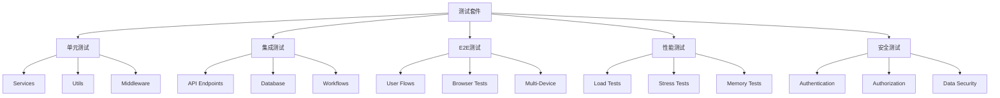

# 🧪 GitLab Copilot 测试指南

<div align="center">

[](https://github.com/your-repo)
[](https://github.com/your-repo)
[](https://github.com/your-repo)

*全面的测试策略，确保代码质量、安全性和性能*

</div>

## 📋 目录

- [测试架构](#测试架构)
- [测试分类](#测试分类)
- [环境配置](#环境配置)
- [运行测试](#运行测试)
- [测试标准](#测试标准)
- [编写测试](#编写测试)
- [测试覆盖率](#测试覆盖率)
- [CI/CD 集成](#cicd-集成)
- [故障排除](#故障排除)
- [最佳实践](#最佳实践)

## 🏗️ 测试架构



### 测试层级

| 层级 | 目的 | 覆盖范围 | 执行速度 |
|------|------|----------|----------|
| **单元测试** | 验证单个函数/模块 | 90%+ | 🚀 快速 |
| **集成测试** | 验证组件协作 | 80%+ | ⚡ 中等 |
| **E2E 测试** | 验证完整流程 | 关键路径 | 🐢 较慢 |
| **性能测试** | 验证性能指标 | 关键操作 | ⏱️ 中等 |
| **安全测试** | 验证安全措施 | 100% | 🔒 中等 |

## 📂 测试分类

### 1. 单元测试 (`src/**/__tests__/`)

测试独立的函数和模块，确保基础组件正确工作。

#### 测试组件

- **Authentication Service** (`authService.test.ts`)
  - 密码哈希和验证
  - JWT 令牌生成和验证
  - 用户注册和登录逻辑
  - 会话管理

- **GitLab Config Service** (`gitlabConfigService.test.ts`)
  - 配置 CRUD 操作
  - 配置加密/解密
  - 默认配置管理
  - 配置验证

- **Event Processor** (`eventProcessor.test.ts`)
  - Webhook 事件处理
  - AI 指令提取
  - Session 管理逻辑
  - 工作流协调

- **Session Manager** (`sessionManager.test.ts`)
  - Session 创建和管理
  - Session 过期处理
  - Session 清理
  - 统计信息

### 2. 安全测试 (`authService.security.test.ts`)

专注于安全相关的测试，确保系统抵御常见攻击。

<details>
<summary>🔒 安全测试场景</summary>

#### 密码安全
- ✅ Bcrypt 轮次验证 (最小 10 轮)
- ✅ 密码复杂度要求
- ✅ 常见密码检测
- ✅ 时序攻击防护

#### 暴力破解防护
- ✅ 账户锁定 (5 次失败后)
- ✅ 渐进式延迟 (指数退避)
- ✅ 尝试次数跟踪
- ✅ 锁定时间管理

#### JWT 安全
- ✅ 令牌签名验证
- ✅ 过期时间检查
- ✅ 令牌类型验证
- ✅ 刷新令牌安全

#### Session 安全
- ✅ Session 限制强制执行
- ✅ 登出时清理 Session
- ✅ 并发 Session 处理
- ✅ Session 新鲜度验证

#### 输入验证
- ✅ SQL 注入防护
- ✅ XSS 攻击防护
- ✅ CSRF 令牌验证
- ✅ 数据清理

</details>

### 3. 集成测试 (`src/__tests__/integration/`)

测试多个组件协同工作的场景。

```typescript
// 示例：完整的用户工作流测试
describe('User Authentication Workflow', () => {
  it('should complete registration and login flow', async () => {
    // 1. 注册新用户
    const registerResponse = await request(app)
      .post('/auth/register')
      .send(testUser);
    expect(registerResponse.status).toBe(201);
    
    // 2. 验证用户已创建
    const user = await userRepository.findByEmail(testUser.email);
    expect(user).toBeDefined();
    
    // 3. 登录用户
    const loginResponse = await request(app)
      .post('/auth/login')
      .send({ email: testUser.email, password: testUser.password });
    expect(loginResponse.status).toBe(200);
    
    // 4. 访问受保护资源
    const dashboardResponse = await request(app)
      .get('/auth/dashboard')
      .set('Cookie', loginResponse.headers['set-cookie']);
    expect(dashboardResponse.status).toBe(200);
  });
});
```

### 4. E2E 测试 (`src/__tests__/e2e/`)

模拟真实用户行为，测试完整的用户旅程。

```typescript
// 示例：跨标签页 Session 管理
describe('Multi-Tab Session Management', () => {
  it('should handle concurrent sessions across tabs', async () => {
    // 模拟多个浏览器标签
    const tab1 = await createSession();
    const tab2 = await createSession();
    
    // 在 tab1 中登录
    await tab1.login(testUser);
    
    // 在 tab2 中验证 Session 同步
    const isAuthenticated = await tab2.checkAuth();
    expect(isAuthenticated).toBe(true);
    
    // 在 tab1 中登出
    await tab1.logout();
    
    // 验证 tab2 也已登出
    const stillAuthenticated = await tab2.checkAuth();
    expect(stillAuthenticated).toBe(false);
  });
});
```

### 5. 性能测试 (`src/__tests__/performance/`)

验证系统在负载下的性能表现。

```typescript
// 示例：认证性能基准测试
describe('Authentication Performance', () => {
  it('should handle 50 concurrent registrations', async () => {
    const startTime = Date.now();
    const registrations = Array(50).fill(null).map((_, i) => 
      authService.register({
        username: `user${i}`,
        email: `user${i}@example.com`,
        password: 'SecurePass123!'
      })
    );
    
    await Promise.all(registrations);
    const duration = Date.now() - startTime;
    
    expect(duration).toBeLessThan(10000); // 10 秒内完成
  });
});
```

## ⚙️ 环境配置

### 测试环境变量

创建 `.env.test` 文件：

```bash
# 测试数据库 (使用内存数据库)
MONGODB_URI=mongodb://localhost:27017/test-gitlab-copilot
MONGODB_DB=test-gitlab-copilot

# 快速 Bcrypt (仅用于测试)
BCRYPT_ROUNDS=4

# 测试用 JWT 配置
JWT_SECRET=test-jwt-secret-key-for-testing-only
JWT_ACCESS_EXPIRES_IN=15m
JWT_REFRESH_EXPIRES_IN=7d

# 宽松的速率限制 (便于测试)
RATE_LIMIT_WINDOW_MS=60000
RATE_LIMIT_MAX_REQUESTS=100

# 测试用加密密钥
ENCRYPTION_KEY=0123456789abcdef0123456789abcdef

# 日志级别
LOG_LEVEL=error
```

### 测试数据库

项目使用 `mongodb-memory-server` 提供隔离的测试环境：

```typescript
// src/__tests__/setup.ts
import { MongoMemoryServer } from 'mongodb-memory-server';

let mongoServer: MongoMemoryServer;

beforeAll(async () => {
  mongoServer = await MongoMemoryServer.create();
  const mongoUri = mongoServer.getUri();
  process.env.MONGODB_URI = mongoUri;
});

afterAll(async () => {
  await mongoServer.stop();
});
```

## 🚀 运行测试

### 基本命令

```bash
# 运行所有测试
npm test

# 运行特定测试文件
npm test -- sessionManager.test.ts

# 监听模式 (开发时使用)
npm run test:watch

# 生成覆盖率报告
npm run test:coverage
```

### 分类测试

```bash
# 仅运行单元测试
npm run test:unit

# 仅运行安全测试
npm run test:security

# 仅运行集成测试
npm run test:integration

# 仅运行 E2E 测试
npm run test:e2e

# 仅运行性能测试
npm run test:performance
```

### CI/CD 模式

```bash
# CI 环境运行 (包含覆盖率报告)
npm run test:ci

# 快速测试 (跳过耗时测试)
npm run test:quick
```

### 高级选项

```bash
# 详细输出
npm test -- --verbose

# 仅运行失败的测试
npm test -- --onlyFailures

# 更新快照
npm test -- --updateSnapshot

# 调试模式
npm test -- --detectOpenHandles --forceExit
```

## 📊 测试标准

### 覆盖率要求

| 类型 | 最低覆盖率 | 目标覆盖率 |
|------|-----------|-----------|
| **语句覆盖率** | 85% | 90%+ |
| **分支覆盖率** | 80% | 85%+ |
| **函数覆盖率** | 85% | 90%+ |
| **行覆盖率** | 85% | 90%+ |

### 性能基准

#### 认证操作

| 操作 | 目标时间 | 最大时间 |
|------|---------|---------|
| 用户注册 | < 300ms | < 500ms |
| 用户登录 | < 200ms | < 300ms |
| 令牌验证 | < 30ms | < 50ms |
| 令牌刷新 | < 100ms | < 150ms |

#### 批量操作

| 操作 | 数量 | 目标时间 |
|------|-----|---------|
| 并发注册 | 50 | < 10s |
| 并发登录 | 20 | < 5s |
| 令牌验证 | 100 | < 5s |

#### 数据库性能

| 操作 | 数据规模 | 目标时间 |
|------|---------|---------|
| 用户查询 | 100+ | < 300ms |
| Session 管理 | 50+ | < 400ms |
| 配置查询 | 100+ | < 200ms |

### 安全要求

✅ **必须通过的安全测试**

- [ ] 密码 Bcrypt 轮次 >= 10
- [ ] 暴力破解保护 (5 次失败锁定)
- [ ] JWT 签名验证
- [ ] Session 限制强制执行
- [ ] SQL 注入防护
- [ ] XSS 攻击防护
- [ ] CSRF 令牌验证
- [ ] 敏感数据加密

## ✍️ 编写测试

### 测试模板

#### 单元测试模板

```typescript
import { describe, it, expect, beforeEach, afterEach } from '@jest/globals';

describe('ComponentName', () => {
  // 设置和清理
  beforeEach(() => {
    // 初始化测试环境
  });

  afterEach(() => {
    // 清理资源
  });

  // 分组相关测试
  describe('methodName', () => {
    it('should handle normal case', () => {
      // Arrange (准备)
      const input = 'test';
      
      // Act (执行)
      const result = component.method(input);
      
      // Assert (断言)
      expect(result).toBe('expected');
    });

    it('should handle error case', () => {
      // 测试错误处理
      expect(() => {
        component.method(null);
      }).toThrow('Expected error message');
    });

    it('should handle edge case', () => {
      // 测试边界情况
    });
  });
});
```

#### 集成测试模板

```typescript
import request from 'supertest';
import { app } from '../server';

describe('API Endpoint Integration', () => {
  let authToken: string;

  beforeAll(async () => {
    // 创建测试用户并获取令牌
    const response = await request(app)
      .post('/auth/login')
      .send(testCredentials);
    authToken = response.body.token;
  });

  it('should perform authenticated operation', async () => {
    const response = await request(app)
      .get('/api/protected-resource')
      .set('Authorization', `Bearer ${authToken}`);
    
    expect(response.status).toBe(200);
    expect(response.body).toHaveProperty('data');
  });
});
```

#### 性能测试模板

```typescript
describe('Performance Benchmark', () => {
  it('should meet performance requirements', async () => {
    const iterations = 100;
    const startTime = performance.now();
    
    for (let i = 0; i < iterations; i++) {
      await performOperation();
    }
    
    const endTime = performance.now();
    const avgTime = (endTime - startTime) / iterations;
    
    expect(avgTime).toBeLessThan(50); // 每次操作 < 50ms
  });
});
```

### 最佳实践

#### ✅ 推荐做法

```typescript
// ✅ 使用描述性的测试名称
it('should return 401 when user provides invalid credentials', () => {});

// ✅ 使用 AAA 模式 (Arrange, Act, Assert)
it('should hash password correctly', async () => {
  // Arrange
  const password = 'SecurePass123!';
  
  // Act
  const hashed = await hashPassword(password);
  
  // Assert
  expect(hashed).not.toBe(password);
  expect(await comparePassword(password, hashed)).toBe(true);
});

// ✅ 测试边界情况
it('should handle empty input', () => {});
it('should handle null input', () => {});
it('should handle extremely long input', () => {});

// ✅ 使用测试数据工厂
const createTestUser = (overrides = {}) => ({
  username: 'testuser',
  email: 'test@example.com',
  password: 'SecurePass123!',
  ...overrides
});
```

#### ❌ 避免的做法

```typescript
// ❌ 模糊的测试名称
it('should work', () => {});

// ❌ 测试多个不相关的东西
it('should login and create config and fetch stats', () => {});

// ❌ 依赖测试执行顺序
it('first test - create user', () => {});
it('second test - login user', () => {}); // 依赖第一个测试

// ❌ 硬编码的测试数据
it('should find user', async () => {
  const user = await findUser('hardcoded@email.com'); // 不好
});
```

## 📈 测试覆盖率

### 查看覆盖率报告

```bash
# 生成 HTML 覆盖率报告
npm run test:coverage

# 打开报告
open coverage/lcov-report/index.html
```

### 覆盖率配置

在 `jest.config.json` 中配置覆盖率阈值：

```json
{
  "coverageThreshold": {
    "global": {
      "branches": 80,
      "functions": 85,
      "lines": 85,
      "statements": 85
    },
    "./src/services/": {
      "branches": 90,
      "functions": 90,
      "lines": 90,
      "statements": 90
    }
  }
}
```

### 覆盖率徽章

在 CI/CD 中生成覆盖率徽章：

```yaml
# .github/workflows/test.yml
- name: Generate Coverage Badge
  uses: cicirello/jacoco-badge-generator@v2
  with:
    badges-directory: badges
    generate-summary: true
```

## 🔄 CI/CD 集成

### GitHub Actions 配置

```yaml
# .github/workflows/test.yml
name: Test Suite

on:
  push:
    branches: [ main, develop ]
  pull_request:
    branches: [ main, develop ]

jobs:
  test:
    runs-on: ubuntu-latest
    
    strategy:
      matrix:
        node-version: [16.x, 18.x, 20.x]
    
    steps:
    - uses: actions/checkout@v3
    
    - name: Use Node.js ${{ matrix.node-version }}
      uses: actions/setup-node@v3
      with:
        node-version: ${{ matrix.node-version }}
        cache: 'npm'
    
    - name: Install dependencies
      run: npm ci
    
    - name: Run linter
      run: npm run lint
    
    - name: Run type check
      run: npm run type-check
    
    - name: Run tests
      run: npm run test:ci
    
    - name: Upload coverage
      uses: codecov/codecov-action@v3
      with:
        files: ./coverage/lcov.info
        flags: unittests
        name: codecov-umbrella
    
    - name: Archive coverage report
      uses: actions/upload-artifact@v3
      with:
        name: coverage-report
        path: coverage/
```

### GitLab CI 配置

```yaml
# .gitlab-ci.yml
stages:
  - test
  - report

test:
  stage: test
  image: node:18
  script:
    - npm ci
    - npm run lint
    - npm run type-check
    - npm run test:ci
  coverage: '/Lines\s*:\s*(\d+\.\d+)%/'
  artifacts:
    reports:
      coverage_report:
        coverage_format: cobertura
        path: coverage/cobertura-coverage.xml
    paths:
      - coverage/

coverage:
  stage: report
  image: node:18
  script:
    - npm run test:coverage
  artifacts:
    paths:
      - coverage/
  only:
    - main
```

### 预提交钩子

使用 Husky 在提交前运行测试：

```json
// package.json
{
  "husky": {
    "hooks": {
      "pre-commit": "lint-staged",
      "pre-push": "npm run test:quick"
    }
  },
  "lint-staged": {
    "*.ts": [
      "eslint --fix",
      "prettier --write",
      "npm test -- --bail --findRelatedTests"
    ]
  }
}
```

## 🔧 故障排除

### 常见问题

<details>
<summary><strong>测试超时</strong></summary>

**症状**: 测试运行超过默认超时时间

**解决方案**:
```typescript
// 增加特定测试的超时时间
it('long running test', async () => {
  // 测试代码
}, 30000); // 30 秒超时

// 或在 jest.config.json 中全局配置
{
  "testTimeout": 10000
}
```

</details>

<details>
<summary><strong>数据库连接问题</strong></summary>

**症状**: 测试无法连接到测试数据库

**解决方案**:
```bash
# 检查 MongoDB Memory Server 是否正确安装
npm install --save-dev mongodb-memory-server

# 检查环境变量
cat .env.test

# 清理并重新安装
rm -rf node_modules package-lock.json
npm install
```

</details>

<details>
<summary><strong>测试之间相互影响</strong></summary>

**症状**: 单独运行测试通过，批量运行失败

**解决方案**:
```typescript
// 确保每个测试后清理数据库
afterEach(async () => {
  await clearDatabase();
});

// 使用隔离的测试数据
beforeEach(() => {
  testData = createFreshTestData();
});

// 运行测试时使用 --runInBand
npm test -- --runInBand
```

</details>

<details>
<summary><strong>内存泄漏</strong></summary>

**症状**: 测试运行时内存持续增长

**解决方案**:
```bash
# 检测内存泄漏
npm test -- --detectLeaks

# 查看内存使用情况
npm test -- --logHeapUsage

# 确保清理所有资源
afterAll(async () => {
  await closeConnections();
  await cleanupResources();
});
```

</details>

### 调试技巧

#### 1. 调试单个测试

```bash
# 运行特定测试并输出详细信息
npm test -- --verbose sessionManager.test.ts

# 使用 VS Code 调试器
# 在 .vscode/launch.json 中配置
{
  "type": "node",
  "request": "launch",
  "name": "Jest Debug",
  "program": "${workspaceFolder}/node_modules/.bin/jest",
  "args": ["--runInBand", "${file}"],
  "console": "integratedTerminal"
}
```

#### 2. 查看失败详情

```bash
# 只运行失败的测试
npm test -- --onlyFailures

# 显示完整错误堆栈
npm test -- --verbose --no-coverage
```

#### 3. 性能分析

```bash
# 查看慢速测试
npm test -- --verbose | grep "SLOW"

# 生成性能报告
npm test -- --json --outputFile=test-results.json
```

## 📚 最佳实践

### 测试金字塔

```
        E2E (5%)
       /         \
    集成 (15%)
   /             \
单元测试 (80%)
```

**原则**:
- 80% 单元测试: 快速、隔离、易维护
- 15% 集成测试: 验证组件协作
- 5% E2E 测试: 验证关键用户流程

### 命名约定

```typescript
// ✅ 描述性的测试套件名称
describe('AuthenticationService', () => {
  describe('register()', () => {
    it('should create new user with hashed password', () => {});
    it('should reject duplicate email addresses', () => {});
    it('should validate password complexity', () => {});
  });
});

// ✅ 使用 Given-When-Then 模式
it('should lock account when user fails login 5 times', () => {
  // Given: 用户已失败 4 次
  // When: 用户再次失败
  // Then: 账户被锁定
});
```

### 测试数据管理

```typescript
// ✅ 使用工厂函数创建测试数据
const userFactory = {
  build: (overrides = {}) => ({
    username: faker.internet.userName(),
    email: faker.internet.email(),
    password: 'SecurePass123!',
    ...overrides
  }),
  buildMany: (count: number) => 
    Array(count).fill(null).map(() => userFactory.build())
};

// ✅ 使用fixtures 管理复杂测试数据
import { validUser, invalidUser, lockedUser } from './fixtures/users';
```

### 异步测试

```typescript
// ✅ 使用 async/await
it('should create user asynchronously', async () => {
  const user = await userService.create(testUser);
  expect(user).toBeDefined();
});

// ✅ 测试 Promise 拒绝
it('should reject invalid data', async () => {
  await expect(userService.create(invalidData))
    .rejects
    .toThrow('Validation error');
});

// ✅ 测试回调
it('should call callback on completion', (done) => {
  service.process((err, result) => {
    expect(err).toBeNull();
    expect(result).toBeDefined();
    done();
  });
});
```

### Mock 和 Stub

```typescript
// ✅ Mock 外部依赖
jest.mock('../services/gitlabService');

it('should handle GitLab API error', async () => {
  const mockGitlab = gitlabService as jest.Mocked<typeof gitlabService>;
  mockGitlab.createMR.mockRejectedValue(new Error('API Error'));
  
  await expect(workflow.execute())
    .rejects
    .toThrow('API Error');
});

// ✅ Spy 验证调用
it('should log authentication attempts', async () => {
  const logSpy = jest.spyOn(logger, 'info');
  
  await authService.login(credentials);
  
  expect(logSpy).toHaveBeenCalledWith(
    expect.stringContaining('Login attempt')
  );
});
```

## 📖 参考资源

### 推荐阅读

- [Jest 官方文档](https://jestjs.io/)
- [Testing Best Practices](https://github.com/goldbergyoni/javascript-testing-best-practices)
- [Node.js Testing Guide](https://nodejs.org/en/docs/guides/testing/)

### 测试工具

- **Jest**: 测试框架
- **Supertest**: HTTP 测试
- **MongoDB Memory Server**: 内存数据库
- **Faker**: 测试数据生成
- **MSW**: API Mock

### 相关文档

- [README.md](./README.md) - 项目概览
- [CODE_REVIEW_GUIDELINES.md](./CODE_REVIEW_GUIDELINES.md) - 代码审查指南
- [docs/platform_design.md](./docs/platform_design.md) - 平台设计文档

---

<div align="center">

**[⬆ 回到顶部](#-gitlab-copilot-测试指南)**

保持测试覆盖率 > 90% 🎯

</div>
