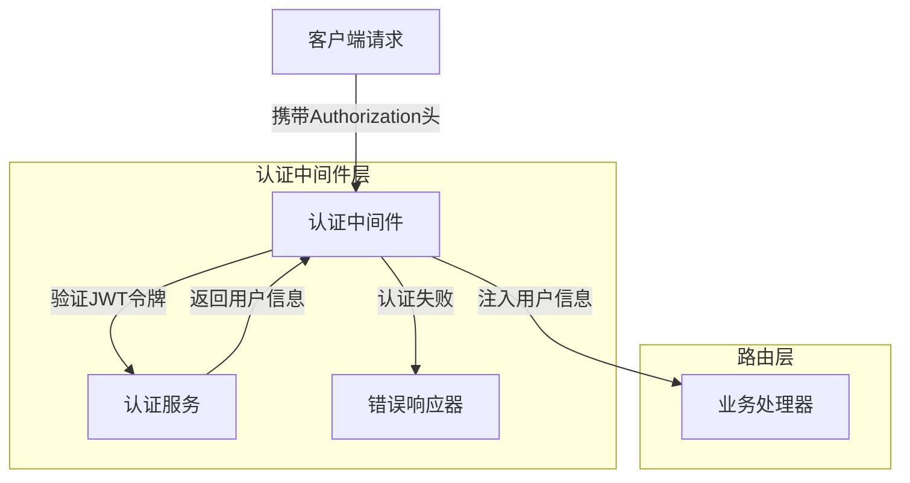
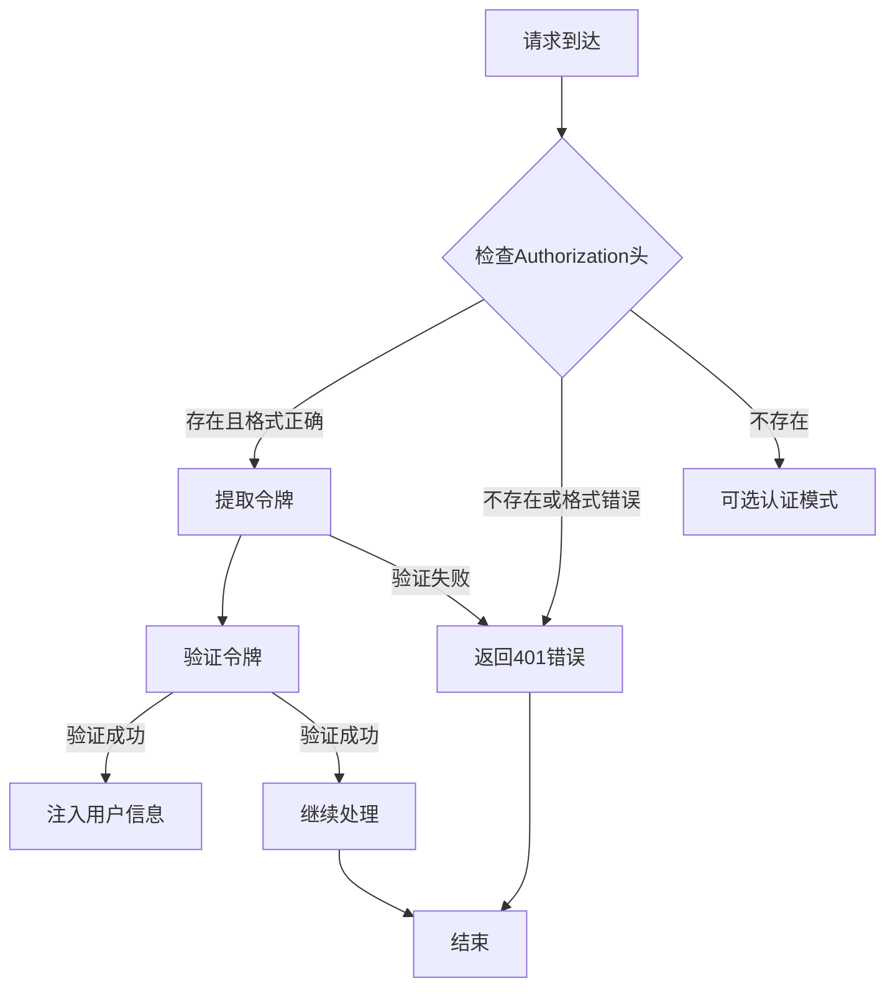
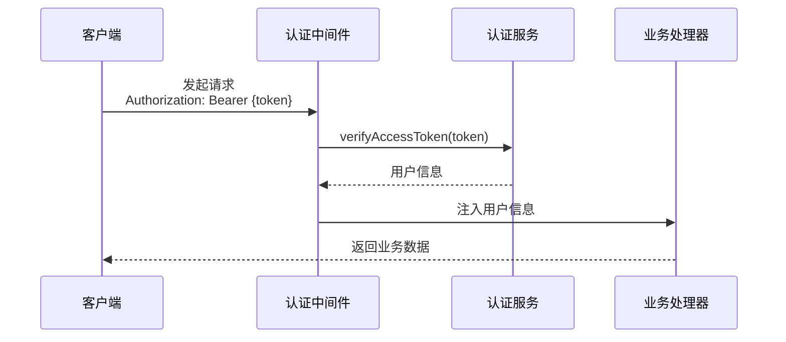
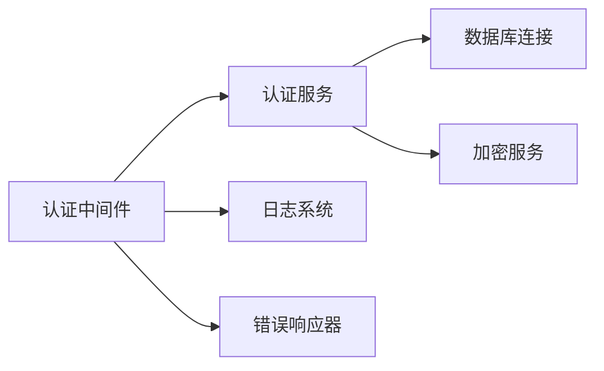

# 认证中间件 (Authentication Middleware)

## 概述

**作用**：为 GitLab AI Copilot 系统提供基于 JWT 的请求认证机制，确保只有合法用户才能访问受保护的 API 端点。

**使用场景**：
- 用户访问需要身份验证的 API 资源
- Webhook 请求的签名验证
- 多租户环境下的用户身份识别

**核心价值**：
- **企业级安全**：通过 JWT 令牌验证用户身份
- **请求追踪**：为每个请求分配唯一标识符
- **灵活认证**：支持强制认证和可选认证两种模式

## 快速开始

1. **配置认证服务**：设置 JWT 密钥和认证参数
2. **应用中间件**：在路由配置中注册认证中间件
3. **令牌验证**：系统自动验证请求头中的 Bearer 令牌
- **用户信息注入**：验证成功后，用户信息自动注入到请求对象中
- **错误处理**：认证失败时返回标准化的错误响应

## 架构设计

### 系统架构图



### 项目结构

```
src/
├── middleware/              # 中间件目录
│   ├── auth.ts             # 认证中间件主文件
│   └── __tests__/          # 测试文件
├── services/
│   ├── authService.ts       # 认证业务逻辑
│   └── __tests__/          # 服务测试
├── utils/
│   ├── gitlabAuth.ts       # GitLab 认证工具
└── types/
    └── auth.ts              # 认证相关类型定义
```

### 设计原则

- **单例模式**：认证服务采用单例模式确保全局唯一性
- **责任链模式**：中间件按顺序执行，每个中间件处理特定职责
- **配置驱动**：通过环境变量灵活配置认证参数

## 核心组件分析

### 组件1：JWT 认证中间件
**文件路径**：`src/middleware/auth.ts`

**职责**：
- 解析请求头中的 Authorization 字段
- 验证 Bearer 令牌的有效性
- 将用户信息注入到请求上下文中
- 处理认证失败的标准错误响应

**关键要点**：
- 采用异步验证机制，支持高并发场景
- 标准化错误响应格式，便于前端统一处理
- 支持请求 ID 追踪，便于问题排查

### 组件2：认证服务
**文件路径**：`src/services/authService.ts`

**职责**：
- 实现 JWT 令牌的验证逻辑
- 管理用户会话信息
- 提供租户上下文管理

**关键要点**：
- 基于 Promise 的异步验证接口
- 支持多租户环境下的用户隔离
- 集成 GitLab 认证机制

## 执行流程

### 业务流程图



### 时序图（关键交互）



### 关键路径说明

1. **请求拦截**：`src/middleware/auth.ts` 中的 `authenticateJWT` 函数拦截所有请求
2. **令牌提取**：从 Authorization 头中提取 Bearer 令牌
3. **异步验证**：调用认证服务验证令牌有效性
4. **用户注入**：验证成功后，用户信息注入到请求对象
5. **错误处理**：认证失败时返回标准化的 401 错误响应

## 依赖关系

### 内部依赖



### 外部依赖

- **jsonwebtoken 库**：用于 JWT 令牌的生成和验证
- **bcrypt 库**：用于密码加密和验证
- **express 框架**：提供中间件执行环境

### 依赖注入

通过模块导入方式实现依赖注入，认证中间件通过 import 语句引入认证服务，实现松耦合架构设计

## 使用方式

### 基础用法

1. **配置环境变量**：设置 JWT 密钥和认证参数
2. **注册中间件**：在 Express 应用中注册认证中间件
3. **令牌生成**：用户登录成功后生成 JWT 令牌
4. **请求认证**：客户端在请求头中携带 Bearer 令牌
5. **自动验证**：系统自动验证令牌并注入用户信息

### 高级用法

- **可选认证模式**：对于某些公开接口，支持可选认证
- **多租户支持**：在认证过程中识别租户上下文
- **会话管理**：支持长会话模式下的用户状态保持

### API参考

| 方法/属性 | 类型 | 说明 | 使用提示 |
|---------|------|------|----------------|
| authenticateJWT | (req, res, next) => void | 强制 JWT 认证 | 适用于需要严格身份验证的接口 |
| optionalJWT | (req, res, next) => void | 可选 JWT 认证 | 适用于公开但需要用户信息的接口 |
| requireUserAccess | (req, res, next) => void | 用户资源访问控制 | 确保用户只能访问自己的资源 |

### 配置选项

- **JWT_SECRET**：JWT 签名密钥，用于令牌验证
- **SESSION_MAX_IDLE_TIME**：会话最大空闲时间，控制会话生命周期
- **CORS_ORIGINS**：跨域资源共享配置，控制允许访问的域名列表

## 最佳实践与注意事项

### ✅ 推荐做法

1. **使用环境变量配置**：确保敏感信息不硬编码在代码中
   - 适用场景：生产环境部署
   - 效果说明：提高系统安全性，便于配置管理

2. **标准化错误响应**：所有认证错误返回统一格式的响应
   - 适用场景：所有需要认证的接口
   - 效果说明：便于前端统一错误处理逻辑

### ❌ 常见陷阱

1. **令牌泄露**：JWT 令牌在传输过程中可能被截获
   - 现象描述：攻击者获取令牌后可以冒充用户
   - 正确做法：使用 HTTPS 加密传输，设置合理的令牌过期时间

2. **会话管理不当**：长时间不清理过期会话可能导致内存泄漏
   - 正确做法：配置会话清理服务，定期清理过期会话数据

### 性能优化建议

- **异步验证**：使用 Promise 异步验证令牌，避免阻塞事件循环
- **缓存机制**：对于频繁验证的令牌，可以引入缓存机制提高性能

### 安全注意事项

- **敏感信息加密**：用户令牌和密码等敏感信息使用 AES-256 加密存储
- **请求限流**：防止认证接口被暴力破解

## 测试策略

### 单元测试示例

需要覆盖的测试场景包括：有效令牌验证、无效令牌拒绝、缺失令牌处理、令牌过期检测等场景，确保认证逻辑的正确性和安全性

### 集成测试要点

- 测试认证中间件与其他业务组件的集成
- 验证多租户环境下的用户隔离机制

### 调试技巧

- 开启调试日志：设置 LOG_LEVEL=debug 查看详细认证过程
- 常见问题排查：检查 JWT 密钥配置、验证令牌格式、排查网络连接问题

### 性能监控

- **认证成功率**：监控认证成功与失败的比例
- **响应时间**：监控认证过程的平均响应时间
- **错误频率**：监控认证失败请求的频率和原因

## 扩展性设计

### 扩展点

- **认证策略扩展**：可以通过实现新的认证适配器支持更多认证方式
- **令牌格式扩展**：支持不同类型的令牌格式和验证机制

### 版本演进

- **向后兼容**：确保新版本中间件兼容旧版本客户端

### 相关技术点

- [请求拦截器](./请求拦截器.md)
- [错误处理器](./错误处理器.md)
- [限流中间件](./限流中间件.md)

### 当前版本的限制

- 目前主要支持 JWT 令牌认证
- 令牌刷新机制需要客户端主动发起

## 总结

认证中间件作为 GitLab AI Copilot 系统的安全门户，通过标准化的 JWT 认证机制确保系统访问安全，同时支持多租户环境下的用户身份识别和资源隔离，为企业级应用提供可靠的身份验证保障。
