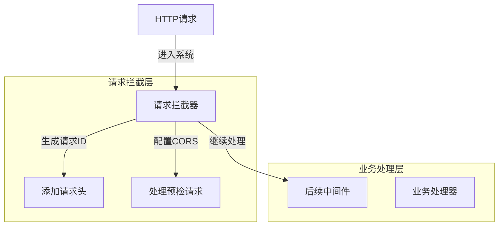
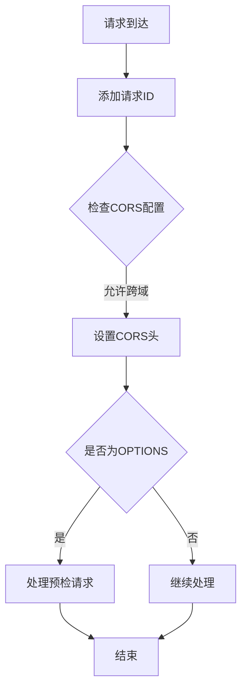
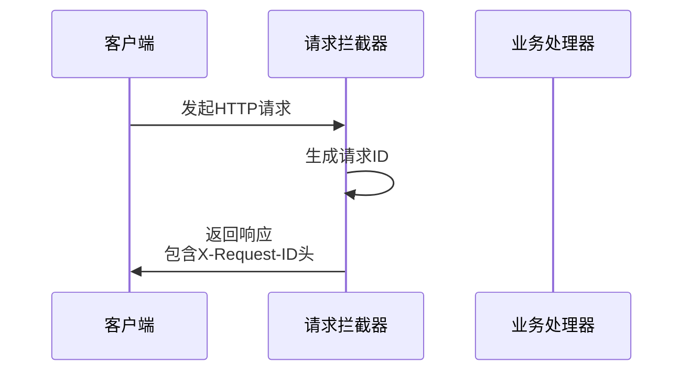
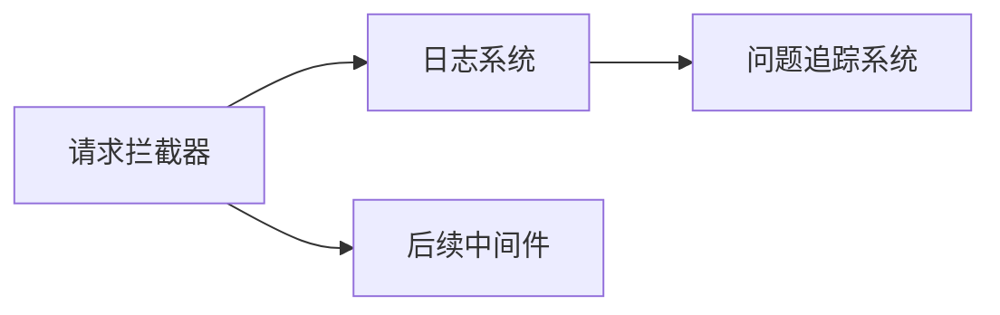

# 请求拦截器 (Request Interceptor)

## 概述

**作用**：在请求处理链的最前端拦截所有 HTTP 请求，进行预处理和基础验证，为后续中间件提供标准化的请求上下文。

**使用场景**：
- 所有 HTTP 请求的预处理和标准化
- 请求 ID 生成和追踪
- 跨域资源共享配置管理

**核心价值**：
- **统一入口**：为所有请求提供统一的处理入口
- **上下文管理**：为请求添加必要的上下文信息
- **安全防护**：防止恶意请求进入系统核心逻辑

## 快速开始

1. **注册拦截器**：在 Express 应用配置中注册请求拦截器中间件
2. **请求追踪**：为每个请求生成唯一标识符
3. **跨域配置**：根据环境配置自动处理 CORS 请求

## 架构设计

### 系统架构图



### 项目结构

```
src/
├── middleware/              # 中间件目录
│   ├── auth.ts             # 包含请求拦截器
│   └── __tests__/          # 测试文件
├── server/
│   ├── webhookServer.ts     # 服务器配置
└── utils/
    └── logger.ts            # 日志系统
```

### 设计原则

- **责任链模式**：请求拦截器作为处理链的第一个环节
- **配置驱动**：通过环境变量灵活配置拦截器行为

## 核心组件分析

### 组件1：请求 ID 生成器
**文件路径**：`src/middleware/auth.ts`

**职责**：
- 为每个请求生成唯一的请求标识符
- 在响应头中添加请求 ID 便于追踪
- 支持请求全链路追踪和问题排查

**关键要点**：
- 基于时间戳和随机数生成唯一标识符
- 确保请求 ID 在微服务架构中的传递一致性

### 组件2：CORS 配置器
**文件路径**：`src/middleware/auth.ts`

**职责**：
- 配置跨域资源共享策略
- 处理 OPTIONS 预检请求
- 支持多域名白名单配置

**关键要点**：
- 动态域名验证，支持开发和生产环境不同配置
- 预检请求自动处理，减少业务代码复杂度

## 执行流程

### 业务流程图



### 时序图（关键交互）



### 关键路径说明

1. **请求接收**：`src/server/webhookServer.ts` 接收所有 HTTP 请求
2. **请求ID生成**：为每个请求分配唯一标识符
3. **CORS验证**：检查请求来源是否在允许列表中
4. **预检处理**：对于 OPTIONS 请求，直接返回 200 状态码
5. **请求传递**：将处理后的请求传递给后续中间件

## 依赖关系

### 内部依赖



### 外部依赖

- **express 框架**：提供中间件执行环境
- **cookie-parser 库**：用于解析请求中的 Cookie 信息
- **express-rate-limit 库**：用于请求限流控制

### 依赖注入

通过 Express 中间件注册机制实现依赖注入，拦截器作为第一个中间件执行

## 使用方式

### 基础用法

1. **环境配置**：设置 CORS 允许的域名列表
2. **中间件注册**：在服务器配置中注册请求拦截器

### 高级用法

- **动态域名管理**：支持运行时动态更新允许的域名列表

### API参考

| 方法/属性 | 类型 | 说明 | 使用提示 |
|---------|------|------|----------------|
| addRequestId | (req, res, next) => void | 请求ID生成 | 适用于所有需要请求追踪的场景 |

### 配置选项

- **CORS_ORIGINS**：配置允许跨域访问的域名列表
- **REQUEST_ID_PREFIX**：自定义请求ID前缀，便于日志分类和识别 |

## 最佳实践与注意事项

### ✅ 推荐做法

1. **配置域名白名单**：在生产环境中严格限制允许访问的域名
- **请求ID标准化**：确保所有请求都有唯一的标识符

### ❌ 常见陷阱

1. **CORS配置过宽**：允许所有域名访问可能导致安全风险
   - 正确做法：根据实际需求配置具体的域名列表

### 性能优化建议

- **轻量级处理**：请求拦截器应保持轻量级，避免影响系统整体性能

### 安全注意事项

- **域名验证**：严格验证请求来源域名，防止跨站请求伪造攻击

## 测试策略

### 单元测试示例

需要覆盖的测试场景包括：请求ID生成正确性、CORS配置有效性、预检请求处理正确性等场景

### 集成测试要点

- 测试请求拦截器与其他中间件的集成效果
- 验证请求ID在微服务间的传递一致性

### 调试技巧

- 查看请求ID：通过响应头中的 X-Request-ID 字段追踪请求处理链路

### 性能监控

- **请求处理时间**：监控请求拦截器的平均处理时间
- **CORS请求统计**：监控跨域请求的数量和来源

## 扩展性设计

### 扩展点

- **请求预处理扩展**：可以添加更多的请求预处理逻辑
- **请求追踪扩展**：支持更复杂的请求链路追踪机制

### 版本演进

- **向后兼容**：确保新版本拦截器兼容旧版本客户端

### 相关技术点

- [认证中间件](./认证中间件.md)
- [错误处理器](./错误处理器.md)
- [限流中间件](./限流中间件.md)

## 总结

请求拦截器作为 GitLab AI Copilot 系统的第一道防线，通过请求ID生成和CORS配置管理，为系统提供统一的请求处理入口和全链路追踪能力，确保企业级应用的可观测性和可维护性。
