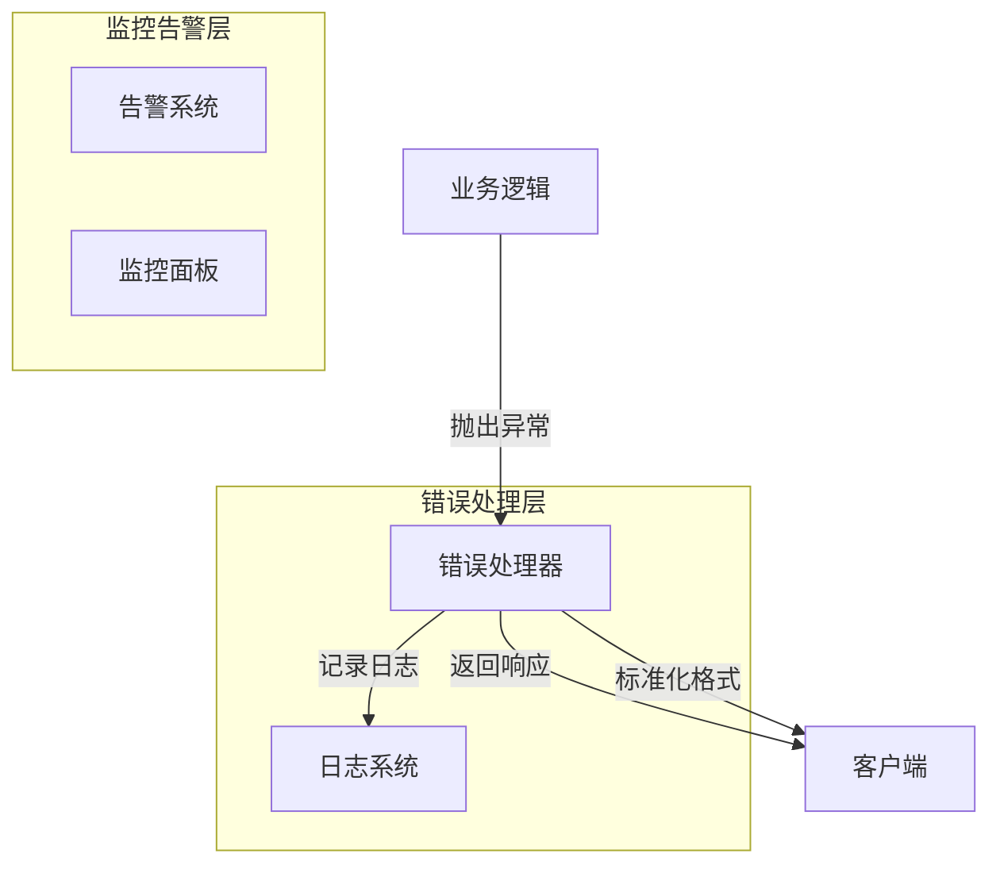
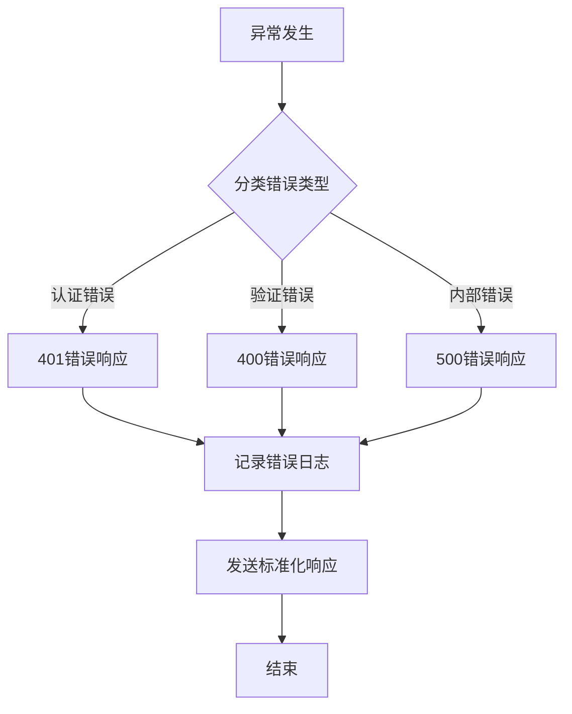
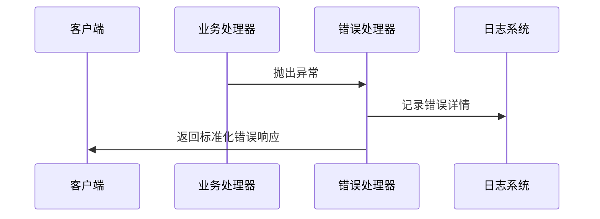
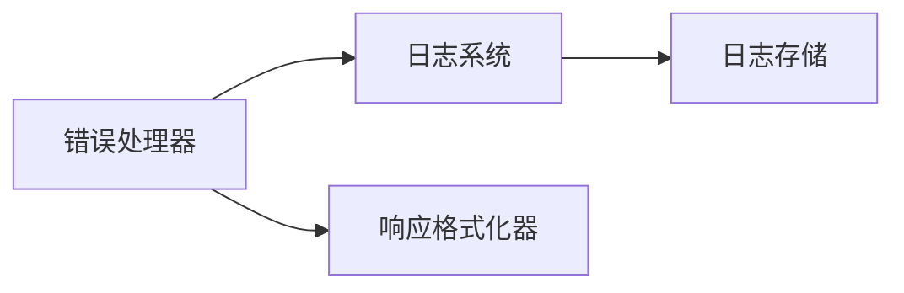

# 错误处理器 (Error Handler)

## 概述

**作用**：为 GitLab AI Copilot 系统提供统一的错误处理和响应机制，确保所有异常情况都能被妥善处理并返回标准化的错误信息。

**使用场景**：
- 系统运行时异常的统一处理
- 标准化错误响应格式
- 错误日志记录和追踪

**核心价值**：
- **用户体验**：提供清晰、一致的错误信息
- **系统可观测性**：通过错误日志监控系统健康状况
- **问题排查**：提供完整的错误上下文信息便于调试

## 快速开始

1. **错误类型定义**：在类型系统中定义标准化的错误类型
2. **错误响应标准化**：所有错误返回统一格式的 JSON 响应
3. **错误分类处理**：根据错误类型返回不同的 HTTP 状态码

## 架构设计

### 系统架构图



### 项目结构

```
src/
├── middleware/              # 中间件目录
│   ├── auth.ts             # 包含错误处理逻辑
└── types/
    └── auth.ts              # 错误类型定义
```

### 设计原则

- **统一接口**：所有错误通过相同的接口进行处理和响应
- **错误分类**：根据错误严重程度和类型进行分类处理
└── utils/
    └── logger.ts            # 日志记录工具
```

## 核心组件分析

### 组件1：错误响应器
**文件路径**：`src/middleware/auth.ts`

**职责**：
- 接收各种类型的异常
- 根据异常类型生成标准化的错误响应
- 记录详细的错误日志便于问题排查

**关键要点**：
- 支持多种错误类型：认证错误、验证错误、内部错误等
- 根据错误类型自动设置合适的 HTTP 状态码

### 组件2：错误类型系统
**文件路径**：`src/types/auth.ts`

**职责**：
- 定义标准化的错误响应格式
- 提供错误码和错误消息的标准化映射

## 执行流程

### 业务流程图



### 时序图（关键交互）



### 关键路径说明

1. **异常捕获**：业务逻辑中抛出的异常被错误处理器捕获
2. **错误分类**：根据异常类型确定错误分类和响应状态码
    ErrorHandler->>Client: 错误响应
```

## 依赖关系

### 内部依赖



### 外部依赖

- **express 框架**：提供错误处理中间件执行环境
- **winston 库**：提供结构化的日志记录能力

### 依赖注入

通过模块导入和函数调用实现依赖注入，错误处理器作为全局异常处理机制

## 使用方式

### 基础用法

1. **错误类型定义**：在类型系统中明确定义各种错误类型及其属性

## 最佳实践与注意事项

### ✅ 推荐做法

1. **统一错误格式**：所有错误返回相同的 JSON 结构
- 适用场景：前端错误处理逻辑统一化
- 效果说明：减少前端代码复杂度，提高开发效率

2. **错误日志记录**：确保所有错误都有详细的日志记录
- 适用场景：生产环境问题排查
- 效果说明：快速定位问题根源

### ❌ 常见陷阱

1. **错误信息泄露**：在生产环境中可能泄露敏感系统信息
- 现象描述：错误响应中包含内部错误详情
- 正确做法：只返回必要的错误信息，避免泄露系统内部结构

### 性能优化建议

- **错误响应优化**：确保错误响应不会包含过多冗余信息
- **错误分类优化**：根据业务需求合理划分错误类型

### 安全注意事项

- **错误信息脱敏**：确保错误响应中不包含敏感数据
- **错误频率监控**：监控系统错误频率，及时发现潜在问题

## 测试策略

### 单元测试示例

需要覆盖的测试场景包括：认证错误处理、验证错误处理、内部错误处理等场景，确保错误处理逻辑的完整性和正确性

### 集成测试要点

- 测试错误处理器与其他中间件的集成效果
- 验证错误响应格式的标准化程度

### 调试技巧

- 查看错误日志：通过日志系统查看详细的错误信息
- 错误追踪：通过请求 ID 追踪错误发生的完整链路

### 性能监控

- **错误率监控**：监控系统整体错误率变化趋势
- **错误类型分布**：分析不同类型错误的分布情况

## 扩展性设计

### 扩展点

- **错误类型扩展**：可以添加新的错误类型支持
- **错误响应定制**：支持根据业务需求定制错误响应内容

### 版本演进

- **向后兼容**：确保新版本错误处理器兼容旧版本客户端

### 相关技术点

- [认证中间件](./认证中间件.md)
- [请求拦截器](./请求拦截器.md)
- [限流中间件](./限流中间件.md)

## 总结

错误处理器作为 GitLab AI Copilot 系统的安全保障机制，通过标准化的错误处理和响应机制，确保系统在异常情况下仍能提供良好的用户体验和问题排查能力。
