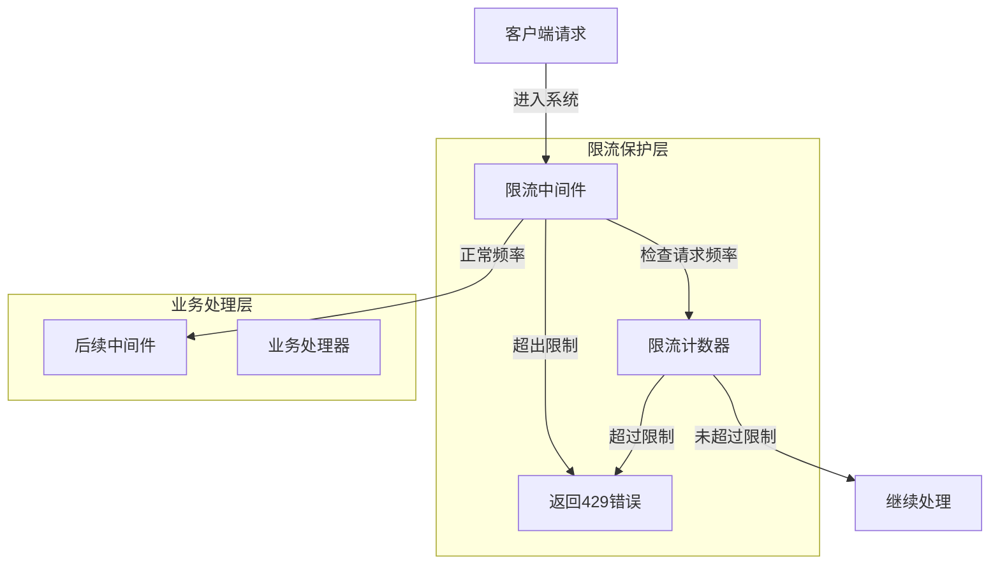
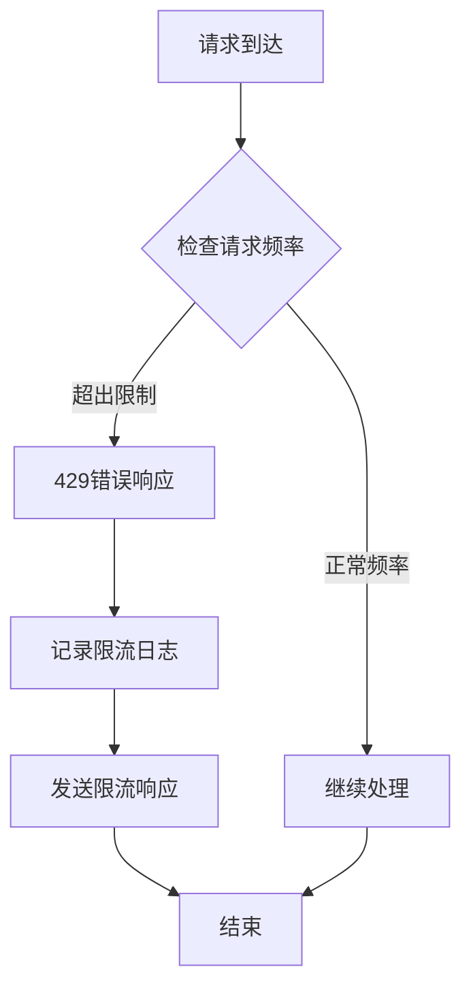
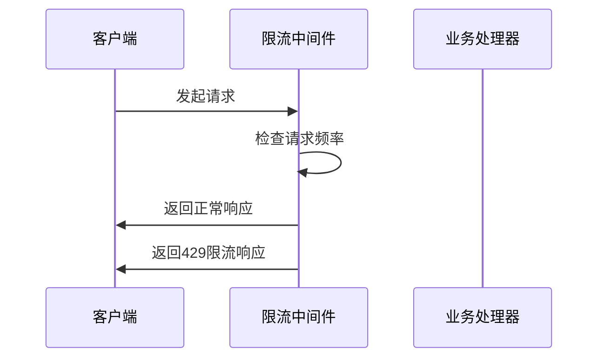
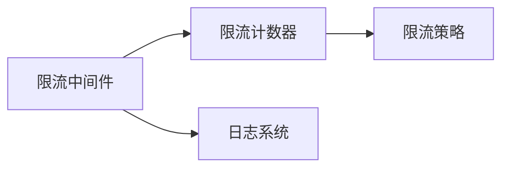

# 限流中间件 (Rate Limiting Middleware)

## 概述

**作用**：为 GitLab AI Copilot 系统提供请求频率限制机制，防止恶意攻击和系统过载，保障服务稳定性。

**使用场景**：
- API 接口的访问频率控制
- 防止暴力破解和 DDoS 攻击
- 资源保护和服务质量保障

**核心价值**：
- **系统保护**：防止恶意请求导致系统资源耗尽
- **公平使用**：确保所有用户都能公平地使用系统资源
- **性能优化**：通过限流保护系统核心业务逻辑

## 快速开始

1. **配置限流参数**：设置请求频率限制阈值
2. **注册中间件**：在 Express 应用配置中注册限流中间件
3. **监控告警**：实时监控限流情况，及时发现异常访问模式

## 架构设计

### 系统架构图



### 项目结构

```
src/
├── middleware/              # 中间件目录
│   ├── auth.ts             # 包含限流逻辑
└── utils/
    └── config.ts            # 配置管理系统
```

### 设计原则

- **滑动窗口算法**：采用时间窗口内的请求计数机制
- **多维度限流**：支持基于 IP、用户、接口等多维度的限流策略
```

## 核心组件分析

### 组件1：限流策略管理器
**文件路径**：`src/middleware/auth.ts`

**职责**：
- 管理不同维度的限流策略配置
- 动态调整限流阈值
- 支持不同场景的限流需求

**关键要点**：
- **动态配置**：支持运行时调整限流参数
- **智能限流**：根据请求特征动态调整限流策略

### 组件2：限流计数器
**文件路径**：`src/middleware/auth.ts`

**职责**：
- 记录每个维度的请求频率
- 判断是否超出限制阈值
- 返回标准化的限流错误响应

## 执行流程

### 业务流程图



### 时序图（关键交互）



### 关键路径说明

1. **请求接收**：限流中间件拦截所有请求
2. **频率检查**：根据限流策略检查请求频率是否超出限制
- 如果超出限制，返回 429 状态码和标准化的限流错误信息

## 依赖关系

### 内部依赖



### 外部依赖

- **express-rate-limit 库**：提供基础的限流功能
- **Redis 或内存存储**：用于存储限流计数数据
```

### 依赖注入

通过 Express 中间件注册机制实现依赖注入，限流中间件作为安全防护层执行

## 使用方式

### 基础用法

1. **环境配置**：设置限流阈值和窗口时间
2. **策略配置**：定义不同维度的限流策略

### 高级用法

- **智能限流**：根据用户行为模式动态调整限流策略

### API参考

| 方法/属性 | 类型 | 说明 | 使用提示 |
|---------|------|------|----------------|
| rateLimit | (req, res, next) => void | 请求频率限制 | 适用于所有需要保护的系统接口 |

### 配置选项

- **RATE_LIMIT_WINDOW_MS**：限流时间窗口长度，控制统计周期
- **RATE_LIMIT_MAX**：最大允许请求数，控制访问频率上限
- **RATE_LIMIT_SKIP_SUCCESSFUL_REQUESTS**：是否跳过成功请求的限流计数
- **RATE_LIMIT_MESSAGE**：限流时返回的错误消息内容

## 最佳实践与注意事项

### ✅ 推荐做法

1. **分层限流**：针对不同重要性的接口设置不同的限流阈值

## 测试策略

### 单元测试示例

需要覆盖的测试场景包括：正常频率请求处理、超出限制请求拒绝、限流策略切换等场景

### 集成测试要点

- 测试限流中间件与其他中间件的集成效果
- 验证限流策略的正确性和有效性

### 调试技巧

- 查看限流日志：通过日志系统查看限流触发情况和原因

### 性能监控

- **限流触发频率**：监控限流中间件被触发的频率和模式

## 扩展性设计

### 扩展点

- **限流策略扩展**：可以添加新的限流算法和策略

### 版本演进

- **向后兼容**：确保新版本限流中间件兼容旧版本客户端

### 相关技术点

- [认证中间件](./认证中间件.md)
- [请求拦截器](./请求拦截器.md)
- [错误处理器](./错误处理器.md)

## 总结

限流中间件作为 GitLab AI Copilot 系统的防护屏障，通过智能的请求频率限制机制，有效防止恶意攻击和系统过载，确保企业级应用的稳定性和可靠性。
