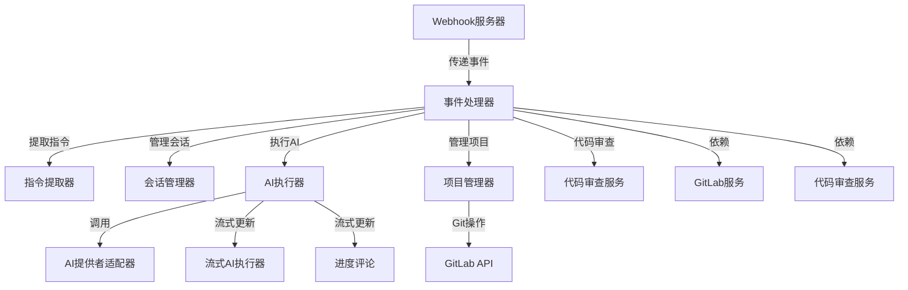
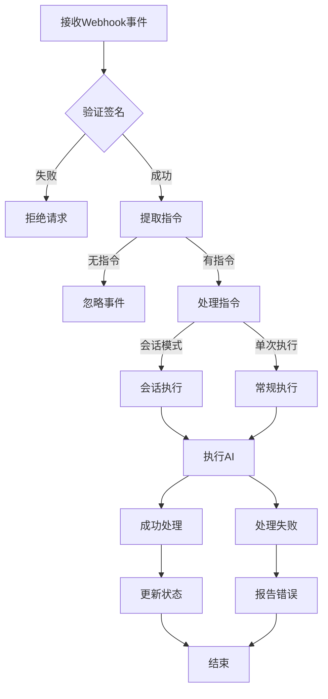
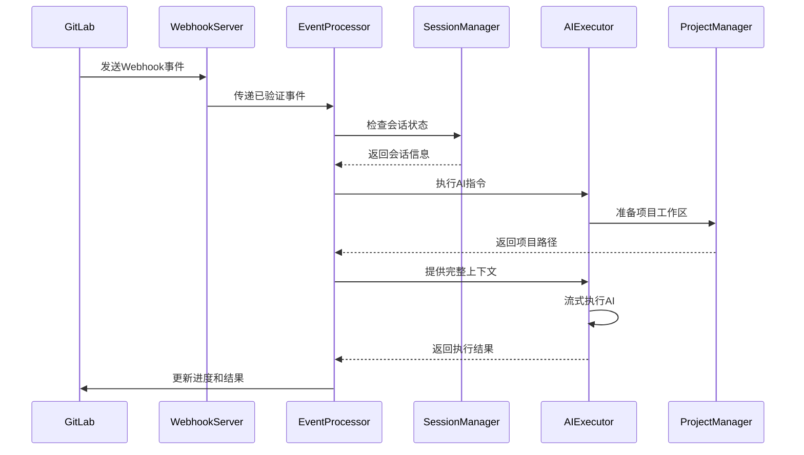

# 事件处理器 (Event Processor)

## 概述
- **作用**：作为GitLab AI Copilot系统的中央协调器，负责接收、解析和处理所有GitLab Webhook事件，协调AI工作流程的各个组件。
- **使用场景**：当GitLab系统产生Issue创建、评论、Merge Request等事件时，作为第一层处理入口。
- **核心价值**：通过统一的事件处理机制，确保AI工作流的可靠性和可追溯性。

## 快速开始
1. Webhook服务器接收GitLab事件并验证签名
2. 事件处理器解析事件内容并提取AI指令
3. 根据事件类型和配置决定执行策略（会话模式或单次执行）
4. 协调AI执行器、项目管理器、会话管理器等组件完成AI任务
5. 返回处理结果并更新事件状态

## 架构设计

### 系统架构图


### 项目结构
```
src/
├── services/
│   ├── eventProcessor.ts     # 中央事件处理器
│   ├── sessionManager.ts     # 会话管理器
│   ├── streamingAiExecutor.ts # 流式AI执行器
│   ├── aiExecutor.ts          # AI执行器
│   ├── projectManager.ts       # 项目管理器
│   └── codeReviewService.ts  # 代码审查服务
```

### 设计原则
- **单职责原则**：事件处理器专注于事件路由和协调，不包含具体业务逻辑
- **异步处理**：所有操作都采用异步模式，避免阻塞事件处理
- **错误隔离**：单个事件处理失败不影响其他事件处理
- **可扩展性**：通过模块化设计支持新的事件类型和AI模型

## 核心组件分析

### 组件1：中央事件处理器
**文件路径**：`src/services/eventProcessor.ts`

**职责**：
- 接收并验证GitLab Webhook事件
- 提取AI指令和上下文信息
- 协调会话管理和AI执行
- 处理进度更新和错误恢复

**关键要点**：
- 采用AsyncLocalStorage管理事件上下文，确保多租户环境下的数据隔离
- 实现基于Issue的锁机制，防止并发处理同一Issue
- 支持多轮对话和长交互会话模式
- 提供完整的错误处理和状态跟踪机制

### 组件2：指令提取器
**文件路径**：`src/utils/webhook.ts`

**职责**：
- 从事件内容中识别AI指令标记（@claude、@codex）
- 构建完整的执行上下文，包括代码片段、讨论历史等
- 支持多种事件类型：Issue、Merge Request、Note等

**关键要点**：
- 支持多种指令触发方式：提及、斜杠命令等
- 自动检测AI提供者类型和场景模式

## 执行流程

### 业务流程图


### 时序图（关键交互）


### 关键路径说明
1. **事件接收**：Webhook服务器接收并验证GitLab事件签名
2. **指令解析**：从事件内容中提取AI指令和参数
3. **会话决策**：根据事件类型和现有会话决定执行策略
4. **AI执行**：调用AI提供者适配器执行具体任务
5. **结果处理**：根据执行结果更新Issue/MR状态
3. **状态更新**：记录事件处理状态和执行时间

## 依赖关系

### 内部依赖
```mermaid
graph LR
    A[事件处理器] --> B[会话管理器]
    A --> C[AI执行器]
    A --> D[项目管理器]
    A --> E[代码审查服务]

### 外部依赖
- **GitLab API**：通过GitLab REST API与GitLab实例交互
- **AI CLI工具**：集成Claude Code CLI和Codex CLI
- **MongoDB**：多租户数据存储和会话持久化
- **Express.js**：Web框架提供HTTP服务能力

### 依赖注入
通过构造函数注入所有依赖组件，确保模块间的松耦合关系

## 使用方式

### 基础用法
1. 配置Webhook服务器监听端口和签名密钥
2. 在GitLab中配置Webhook指向该服务
3. 事件处理器自动监听并处理符合条件的事件
4. 根据事件内容自动提取AI指令并执行相应任务

### 高级用法
- **多租户支持**：通过用户令牌识别不同租户，确保数据完全隔离
- **会话管理**：支持长交互会话，AI能够记住上下文并进行多轮对话
- **自动代码审查**：当Merge Request目标分支为develop时自动触发代码审查
- **冲突解决**：自动检测并尝试解决Git rebase冲突
- **Spec Kit集成**：支持文档规范模式的自动生成和管理

### API参考
| 方法/属性 | 类型 | 说明 | 使用提示 |
|---------|------|------|----------------|
| processEvent | (event: GitLabWebhookEvent, tenant?: TenantUserContext) => Promise<ProcessEventResult> | 处理GitLab Webhook事件 | 支持Issue、MR、Note等多种事件类型 |
| getSessionStats | () => SessionStats | 获取会话统计信息 | 用于监控和调试会话状态 |
| cleanExpiredSessions | (maxAge?: number) => number | 手动清理过期会话 | 定期调用以释放系统资源 |

### 配置选项
- **SESSION_ENABLED**：是否启用会话模式，支持长交互对话
- **SESSION_MAX_IDLE_TIME**：会话最大空闲时间，默认7天
- **SESSION_MAX_SESSIONS**：最大会话数量限制
- **AI_EXECUTION_DELAY_MS**：AI执行前的延迟时间，用于避免请求过载
- **LOG_LEVEL**：日志级别控制，支持debug、info、warn、error
- **WORK_DIR**：工作目录路径，用于存储临时文件和项目工作区

## 最佳实践与注意事项

### ✅ 推荐做法
1. **启用会话模式**：对于需要多轮交互的复杂任务，启用会话模式可以显著提升AI的理解能力和执行效果

### ❌ 常见陷阱
1. **并发处理**：同一Issue的并发处理可能导致状态不一致
   - 现象描述：多个AI同时处理同一Issue可能产生冲突
   - 正确做法：使用基于Issue的锁机制确保串行处理
   - 为什么要避免：保证AI工作流的可靠性和结果的一致性

2. **内存泄漏**：长时间运行的会话可能占用过多内存资源
   - 现象描述：会话数据未及时清理导致内存持续增长
   - 正确做法：配置合理的会话超时时间和清理策略

### 性能优化建议
- **工作区复用**：对于同一Issue的多次处理，复用已有的Git工作区
   - 预期收益：减少Git操作时间，提升响应速度

### 安全注意事项
- **Webhook签名验证**：确保所有Webhook请求都来自可信的GitLab实例
- **数据加密**：敏感配置信息如GitLab Token使用AES-256加密存储
- **多租户隔离**：通过加密密钥和数据库隔离确保企业级数据安全

## 测试策略

### 单元测试示例
需要覆盖的事件类型包括Issue创建、Issue评论、Merge Request创建、Merge Request评论等

### 集成测试要点
- 验证Webhook签名验证机制的正确性
- 测试会话管理器的生命周期管理功能
- 验证错误处理机制在各种异常情况下的表现

### 调试技巧
- 启用调试日志可以查看详细的事件处理流程和AI执行状态

### 性能监控
- **事件处理成功率**：监控事件处理的成功率和错误率
- **会话数量监控**：确保会话数量在合理范围内
- **内存使用监控**：防止会话数据占用过多内存资源

## 扩展性设计

### 扩展点
- **新事件类型支持**：通过扩展事件解析逻辑支持新的事件类型
- **AI模型扩展**：通过实现新的Provider适配器支持更多AI模型

### 版本演进
- 当前版本支持Issue和Merge Request相关事件
- 未来可扩展支持更多GitLab事件类型

### 相关技术点
- [Webhook服务器](../网络协议/Webhook服务器.md)
- [会话管理器](../状态管理/会话管理器.md)
- [AI执行器架构](../工具集成/AI执行器架构.md)
