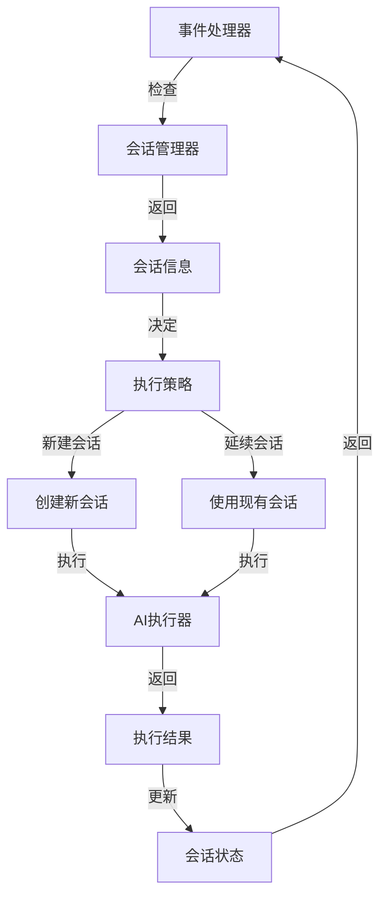
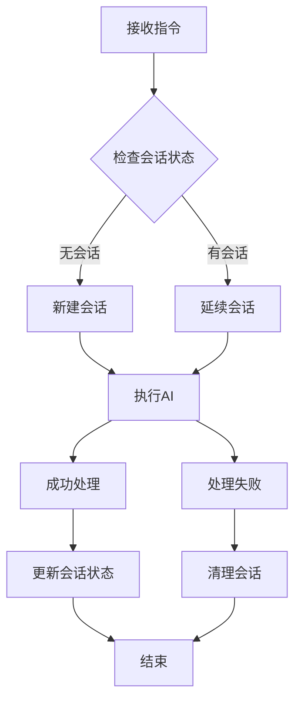
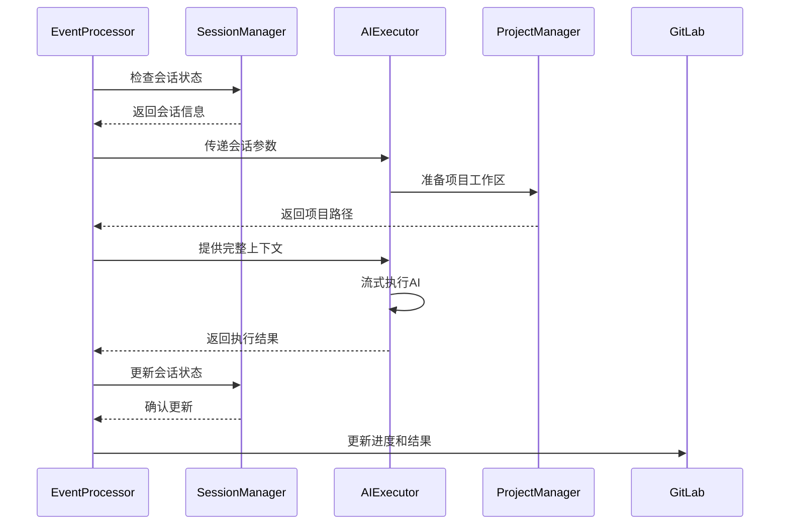
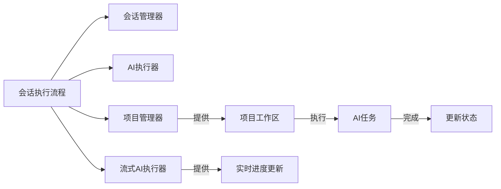

# 会话执行流程 (Session Execution Flow)

## 概述
- **作用**：管理AI交互的完整生命周期，支持长对话模式和多轮交互，确保上下文连贯性。
- **使用场景**：当用户需要与AI进行多轮对话时，维护会话状态和上下文信息。
- **核心价值**：通过会话机制实现智能记忆和上下文感知，提升复杂任务的执行效果。

## 快速开始
1. 检查是否存在现有会话
2. 根据会话状态决定执行策略（新建会话、延续会话、单次执行等）
- **使用场景**：当Issue涉及复杂需求需要多次交互时，启用会话模式

## 架构设计

### 系统架构图


### 项目结构
```
src/
├── services/
│   ├── sessionManager.ts     # 会话管理器
│   ├── streamingAiExecutor.ts # 流式AI执行器
│   └── sessionStore.ts       # 会话存储
```

### 设计原则
- **状态持久化**：会话状态和上下文信息持久化存储，支持服务重启后恢复
- **资源管理**：自动清理过期会话，防止内存泄漏
- **并发控制**：基于Issue的锁机制确保同一时间只有一个AI在处理
- **上下文连贯**：通过会话机制确保多轮对话的连贯性和一致性

## 核心组件分析

### 组件1：会话管理器
**文件路径**：`src/services/sessionManager.ts`

**职责**：
- 管理会话的生命周期，包括创建、更新、查询和删除操作
- 维护会话的上下文信息，包括历史对话、代码变更、文件位置等

**关键要点**：
- 采用多租户架构，确保不同用户和组织的数据完全隔离
- 支持多种AI提供者的会话管理，每个提供者可以有自己的会话ID
- 提供会话统计信息和过期会话清理功能

### 组件2：流式AI执行器
**文件路径**：`src/services/streamingAiExecutor.ts`

**职责**：
- 实现流式AI执行，支持实时进度更新
- 处理会话的创建、延续和清理等操作

**关键要点**：
- 支持实时进度更新，用户可以看到AI工作的详细过程
- 支持会话模式的AI执行，包括新建会话和延续现有会话

## 执行流程

### 业务流程图


### 时序图（关键交互）


### 关键路径说明
1. **会话状态检查**：根据Issue标识查询是否存在活跃会话
2. **执行策略决策**：根据会话状态决定使用新建会话、延续会话或单次执行
```

## 依赖关系

### 内部依赖


### 外部依赖
- **MongoDB存储**：用于会话状态的持久化存储
- **多租户架构**：确保不同组织的数据完全隔离和安全

### 依赖注入
通过构造函数注入会话管理器，确保会话状态的一致性和可靠性

## 使用方式

### 基础用法
1. 事件处理器调用会话管理器检查会话状态
2. 根据返回的会话信息决定执行策略

### 高级用法
- **长交互会话**：支持复杂的多轮对话，AI能够记住之前的讨论内容
- **自动冲突解决**：当Git rebase出现冲突时，自动尝试解决冲突
- **Spec Kit集成**：支持文档规范模式的自动生成和管理

### API参考
| 方法/属性 | 类型 | 说明 | 使用提示 |
|---------|------|------|----------------|
| shouldUseSession | (event: GitLabWebhookEvent, tenant?: TenantUserContext) => Promise<{useSession: boolean, issueKey: string, existingSession?: SessionInfo}> | 检查是否使用会话模式 | 返回会话状态和执行建议 |

### 配置选项
- **SESSION_ENABLED**：是否启用会话模式，支持长交互对话
- **SESSION_MAX_IDLE_TIME**：会话最大空闲时间，默认7天
- **SESSION_MAX_SESSIONS**：最大会话数量限制
- **SESSION_CLEANUP_INTERVAL**：会话清理间隔，默认1小时

## 最佳实践与注意事项

### ✅ 推荐做法
1. **启用会话模式**：对于需要多轮交互的复杂任务，启用会话模式可以显著提升AI的理解能力和执行效果

### ❌ 常见陷阱
1. **会话泄漏**：长时间不活动的会话可能占用系统资源
   - 现象描述：会话数据未及时清理导致内存持续增长
   - 正确做法：配置合理的会话超时时间和清理策略
   - 为什么要避免：确保系统资源的合理利用和性能稳定

2. **并发冲突**：同一Issue的并发处理可能导致状态不一致
   - 现象描述：多个AI同时处理同一Issue可能产生冲突
   - 正确做法：使用基于Issue的锁机制确保串行处理
   - 为什么要避免：保证AI工作流的可靠性和结果的一致性

### 性能优化建议
- **会话复用**：对于同一Issue的多次处理，复用已有的Git工作区
   - 预期收益：减少Git操作时间，提升响应速度

### 安全注意事项
- **数据隔离**：通过多租户架构确保不同组织的数据完全隔离
- **权限控制**：确保会话访问符合系统安全策略和用户权限限制

## 测试策略

### 单元测试示例
需要覆盖会话的创建、更新、查询和删除等操作
- 验证会话管理器的生命周期管理功能
- 测试错误处理机制在各种异常情况下的表现

### 集成测试要点
- 验证会话模式下的多轮对话连贯性
- 测试会话清理策略的有效性和资源释放情况

### 调试技巧
- 启用调试日志可以查看详细的会话管理流程和状态变化

### 性能监控
- **会话数量监控**：确保会话数量在合理范围内
- **内存使用监控**：防止会话数据占用过多内存资源

## 扩展性设计

### 扩展点
- **新会话类型支持**：通过扩展会话管理器支持新的会话模式和交互方式

### 版本演进
- 当前版本支持Issue和Merge Request的会话管理
- 未来可扩展支持更多事件类型的会话处理

### 相关技术点
- [事件处理器](./事件处理器.md)
- [会话管理器](../状态管理/会话管理器.md)
- [流式AI执行器](../状态管理/流式AI执行器.md)
