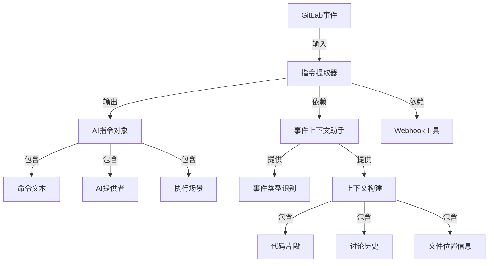
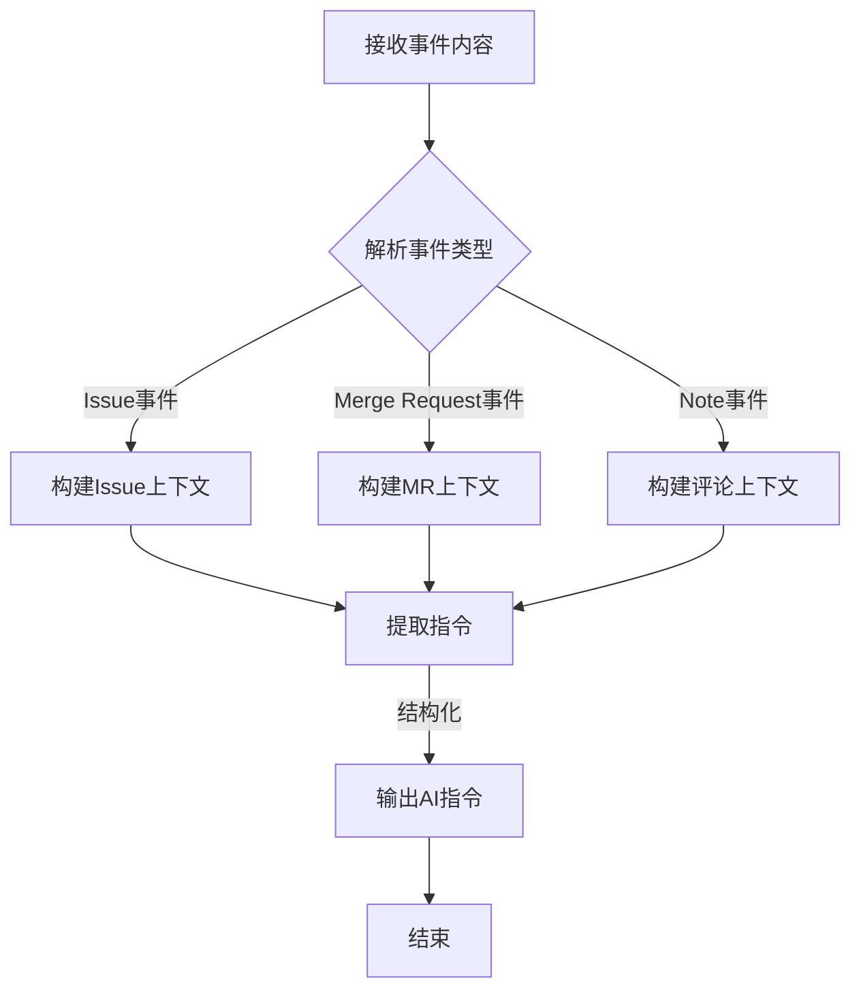
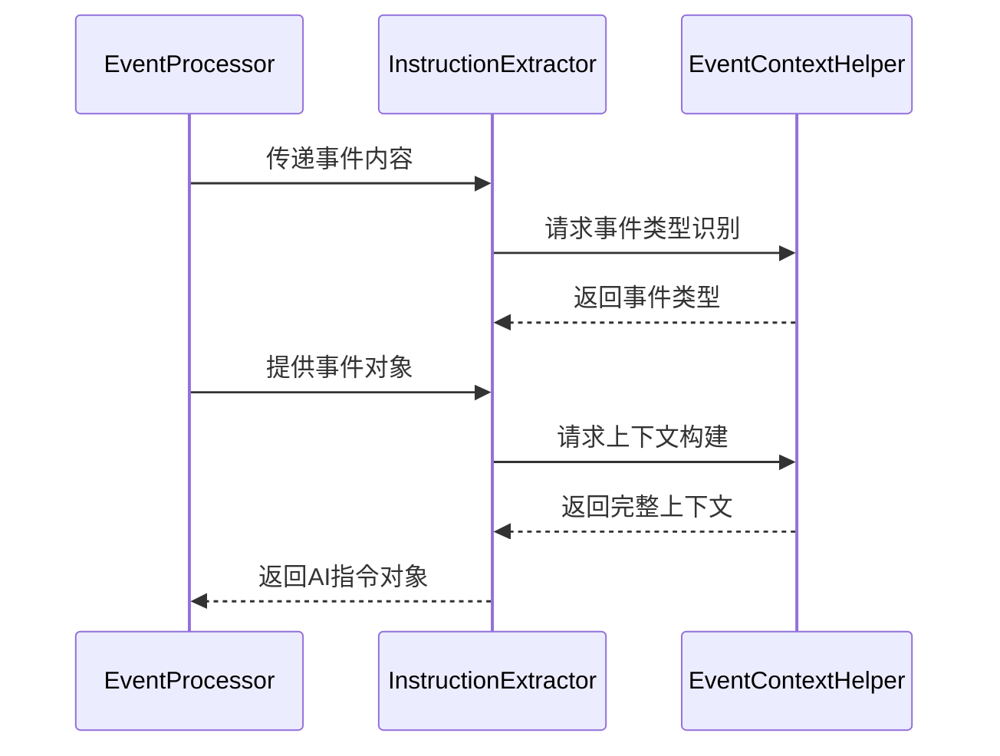
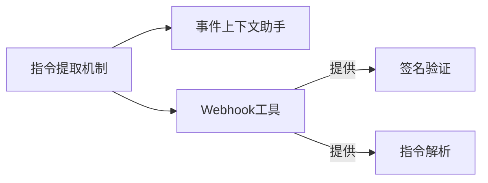

# 指令提取机制 (Instruction Extraction Mechanism)

## 概述
- **作用**：从GitLab Webhook事件内容中智能识别和提取AI指令，为后续执行提供准确的输入参数。
- **使用场景**：当用户通过Issue描述、评论等方式提及AI时，自动解析指令内容和执行参数。
- **核心价值**：通过自然语言处理技术，实现用户意图到AI执行指令的精确转换。

## 快速开始
1. 解析GitLab事件对象，识别事件类型和内容来源
2. 应用正则表达式和关键词匹配识别AI指令标记
3. 构建完整的执行上下文，包括代码变更、讨论历史、文件位置等信息
4. 返回结构化的AI指令对象，包含命令、提供者、上下文等完整信息

## 架构设计

### 系统架构图


### 项目结构
```
src/
├── utils/
│   ├── webhook.ts           # Webhook工具函数
│   └── eventContextHelper.ts # 事件上下文助手
```

### 设计原则
- **智能识别**：支持多种指令触发方式，包括提及、斜杠命令等
- **上下文感知**：根据事件类型和位置信息构建完整的执行环境
- **多模式支持**：识别不同的执行场景（代码开发、文档规范、代码审查等）
- **容错处理**：当无法精确识别指令时，提供合理的默认行为

## 核心组件分析

### 组件1：指令提取器
**文件路径**：`src/utils/webhook.ts`

**职责**：
- 从事件内容中提取AI指令文本
- 识别AI提供者类型（Claude、Codex等）
- 构建执行上下文，包括相关代码文件和讨论内容

**关键要点**：
- 使用正则表达式匹配AI指令标记（@claude、@codex）
- 支持自然语言指令的解析和参数提取
- 自动检测执行场景和模式配置

### 组件2：事件上下文助手
**文件路径**：`src/utils/eventContextHelper.ts`

**职责**：
- 根据事件类型确定上下文构建策略
- 提取讨论线程上下文，支持多轮对话的连贯性

**关键要点**：
- 提供事件类型识别和上下文信息提取功能
- 支持Issue、Merge Request、Note等多种事件类型的上下文构建

## 执行流程

### 业务流程图


### 时序图（关键交互）


### 关键路径说明
1. **事件类型识别**：根据object_kind字段确定事件类型
2. **内容提取**：从不同事件字段中提取指令文本
3. **提供者检测**：根据内容关键词识别AI提供者类型
4. **场景模式判断**：根据指令内容和事件类型确定执行场景
5. **上下文构建**：根据事件位置、讨论历史等信息构建执行环境

## 依赖关系

### 内部依赖


### 外部依赖
- **GitLab事件结构**：依赖GitLab Webhook事件的标准字段定义
- **正则表达式引擎**：用于模式匹配和指令提取

### 依赖注入
通过函数调用方式实现模块间的数据传递，保持轻量级依赖关系

## 使用方式

### 基础用法
1. 事件处理器调用指令提取函数，传递事件对象
2. 提取器解析事件内容，识别AI指令标记
3. 构建完整的执行上下文，包括相关代码文件和讨论内容
4. 返回包含完整执行参数的AI指令对象

### 高级用法
- **多轮对话支持**：通过会话管理器维护历史对话内容
- **自动代码审查触发**：当Merge Request目标分支为develop时自动触发代码审查流程
5. 根据事件类型和内容自动选择执行场景和AI提供者

### API参考
| 方法/属性 | 类型 | 说明 | 使用提示 |
|---------|------|------|----------------|
| extractAiInstructions | (content: string) => AiInstructionResult | 从文本内容中提取AI指令 | 支持自然语言指令和结构化参数提取 |

### 配置选项
- **AI_EXECUTOR**：默认AI执行器配置，支持claude、codex等
- **AI_PROVIDER_DETECTION** | 自动检测AI提供者类型 | 根据关键词匹配识别提供者偏好 |

## 最佳实践与注意事项

### ✅ 推荐做法
1. **明确指令标记**：在Issue描述或评论中明确使用@claude或@codex标记
- **上下文丰富**：提供详细的代码位置、文件路径等信息
- **场景自适应**：根据事件类型自动选择最合适的执行模式

### ❌ 常见陷阱
1. **指令模糊**：用户指令过于模糊可能导致AI无法准确理解意图
   - 现象描述：AI可能无法确定具体要执行什么任务
   - 正确做法：提供清晰、具体的指令描述，包括期望的输出格式和具体需求

2. **上下文缺失**：当无法获取完整的讨论历史时，AI可能缺乏必要的上下文信息
   - 现象描述：AI可能重复询问相同信息或做出错误假设
   - 正确做法：在Issue描述中提供完整的背景信息和具体需求
   - 为什么要避免：确保AI能够基于完整信息做出准确判断和执行

### 性能优化建议
- **智能缓存**：对于频繁访问的上下文信息进行缓存，减少重复计算

### 安全注意事项
- **输入验证**：对所有提取的指令内容进行安全检查和过滤
- **权限控制**：确保指令提取过程符合系统安全策略和权限限制

## 测试策略

### 单元测试示例
需要覆盖各种指令格式和事件类型的组合，确保提取逻辑的准确性和鲁棒性

### 集成测试要点
- 验证不同事件类型下的指令提取准确性
- 测试边界情况和异常输入的处理机制

### 调试技巧
- 启用详细日志可以查看指令提取的详细过程和中间结果

### 性能监控
- **指令提取成功率**：监控指令提取的成功率和错误类型分布
- **性能指标**：记录指令提取的平均响应时间和资源消耗情况

## 扩展性设计

### 扩展点
- **新AI提供者支持**：通过扩展关键词匹配规则支持新的AI模型

### 版本演进
- 当前版本支持Claude和Codex两种AI提供者
- 未来可扩展支持更多AI模型和指令格式

### 相关技术点
- [事件处理器](./事件处理器.md)
- [Webhook签名验证](../网络协议/Webhook签名验证.md)
- [事件上下文助手](../网络协议/事件上下文助手.md)
