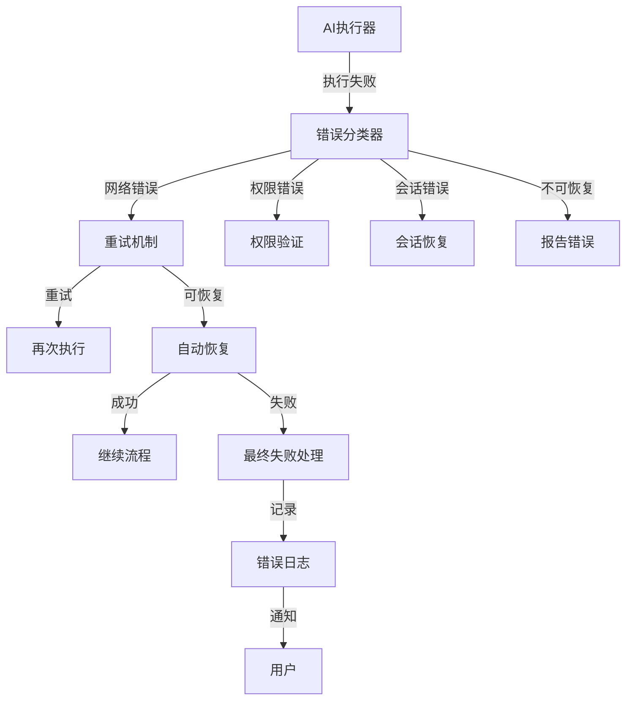
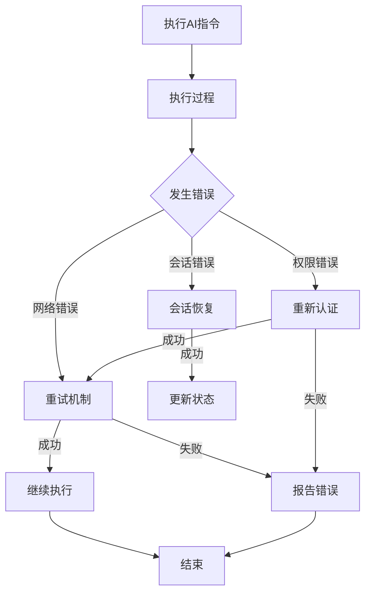
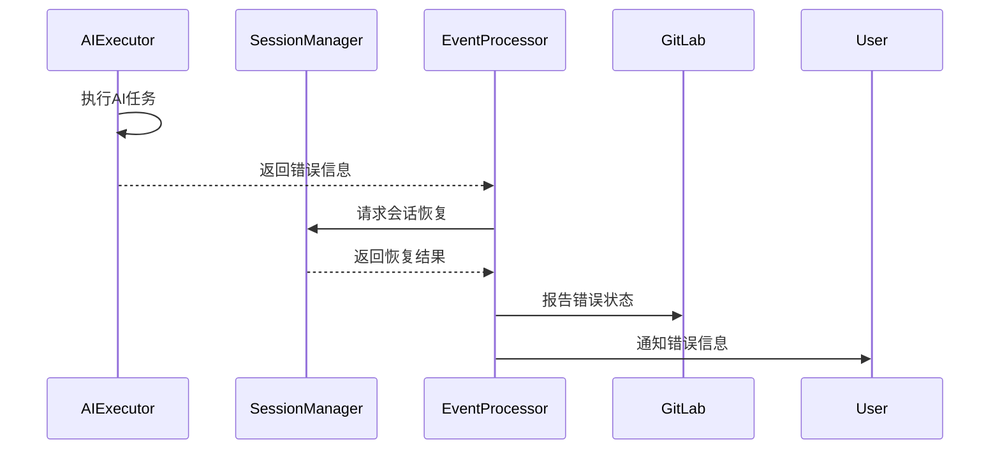
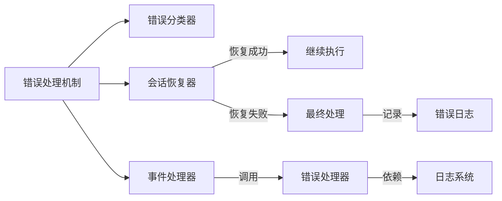

# 错误处理与恢复机制 (Error Handling & Recovery Mechanism)

## 概述
- **作用**：提供系统级的错误处理、状态跟踪和自动恢复能力，确保AI工作流的可靠性和稳定性。
- **使用场景**：当AI执行过程中出现错误、网络异常、权限问题等情况时，确保系统能够优雅处理并尝试恢复。
- **核心价值**：通过完善的错误处理机制，最大程度减少服务中断时间，提升用户体验。

## 快速开始
1. 检测执行过程中的异常情况
2. 根据错误类型分类处理，提供适当的错误信息和恢复建议。

## 架构设计

### 系统架构图


### 项目结构
```
src/
├── services/
│   ├── streamingAiExecutor.ts # 流式AI执行器
│   ├── aiExecutor.ts          # AI执行器
│   └── sessionManager.ts     # 会话管理器
```

### 设计原则
- **分层处理**：在不同层级实现错误处理，从底层网络异常到高层业务逻辑错误
- **自动恢复**：对于可恢复的错误，自动尝试重试和恢复操作
- **状态跟踪**：记录完整的错误处理过程和恢复尝试

## 核心组件分析

### 组件1：错误分类器
**文件路径**：`src/services/streamingAiExecutor.ts`

**职责**：
- 识别和分类不同类型的错误（网络、权限、会话、AI模型等）
- 提供针对性的恢复策略和错误信息

**关键要点**：
- 支持错误类型的智能识别和分类处理
- 提供详细的错误信息和恢复建议

### 组件2：会话恢复器
**文件路径**：`src/services/sessionManager.ts`

**职责**：
- 检测会话相关的错误，如会话过期、会话无效等
- 实现会话的自动恢复机制，包括会话重建和上下文恢复

**关键要点**：
- 支持会话错误的自动检测和恢复尝试
- 提供会话重建和上下文恢复功能，确保多轮对话的连贯性

## 执行流程

### 业务流程图


### 时序图（关键交互）


### 关键路径说明
1. **错误检测**：在执行过程中实时监控异常情况
2. **错误分类**：根据错误特征识别错误类型和严重程度
3. **恢复尝试**：根据错误类型执行相应的恢复策略
4. **状态更新**：根据恢复结果更新系统状态和用户通知
5. **日志记录**：记录完整的错误处理过程和恢复尝试结果

## 依赖关系

### 内部依赖


### 外部依赖
- **GitLab API**：用于错误状态下的API调用重试和权限验证

### 依赖注入
通过函数调用和事件传递实现错误信息的流转和处理

## 使用方式

### 基础用法
1. AI执行器在执行过程中检测到错误
2. 错误分类器识别错误类型和严重程度
- **网络连接**：依赖外部网络环境和服务可用性

## 最佳实践与注意事项

### ✅ 推荐做法
1. **全面错误监控**：在所有关键执行路径上实现错误检测和处理
- **智能恢复策略**：根据错误类型自动选择最合适的恢复方法

### ❌ 常见陷阱
1. **错误信息泄露**：在错误信息中可能包含敏感的系统信息
   - 现象描述：详细的错误信息可能暴露系统内部结构和配置
   - 正确做法：对用户显示友好的错误信息，同时记录详细的错误日志用于调试
   - 为什么要避免：保护系统安全，防止潜在攻击者利用错误信息进行攻击

2. **恢复循环**：某些错误可能无法通过自动恢复解决，需要人工干预
   - 现象描述：系统可能陷入无限的重试循环
   - 正确做法：设置合理的重试次数上限和超时机制

### 性能优化建议
- **错误缓存**：对频繁出现的错误进行缓存，避免重复处理相同错误

### 安全注意事项
- **权限验证**：在错误处理过程中确保所有操作都符合系统安全策略

## 测试策略

### 单元测试示例
需要覆盖各种错误类型和恢复策略的组合测试
- 验证错误分类的准确性和恢复策略的有效性

### 调试技巧
- 启用详细错误日志可以查看错误处理的详细过程和恢复尝试结果

### 性能监控
- **错误率监控**：跟踪系统错误率和错误类型分布
- **恢复成功率**：监控自动恢复机制的成功率和失败原因分析

## 扩展性设计

### 扩展点
- **新错误类型支持**：通过扩展错误分类器支持新的错误类型和恢复策略

### 版本演进
- 当前版本支持网络错误、权限错误、会话错误等常见错误类型
- 未来可扩展支持更多错误类型和更智能的恢复算法

### 相关技术点
- [事件处理器](./事件处理器.md)
- [流式AI执行器](../状态管理/流式AI执行器.md)
- [会话管理器](../状态管理/会话管理器.md)
