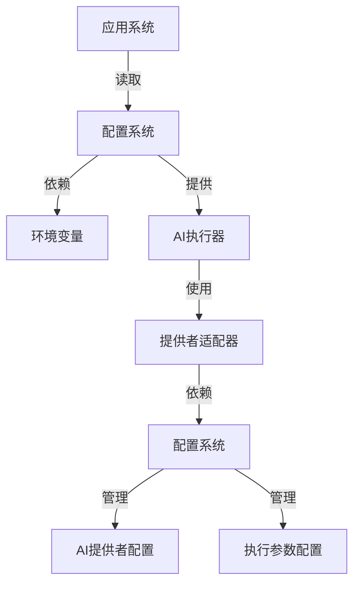
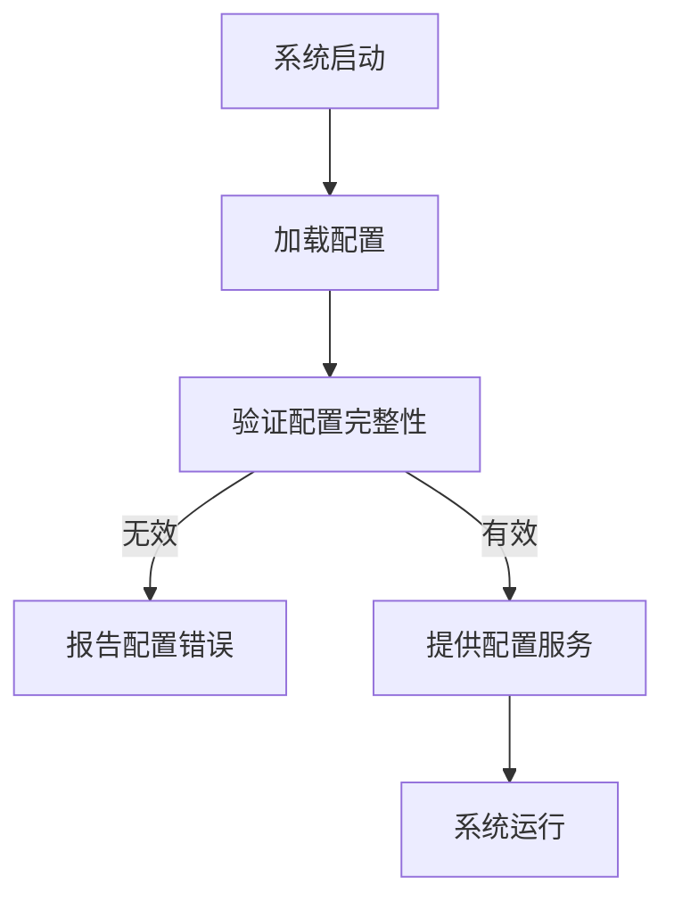
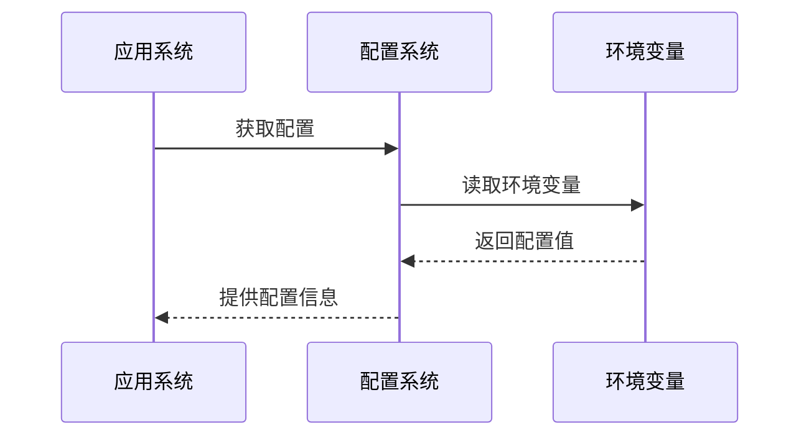
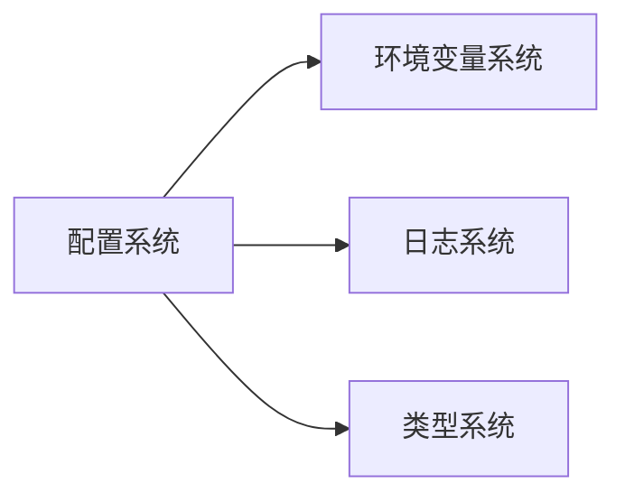

# AI工具配置系统 (AI Tool Configuration System)

## 概述

**作用**：统一管理 AI 工具的配置信息，支持多环境部署和动态配置更新。

**使用场景**：当需要配置 AI 提供者、认证信息、执行参数时使用，确保系统配置的集中管理和安全性。

**核心价值**：通过配置驱动的方式实现 AI 工具的灵活配置和快速切换。

## 快速开始

1. 配置环境变量文件，设置 AI 认证令牌和基础 URL
2. 在系统启动时加载配置，验证配置的完整性
3. 运行时通过配置系统获取必要的执行参数

## 架构设计

### 系统架构图



### 项目结构

```
src/
├── utils/config.ts                 # 配置系统主文件
├── utils/configDebug.ts            # 配置调试工具
└── types/common.ts                 # 通用类型定义
```

### 设计原则

- **配置即代码**：将系统配置作为代码进行版本控制和管理
- **环境隔离**：支持开发、测试、生产等多环境配置
- **安全优先**：敏感信息通过环境变量配置，避免硬编码

**关键设计决策**：
- 采用环境变量作为主要配置源，支持容器化部署
- 实现配置验证机制，确保系统启动时的配置完整性

**架构权衡考虑**：
- 在配置灵活性和安全性之间取得平衡
- 牺牲部分配置便利性换取更好的安全性和可维护性

## 核心组件分析

### 组件1：配置系统主类

**文件路径**：`src/utils/config.ts`

**职责**：
- 统一管理所有 AI 工具相关的配置信息
- 提供类型安全的配置访问接口

**关键要点**：
- 支持配置的懒加载和缓存机制
- 实现配置验证和错误报告机制

### 组件2：AI提供者配置

**文件路径**：`src/utils/config.ts`

**职责**：
- 管理 Claude 和 Codex 等 AI 提供者的配置信息

**关键要点**：
- 包含认证令牌、基础 URL、超时时间等关键配置项

### 组件3：配置调试工具

**文件路径**：`src/utils/configDebug.ts`

**职责**：
- 提供配置调试和验证功能
- 支持配置信息的格式化输出和验证

## 执行流程

### 业务流程图



### 时序图（关键交互）



### 关键路径说明

1. **配置加载阶段**：系统启动时从环境变量加载所有配置信息
2. **配置验证阶段**：检查必要配置项是否已设置
    App-->>Config: 使用配置
```

## 依赖关系

### 内部依赖



### 外部依赖

- **Node.js 环境变量系统**：进程环境变量管理 - 配置来源
- **操作系统环境**：环境变量存储和访问机制

### 依赖注入

通过单例模式提供全局配置访问，避免重复加载和资源浪费。

## 使用方式

### 基础用法

1. **环境变量配置**：在 .env 文件中设置必要的配置项
2. **配置访问**：通过配置系统提供的接口获取配置信息。

### 高级用法

**动态配置更新**：支持运行时配置更新，通过配置重载机制实现配置的动态调整。

### API参考

| 方法/属性 | 类型 | 说明 | 使用提示 |
|---------|------|------|----------------|
| get | (key: string) => any | 获取配置值 | 支持默认值和类型转换 |
| validate | () => boolean | 验证配置完整性 | 用于系统健康检查和启动验证 |
| debug | () => void | 输出调试信息 | 用于问题排查和配置验证 |

### 配置选项

- **GITLAB_BASE_URL**：GitLab 实例基础 URL，用于 API 调用
- **GITLAB_TOKEN**：GitLab 个人访问令牌，用于身份认证
- **AI_EXECUTOR**：默认 AI 执行器选择
- **ANTHROPIC_AUTH_TOKEN**：Claude AI 认证令牌
- **ANTHROPIC_BASE_URL**：Claude API 基础 URL
- **WORK_DIR**：工作目录路径，用于临时文件存储
- **LOG_LEVEL**：日志级别配置，控制日志输出详细程度
- **MONGODB_URI**：MongoDB 连接字符串
- **ENCRYPTION_KEY**：数据加密密钥，用于敏感信息保护

## 最佳实践与注意事项

### ✅ 推荐做法

1. **环境变量管理**：通过 .env 文件统一管理配置信息
   - 确保配置的一致性和可维护性
   - 支持多环境部署

2. **配置验证机制**：在系统启动时验证关键配置项的完整性
   - 避免配置错误导致的系统异常
   - 提高系统部署的可靠性

### ❌ 常见陷阱

1. **配置项缺失**：必要配置项未设置
   - 现象：系统启动失败或功能异常
   - 正确做法：实现配置验证工具，确保部署前的配置检查

2. **敏感信息泄露**：认证令牌等敏感信息未正确保护
   - 现象：安全漏洞，可能导致未授权访问
   - 正确做法：使用加密存储和访问控制保护敏感配置

### 性能优化建议

- **配置缓存**：对频繁访问的配置项进行缓存优化
- **懒加载机制**：按需加载配置信息，减少启动时间

### 安全注意事项

- **敏感信息加密**：对认证令牌等敏感信息进行加密存储
- **访问控制**：限制配置系统的访问权限，防止未授权访问

## 测试策略

### 单元测试示例

需要覆盖配置系统的所有核心方法，包括配置加载、验证、访问等场景

### 集成测试要点

- 验证配置系统与各业务模块的集成效果
- 测试不同环境下的配置加载和验证过程

### 调试技巧

- **配置调试模式**：通过专用工具输出详细的配置信息

### 性能监控

- **配置加载时间**：监控配置系统初始化的性能表现
- **配置访问频率**：跟踪配置信息的使用模式，优化缓存策略

### 扩展性设计

- **新配置项支持**：在配置系统中添加对新配置项的支持

### 版本演进

- **当前版本的限制**：主要支持环境变量配置方式
- **未来改进方向**：支持多种配置源，如配置文件、数据库、远程配置中心等

### 相关技术点

- [AI提供者适配器](./AI提供者适配器.md)
- [AI执行器架构](./AI执行器架构.md)
- [流式AI执行器](./流式AI执行器.md)
- [数据加密机制](../数据访问/数据加密机制.md)
