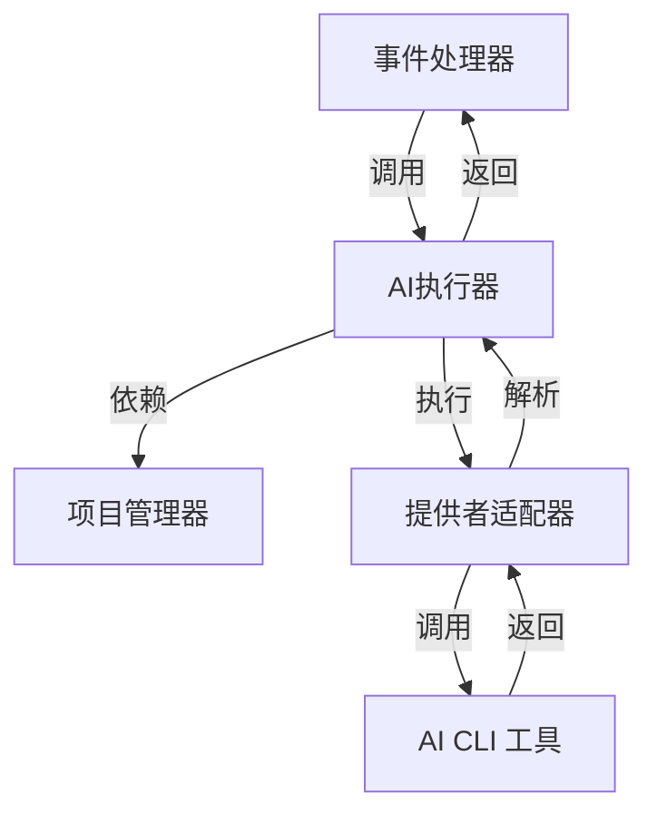
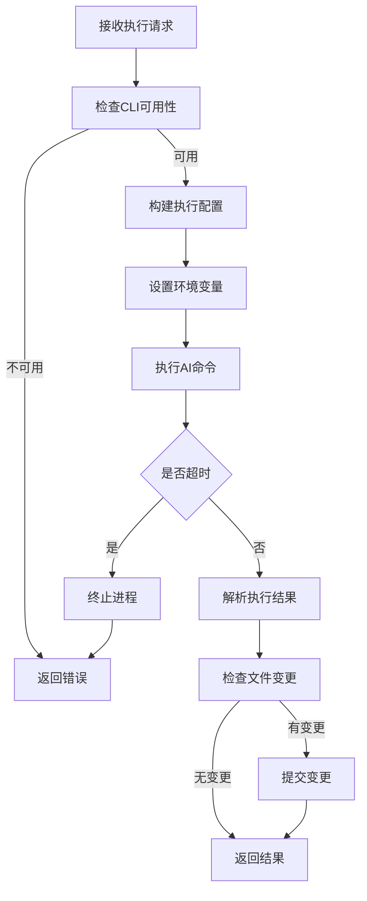
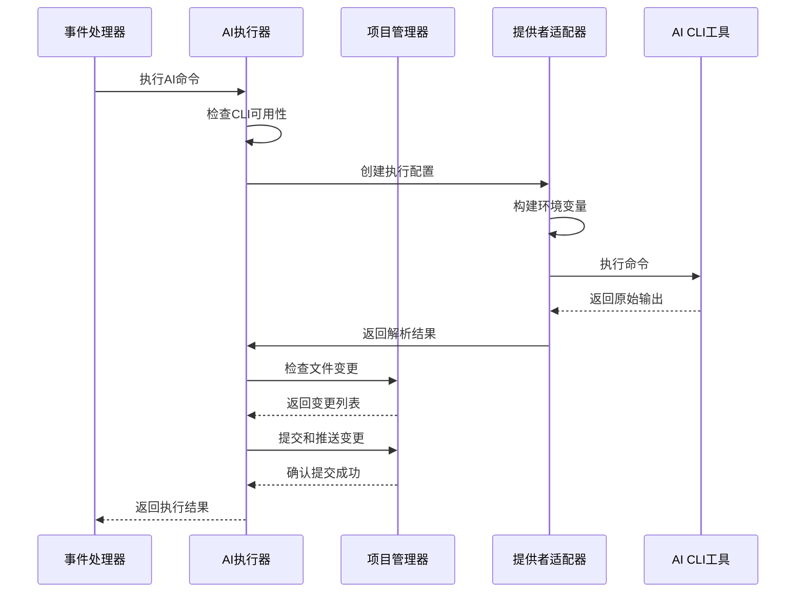
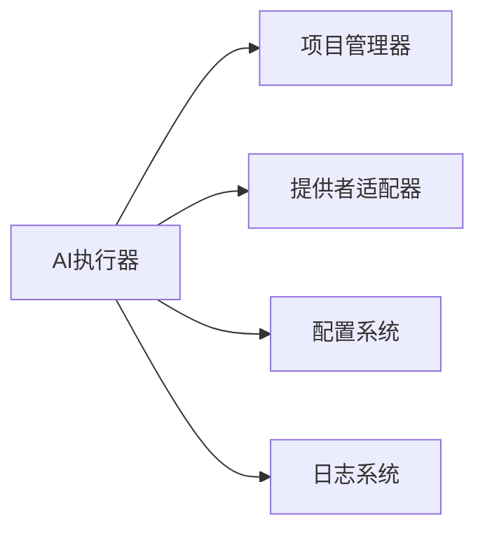

# AI执行器架构 (AI Executor Architecture)

## 概述

**作用**：作为 AI 工具执行的核心调度器，负责管理 AI CLI 命令的执行、超时控制和结果处理。

**使用场景**：当需要执行 AI 命令、管理执行超时、处理文件变更时使用，确保 AI 工作流的可靠执行。

**核心价值**：通过统一的执行接口和错误处理机制，保证 AI 工具执行的稳定性和可观测性。

## 快速开始

1. 初始化 AI 执行器实例，自动创建项目管理器依赖
2. 配置执行超时时间，确保长时间任务的可靠性
3. 执行 AI 命令并处理结果，支持自动提交变更

## 架构设计

### 系统架构图



### 项目结构

```
src/
├── services/aiExecutor.ts         # AI 执行器主文件
├── services/projectManager.ts      # 项目管理器
└── types/aiExecution.ts           # 执行上下文类型定义
```

### 设计原则

- **命令模式**：将 AI 执行请求封装为命令对象
- **责任链模式**：将执行过程分解为多个职责明确的步骤
- **观察者模式**：支持执行进度的实时监控

**关键设计决策**：
- 采用子进程执行 AI CLI 命令，确保执行环境的隔离性
- 实现超时控制机制，防止长时间阻塞
- 提供文件变更检测功能，自动识别 AI 操作的结果

**架构权衡考虑**：
- 在实时性和资源消耗之间取得平衡
- 牺牲部分内存使用换取更好的执行可靠性

## 核心组件分析

### 组件1：AI执行器主类

**文件路径**：`src/services/aiExecutor.ts`

**职责**：
- 管理 AI 命令的完整执行生命周期
- 协调提供者适配器和项目管理器的协作

**关键要点**：
- 支持同步和异步两种执行模式
- 实现 CLI 工具可用性检查，确保执行环境就绪

### 组件2：执行上下文管理

**文件路径**：`src/types/aiExecution.ts`

**职责**：
- 定义 AI 执行所需的上下文信息
- 提供类型安全的执行参数定义

**关键要点**：
- 包含项目 URL、分支信息、执行场景等关键数据
- 支持自定义超时配置，适应不同复杂度的任务

### 组件3：项目管理器集成

**文件路径**：`src/services/projectManager.ts`

**职责**：
- 处理 Git 操作和文件变更检测
- 实现自动提交和推送功能

## 执行流程

### 业务流程图



### 时序图（关键交互）



### 关键路径说明

1. **前置检查阶段**：验证 AI CLI 工具是否可用，避免执行失败
2. **配置构建阶段**：根据提供者类型和上下文构建执行参数
3. **命令执行阶段**：通过子进程执行配置好的命令
4. **结果处理阶段**：解析 AI 输出，检测文件变更
5. **提交阶段**：如果检测到文件变更，自动提交到 Git 仓库
6. **结果返回阶段**：将结构化结果返回给调用方

## 依赖关系

### 内部依赖



### 外部依赖

- **Node.js child_process 模块**：子进程管理 - 命令执行基础
- **Git 命令行工具**：文件变更检测和提交操作
- **AI CLI 工具**：具体的 AI 执行引擎

### 依赖注入

通过构造函数自动创建项目管理器实例，实现依赖的自动管理。配置系统通过环境变量注入，确保灵活性和安全性。

## 使用方式

### 基础用法

1. **初始化执行器**：创建 AI 执行器实例
2. **配置执行上下文**：设置项目信息、分支、超时等参数

### 高级用法

**批量执行模式**：支持同时执行多个 AI 命令，通过队列管理实现并发控制

### API参考

| 方法/属性 | 类型 | 说明 | 使用提示 |
|---------|------|------|----------------|
| execute | (command, projectPath, context) => Promise<ProcessResult> | 执行AI命令 | 处理超时和错误恢复 |
| executeWithCommit | (command, projectPath, context, commitMessage?) => Promise<ProcessResult> | 执行并自动提交变更 | 确保有足够的权限进行Git操作 |
| checkCliAvailability | (provider) => Promise<void> | 检查CLI工具可用性 | 用于系统健康检查和预验证 |
| getExecutorName | (provider) => string | 获取执行器名称 | 用于日志记录和用户反馈 |

### 配置选项

- **默认超时时间**：30分钟，确保长时间任务的可靠性
- **执行器选择策略**：根据配置或用户指令确定使用的 AI 提供者

## 最佳实践与注意事项

### ✅ 推荐做法

1. **超时配置优化**：根据任务复杂度调整超时时间
   - 简单任务：5-10分钟
   - 复杂任务：30分钟或更长
- **环境变量管理**：通过配置系统统一管理 AI 认证信息
   - 避免执行过程中断
   - 提高系统可靠性

2. **执行环境隔离**：为每个执行任务创建独立的子进程
   - 确保执行环境的纯净性
   - 防止资源冲突

### ❌ 常见陷阱

1. **CLI工具未安装**：系统无法找到 AI CLI 工具
   - 现象：执行失败，返回命令未找到错误
   - 正确做法：在部署时确保所有必要的 CLI 工具已正确安装

2. **权限不足**：Git 操作权限不足导致提交失败
   - 现象：执行成功但无法提交变更
   - 正确做法：确保系统用户具有足够的 Git 操作权限

### 性能优化建议

- **子进程复用**：在频繁执行的场景下考虑进程池机制
- **缓存机制**：对频繁使用的配置进行缓存优化

### 安全注意事项

- **执行超时控制**：防止恶意或异常任务长时间占用系统资源
- **资源限制**：对 AI 执行过程进行资源监控和限制

## 测试策略

### 单元测试示例

需要覆盖执行器的所有核心方法，包括正常执行、超时处理、错误恢复等场景

### 集成测试要点

- 验证 AI 执行器与提供者适配器的集成效果
- 测试不同超时配置下的执行行为
- 验证文件变更检测的准确性

### 调试技巧

- **详细日志输出**：通过 LOG_LEVEL=debug 查看执行过程的详细信息

### 性能监控

- **执行成功率**：监控 AI 命令执行的整体成功率
- **平均执行时间**：跟踪不同任务类型的执行效率
- **资源使用监控**：监控子进程的内存和 CPU 使用情况
- **超时事件统计**：记录超时事件的发生频率和原因

## 扩展性设计

### 扩展点

- **新执行策略**：支持不同的执行模式，如批量执行、流水线执行等

### 版本演进

- **当前版本的限制**：主要支持单命令执行模式
- **未来改进方向**：支持分布式执行、负载均衡等高级特性

### 相关技术点

- [AI提供者适配器](./AI提供者适配器.md)
- [项目管理器](../数据访问/存储库模式实现.md)
- [流式AI执行器](../状态管理/流式AI执行器.md)
- [会话管理器](../状态管理/会话管理器.md)
