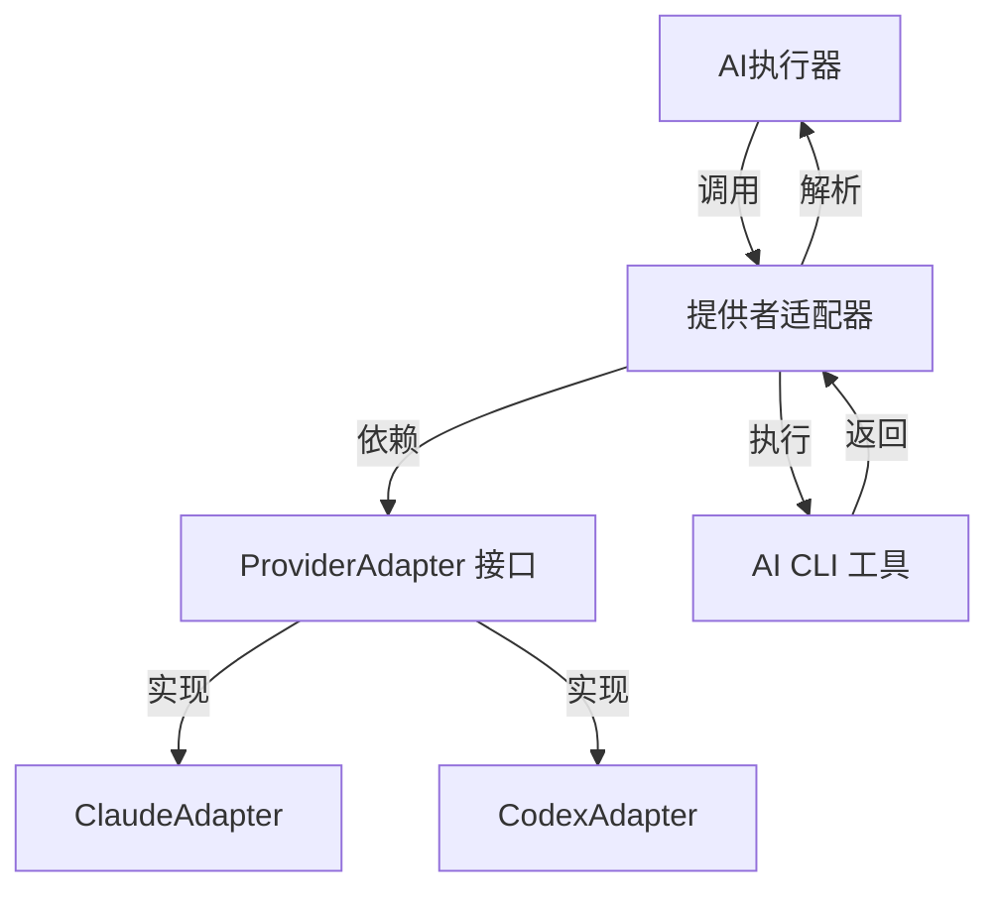
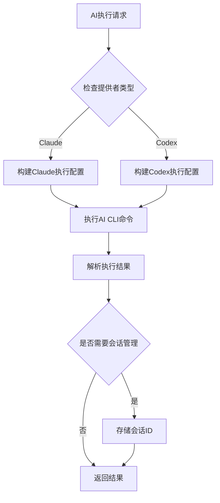
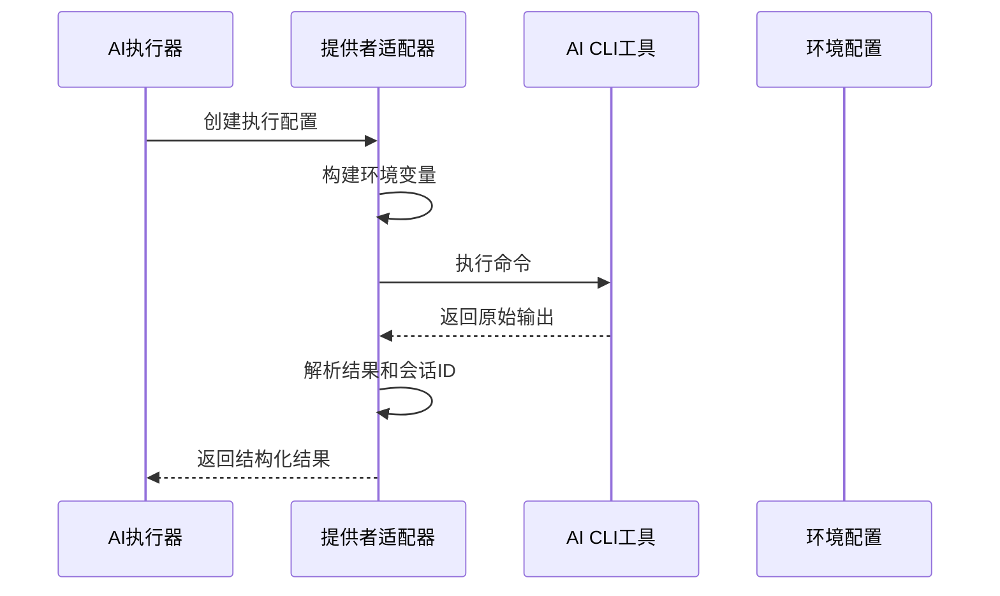
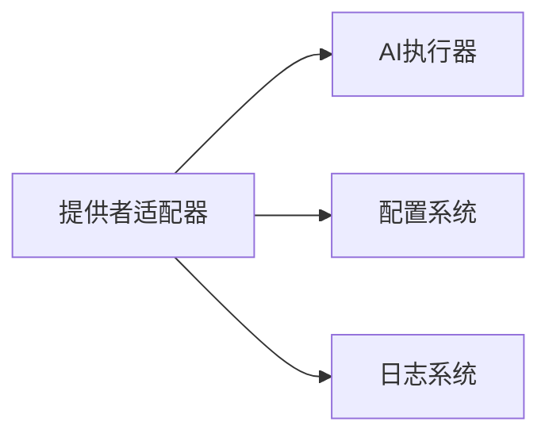

# AI提供者适配器 (AI Provider Adapter)

## 概述

**作用**：为不同的 AI CLI 工具提供统一的接口抽象，实现多 AI 模型的灵活切换和扩展。

**使用场景**：当需要集成新的 AI 模型或切换现有 AI 提供者时使用，确保系统能够无缝对接不同的 AI 执行环境。

**核心价值**：通过适配器模式实现 AI 工具的标准化接入，降低系统与具体 AI 实现的耦合度。

## 快速开始

1. 创建新的 AI 提供者适配器类，继承 ProviderAdapter 基类
2. 实现 getBinary、buildEnv、createExecutionConfig 等核心方法
3. 在系统配置中注册新的提供者标识符
4. 通过环境变量配置相应的认证令牌和基础 URL

## 架构设计

### 系统架构图



### 项目结构

```
src/
├── services/providers/          # 提供者适配器层
│   ├── providerAdapter.ts       # 适配器接口定义
│   ├── claudeAdapter.ts         # Claude AI 适配器
│   └── codexAdapter.ts          # Codex AI 适配器
```

### 设计原则

- **适配器模式**：为不同的 AI CLI 工具提供统一的编程接口
- **依赖倒置原则**：高层模块不依赖低层模块，二者都依赖抽象
- **开闭原则**：对扩展开放，对修改关闭

**关键设计决策**：
- 采用接口隔离原则，每个适配器只负责一个 AI 提供者
- 通过环境变量注入配置，避免硬编码
- 支持会话恢复机制，实现长对话的连续性

**架构权衡考虑**：
- 在统一接口和保持各 AI 工具特性之间取得平衡
- 牺牲部分性能换取更好的扩展性和维护性

## 核心组件分析

### 组件1：ProviderAdapter 接口

**文件路径**：`src/services/providers/providerAdapter.ts`

**职责**：
- 定义所有 AI 提供者适配器必须实现的契约
- 提供类型安全的接口定义

**关键要点**：
- 定义了 ProviderId 类型，支持 'claude' 和 'codex' 两种标识符
- 规范了执行配置构建、环境变量设置、结果解析等核心操作
- 通过泛型设计支持多种 AI 执行结果类型

### 组件2：ClaudeAdapter 实现

**文件路径**：`src/services/providers/claudeAdapter.ts`

**职责**：
- 实现 Claude AI CLI 工具的具体集成逻辑
- 处理 Claude 特有的会话管理和工具权限控制

**关键要点**：
- 支持 Claude 的会话恢复机制，通过 session_id 保持对话连续性
- 实现权限模式切换，支持不同场景下的工具使用策略
- 提供进度消息提取功能，支持实时状态更新

### 组件3：CodexAdapter 实现

**文件路径**：`src/services/providers/codexAdapter.ts`

**职责**：
- 实现 Codex AI CLI 工具的具体集成逻辑
- 处理 Codex 特有的执行参数和环境配置

**关键要点**：
- 针对 Codex CLI 的非交互式执行模式进行优化
- 支持本地认证机制，从用户主目录读取认证信息

## 执行流程

### 业务流程图



### 时序图（关键交互）



### 关键路径说明

1. **配置构建阶段**：AI 执行器根据请求的提供者类型选择对应的适配器
2. **环境配置阶段**：适配器构建适合特定 AI 工具的执行环境
3. **命令执行阶段**：通过子进程执行 AI CLI 命令
4. **结果解析阶段**：适配器将原始输出解析为结构化数据
5. **会话管理阶段**：如果支持会话，提取并存储会话标识符

## 依赖关系

### 内部依赖



### 外部依赖

- **AI CLI 工具**：Claude Code CLI 或 Codex CLI - 核心执行引擎
- **Node.js child_process**：子进程管理 - 命令执行基础
- **环境变量系统**：配置注入 - 认证和基础URL配置

### 依赖注入

通过构造函数注入和配置系统实现依赖解耦，适配器通过配置获取必要的认证信息，避免直接依赖外部服务。

## 使用方式

### 基础用法

1. **选择提供者**：根据用户指令或配置确定使用的 AI 提供者
2. **构建配置**：适配器根据执行上下文构建具体的 CLI 参数
3. **执行命令**：通过子进程执行配置好的 AI 命令
4. **处理结果**：解析 AI 输出，提取文本内容和会话标识符

### 高级用法

**多提供者协同**：在复杂场景下，可以同时使用多个 AI 提供者，通过负载均衡或任务分发策略实现最优执行。

### API参考

| 方法/属性 | 类型 | 说明 | 使用提示 |
|---------|------|------|----------------|
| getBinary | () => string | 获取 CLI 二进制文件名 | 确保系统 PATH 中包含相应二进制文件 |
| buildEnv | (baseEnv: NodeJS.ProcessEnv) => NodeJS.ProcessEnv | 构建执行环境变量 | 处理认证令牌和基础URL配置 |
| createExecutionConfig | (payload, context, options) => ProviderExecutionConfig | 构建执行配置 | 根据场景配置不同的权限模式和输出格式 |
| parseResult | (rawOutput: string) => ParsedExecutionResult | 解析原始输出为结构化数据 | 处理 JSON 解析和错误恢复 |
| extractProgressMessage | (buffer: string) => string | 提取进度消息 | 用于实时状态更新和用户反馈 |

### 配置选项

- **ANTHROPIC_AUTH_TOKEN**：Claude AI 认证令牌，用于身份验证
- **ANTHROPIC_BASE_URL**：Claude API 基础 URL，支持自定义部署
- **输出格式配置**：支持文本和 JSON 两种输出格式
- **权限模式配置**：根据执行场景配置不同的工具权限级别

## 最佳实践与注意事项

### ✅ 推荐做法

1. **统一接口设计**：所有适配器遵循相同的接口规范
   - 确保新提供者的快速集成
   - 降低系统维护成本

2. **环境变量管理**：通过配置系统统一管理敏感信息
   - 避免硬编码认证信息
   - 支持多环境部署

### ❌ 常见陷阱

1. **二进制文件不可用**：系统 PATH 中未包含 AI CLI 工具
   - 现象：执行失败，无法找到命令
   - 正确做法：在系统部署时确保 CLI 工具正确安装和配置
   - 为什么要避免：会导致整个 AI 执行流程中断

2. **认证令牌过期**：AI 服务认证令牌失效
   - 现象：执行返回认证错误
   - 正确做法：定期更新认证令牌，实现自动续期机制

### 性能优化建议

- **会话复用**：利用会话恢复机制避免重复初始化
- **缓存机制**：对频繁使用的配置进行缓存，减少重复构建

### 安全注意事项

- **敏感信息保护**：认证令牌通过环境变量配置，避免泄露
- **权限控制**：根据执行场景限制 AI 工具的使用权限

## 测试策略

### 单元测试示例

需要覆盖适配器接口的所有方法实现，包括正常执行路径和异常处理路径。Mock AI CLI 执行过程，验证参数构建、环境配置和结果解析的正确性。

### 集成测试要点

- 验证适配器与真实 AI CLI 工具的集成效果
- 测试不同场景下的执行配置生成逻辑

### 调试技巧

- **启用调试日志**：通过 LOG_LEVEL=debug 查看详细的执行过程
- **环境变量检查**：确认必要的认证信息已正确配置

### 性能监控

- **执行成功率**：监控 AI 命令执行的成功率
- **执行时间监控**：跟踪不同提供者的执行性能
- **会话使用率**：监控会话机制的利用情况

## 扩展性设计

### 扩展点

- **新提供者集成**：创建新的适配器类并实现 ProviderAdapter 接口
- **配置扩展**：在系统配置中添加新的提供者标识符

### 版本演进

- **当前版本的限制**：仅支持 Claude 和 Codex 两种提供者
- **未来改进方向**：支持更多 AI 模型，如 GPT、Gemini 等

### 相关技术点

- [AI执行器](../异步任务/AI执行器.md)
- [流式AI执行器](../状态管理/流式AI执行器.md)
- [会话管理器](../状态管理/会话管理器.md)
