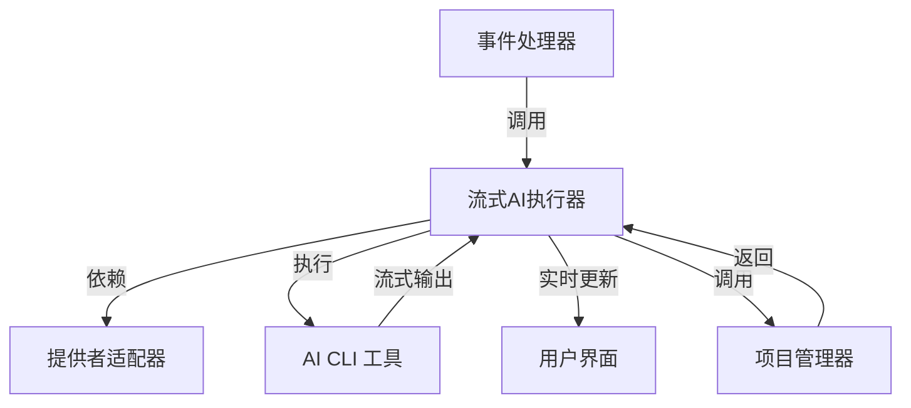
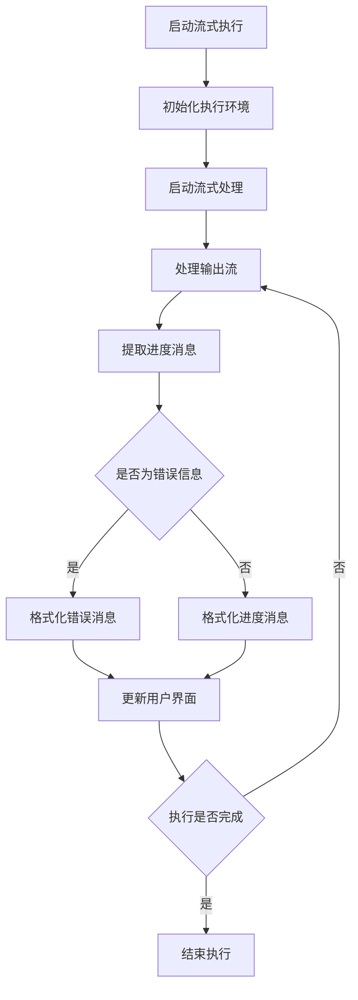
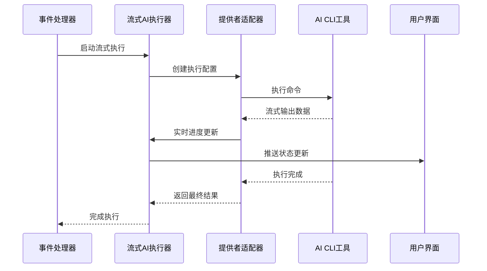
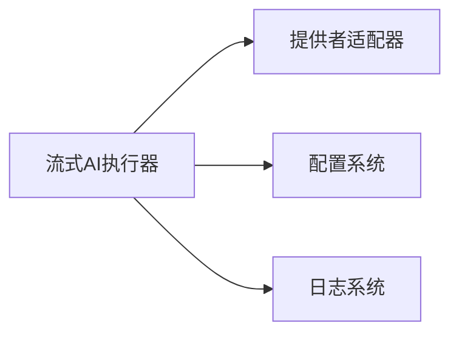

# 流式AI执行器 (Streaming AI Executor)

## 概述

**作用**：提供实时流式 AI 执行能力，支持执行进度的持续更新和用户反馈。

**使用场景**：当需要长时间 AI 执行任务，并实时向用户反馈执行进度和中间结果时使用。

**核心价值**：通过流式处理机制实现 AI 执行过程的实时可见性，提升用户体验和系统交互性。

## 快速开始

1. 初始化流式 AI 执行器实例
2. 配置流式执行参数和回调函数
3. 启动流式执行，实时接收进度更新

## 架构设计

### 系统架构图



### 项目结构

```
src/
├── services/streamingAiExecutor.ts   # 流式AI执行器主文件
└── types/aiExecution.ts                   # 执行上下文类型定义
```

### 设计原则

- **观察者模式**：支持多个观察者订阅执行进度
- **流式处理**：实时处理 AI 输出，支持增量更新

**关键设计决策**：
- 采用事件驱动架构，实时推送执行状态
- 实现进度消息提取和格式化，提供用户友好的反馈信息

**架构权衡考虑**：
- 在实时性和系统资源消耗之间取得平衡
- 牺牲部分内存使用换取更好的用户体验

## 核心组件分析

### 组件1：流式AI执行器主类

**文件路径**：`src/services/streamingAiExecutor.ts`

**职责**：
- 管理流式执行的生命周期
- 处理实时进度更新和错误恢复

**关键要点**：
- 支持进度消息的实时提取和格式化
- 实现执行状态的持续监控和报告

### 组件2：进度消息处理器

**文件路径**：`src/services/streamingAiExecutor.ts`

**职责**：
- 从 AI 输出缓冲区提取有意义的进度信息
- 过滤调试信息和错误信息，提供用户友好的状态更新

**关键要点**：
- 实现智能消息过滤，区分正常输出和错误信息
- 支持进度消息的格式化，包括表情符号和状态指示

## 执行流程

### 业务流程图



### 时序图（关键交互）



### 关键路径说明

1. **初始化阶段**：设置流式执行环境和参数
2. **流式处理阶段**：持续接收和处理 AI 输出
3. **进度更新阶段**：实时提取和格式化进度消息
4. **用户反馈阶段**：通过用户界面实时显示执行进度
5. **完成处理阶段**：收集最终执行结果并返回

## 依赖关系

### 内部依赖



### 外部依赖

- **AI CLI 工具**：支持流式输出的 AI 命令行工具
- **Node.js 流处理**：标准输出和错误流的实时处理

### 依赖注入

通过构造函数注入必要的依赖，包括提供者适配器和配置系统。

## 使用方式

### 基础用法

1. **创建执行器实例**：初始化流式 AI 执行器
2. **配置回调函数**：设置进度更新和完成处理的回调

### 高级用法

**多观察者模式**：支持多个组件同时订阅执行进度，如日志系统、用户界面等

### API参考

| 方法/属性 | 类型 | 说明 | 使用提示 |
|---------|------|------|----------------|
| executeWithStream | (command, projectPath, context, callbacks) => Promise<ProcessResult> | 执行流式AI命令 | 处理实时进度更新和错误恢复 |
| extractProgressMessage | (buffer: string) => string | 提取进度消息 | 智能过滤调试信息和错误信息 |
| onProgress | (message: string) => void | 进度更新回调 | 用于实时用户反馈 |
| onComplete | (result: ProcessResult) => void | 执行完成回调 | 处理最终结果和错误处理 |

### 配置选项

- **流式输出缓冲区大小**：控制内存使用和实时性平衡
- **进度消息格式化规则**：定义如何将原始输出转换为用户友好的消息 |

## 最佳实践与注意事项

### ✅ 推荐做法

1. **实时反馈优化**：确保进度消息的及时性和准确性
   - 提高用户对系统状态的感知
   - 增强系统交互性

2. **错误处理策略**：实时检测和报告执行错误
   - 及时通知用户问题
   - 支持快速故障排除

### ❌ 常见陷阱

1. **内存泄漏**：长时间流式执行可能导致内存使用持续增长
   - 现象：系统内存使用率持续上升
   - 正确做法：实现缓冲区清理机制和内存监控

2. **输出缓冲区溢出**：大量输出可能导致缓冲区溢出
   - 现象：执行异常或系统崩溃
   - 正确做法：设置合理的缓冲区大小和清理策略

### 性能优化建议

- **缓冲区管理**：实现智能缓冲区清理和内存回收机制

### 安全注意事项

- **资源限制**：对流式执行过程进行资源监控和限制

## 测试策略

### 单元测试示例

需要覆盖流式执行的所有关键路径，包括正常流式输出、错误检测、进度更新等场景

### 集成测试要点

- 验证流式执行器与提供者适配器的集成效果
- 测试不同输出量下的性能表现和稳定性

### 调试技巧

- **详细执行日志**：通过调试模式查看流式处理的详细过程

### 性能监控

- **流式执行成功率**：监控流式执行的整体可靠性
- **内存使用监控**：跟踪流式执行过程中的资源消耗情况

### 扩展性设计

- **新流式处理策略**：支持不同的流式处理模式

### 版本演进

- **当前版本的限制**：主要支持单任务流式执行
- **未来改进方向**：支持多任务并发流式执行

### 相关技术点

- [AI提供者适配器](./AI提供者适配器.md)
- [AI执行器架构](./AI执行器架构.md)
- [会话管理器](../状态管理/会话管理器.md)
