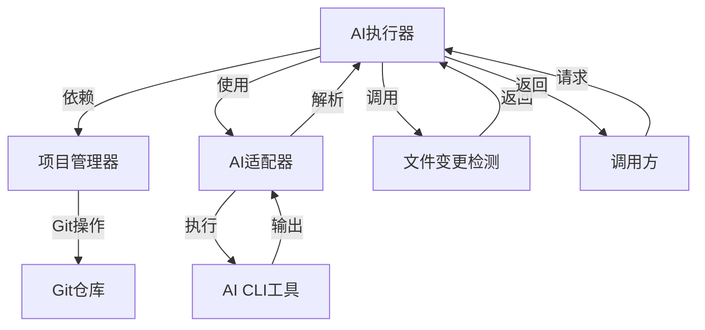
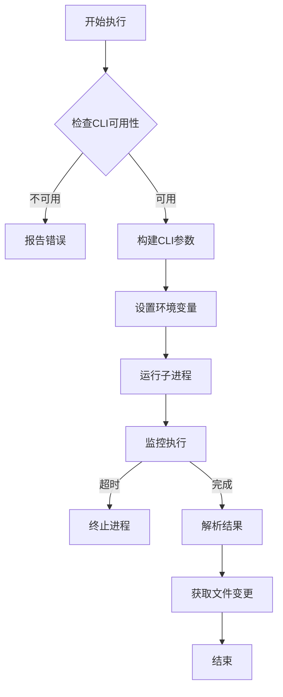
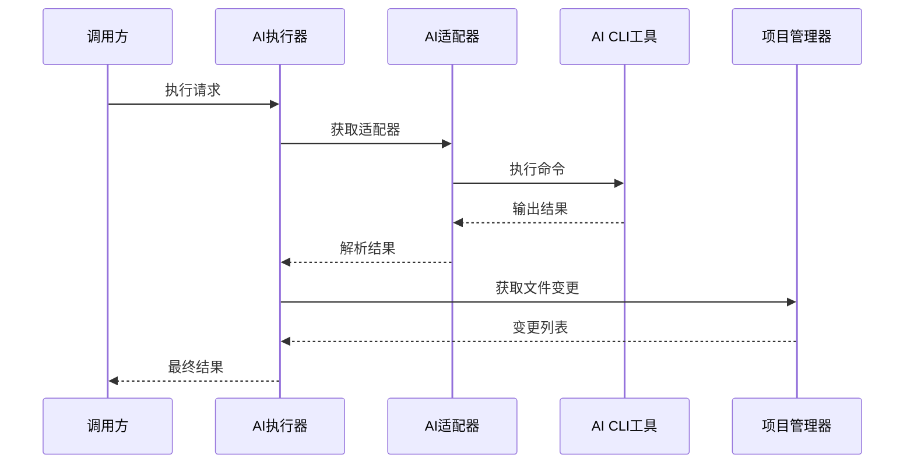
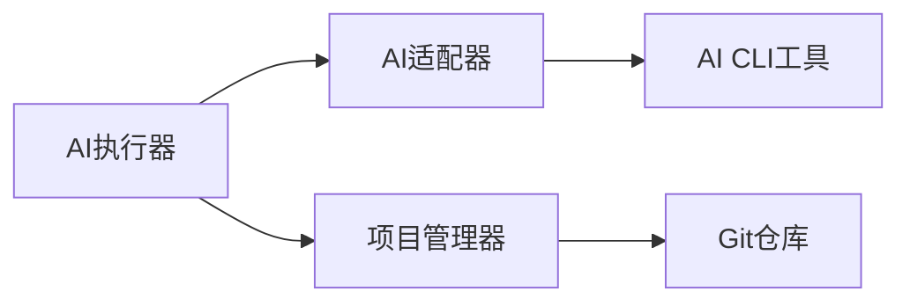

# AI执行器 (AI Executor)

## 概述

### 作用
AI执行器是GitLab AI Copilot的基础AI任务执行组件，负责执行AI CLI工具并管理执行生命周期，包括超时控制、错误处理和结果解析。

### 使用场景
- 执行单次AI代码生成任务
- 处理不需要实时进度反馈的简单AI任务
- 作为流式AI执行器的底层实现基础

### 核心价值
- **统一接口**：为不同AI提供商提供一致的执行接口
- **生命周期管理**：完整的执行过程控制和状态跟踪
- **结果标准化**：统一的输出格式和错误处理机制

## 快速开始
1. 创建AI执行器实例，自动初始化项目管理器
2. 准备执行上下文，包括项目信息、分支配置和超时设置
3. 调用执行方法，传入AI指令和配置参数
4. 处理执行结果，包括成功输出和错误信息

## 架构设计

### 系统架构图


### 项目结构
```
src/
├── services/
│   ├── aiExecutor.ts           # 主执行器
│   ├── projectManager.ts         # 项目管理
│   └── providers/                 # AI适配器
│       ├── claudeAdapter.ts
│       ├── codexAdapter.ts
│       └── providerAdapter.ts
```

### 设计原则
- **工厂模式**：通过配置自动选择AI提供商适配器
- **模板方法模式**：定义标准化的执行流程
- **异常处理**：完善的错误捕获和恢复机制

## 核心组件分析

### 组件1：AI执行器 (AiExecutor)
**文件路径**：`src/services/aiExecutor.ts`

**职责**：
- 管理AI CLI工具的可用性检查
- 控制执行超时和进程管理
- 提供文件变更检测和提交功能

**关键要点**：
- 采用子进程管理机制执行AI CLI工具
- 实现统一的超时控制和错误处理机制
- 支持自动提交和推送AI生成的代码变更

### 组件2：AI适配器 (ProviderAdapter)
**文件路径**：`src/services/providers/providerAdapter.ts`

**职责**：
- 封装不同AI提供商的CLI工具接口差异
- 提供环境变量配置和参数构建功能
- 处理不同提供商的输出格式差异

### 组件3：项目管理器 (ProjectManager)
**文件路径**：`src/services/projectManager.ts`

**职责**：
- 管理Git工作区的状态和变更
- 检测AI执行过程中产生的文件修改
- 执行代码提交和推送操作

## 执行流程

### 业务流程图


### 时序图（关键交互）


### 关键路径说明
1. **CLI可用性检查**：通过版本命令验证AI CLI工具是否可用
2. **参数构建**：根据AI提供商构建不同的CLI参数
3. **环境配置**：设置AI提供商特定的环境变量
4. **进程执行**：通过子进程管理机制运行AI命令
5. **结果解析**：将AI输出解析为结构化结果
6. **变更检测**：识别AI执行过程中产生的文件变更

## 依赖关系

### 内部依赖


### 外部依赖
- **Node.js child_process**：用于执行AI CLI工具的子进程管理
- **AI CLI工具**：Claude Code CLI 或 Codex CLI
- **Git**：用于代码版本管理和变更检测

### 依赖注入
通过构造函数参数注入依赖组件，支持在测试时替换为Mock实现，提高代码可测试性

## 使用方式

### 基础用法
1. 创建AI执行器实例，自动初始化项目管理器
2. 准备执行上下文，包括项目路径、分支信息和超时配置
3. 调用执行方法，传入AI指令和配置参数
4. 处理返回的执行结果和文件变更信息

### 高级用法
- **自动提交模式**：使用executeWithCommit方法自动提交和推送变更
2. **自定义超时**：根据任务复杂度设置合适的执行超时时间

### API参考
| 方法/属性 | 类型 | 说明 | 使用提示 |
|---------|------|------|----------------|
| execute | (command, projectPath, context) => Promise<ProcessResult> | 基础AI执行 | 适用于单次交互场景 |
| executeWithCommit | (command, projectPath, context, commitMessage?) => Promise<ProcessResult> | 自动提交执行 | 适用于需要自动提交变更的场景 |

### 配置选项
- **默认超时时间**：30分钟，适用于大多数AI代码生成任务
- **CLI参数构建**：根据AI提供商构建不同的命令行参数
- **环境变量配置**：支持AI提供商特定的环境变量设置

## 最佳实践与注意事项

### ✅ 推荐做法
1. **合理设置超时**：根据任务复杂度调整执行超时时间
   - 简单任务：5-10分钟
   - 复杂任务：20-30分钟
   - 适用场景：代码生成、文档编写、问题解答

2. **使用自动提交**：对于需要自动记录AI工作成果的场景
   - 适用场景：自动化代码审查、持续集成流程

### ❌ 常见陷阱
1. **CLI工具不可用**：未正确安装或配置AI CLI工具
   - 现象描述：执行失败，提示CLI工具不可用
   - 正确做法：确保AI CLI工具已正确安装并配置认证信息
   - 为什么要避免：会导致所有AI执行任务失败

2. **超时设置不当**：复杂任务设置过短超时时间
   - 现象描述：任务执行被强制终止
   - 正确做法：根据任务复杂度合理设置超时时间

### 性能优化建议
- **进程管理优化**：合理设置子进程资源限制，避免系统资源耗尽
- **缓存策略**：对于重复性任务，考虑实现结果缓存机制

### 安全注意事项
- **认证信息保护**：AI提供商认证信息通过环境变量安全传递
- **执行隔离**：确保AI执行过程不会影响系统稳定性

## 测试策略

### 单元测试示例
需要覆盖CLI可用性检查、参数构建、进程执行和结果解析等关键环节，重点验证超时控制和错误处理机制的正确性

### 集成测试要点
- 验证与项目管理器的集成协作
- 测试文件变更检测的准确性
- 验证自动提交功能的可靠性

### 调试技巧
- 开启调试日志查看详细的执行过程
- 检查AI CLI工具的版本兼容性和认证状态
- 验证不同AI提供商适配器的兼容性

### 性能监控
- **执行成功率**：监控AI执行的成功率指标
- **平均执行时间**：跟踪不同任务的执行时间分布

## 扩展性设计

### 扩展点
- **新的AI提供商**：通过实现ProviderAdapter接口添加新的AI提供商支持
- **自定义结果解析**：支持扩展不同的输出解析策略

### 版本演进
- **当前版本的限制**：仅支持Claude和Codex两种AI提供商
- **未来改进方向**：支持更多AI提供商，优化执行性能

### 相关技术点
- [流式AI执行器](./流式AI执行器.md)
- [项目管理器](../状态管理/会话管理器.md)

## 总结

AI执行器作为GitLab AI Copilot的基础执行组件，提供了统一的AI任务执行接口和完整的生命周期管理能力。通过合理的架构设计和扩展性考虑，为系统提供了稳定可靠的AI执行基础。
