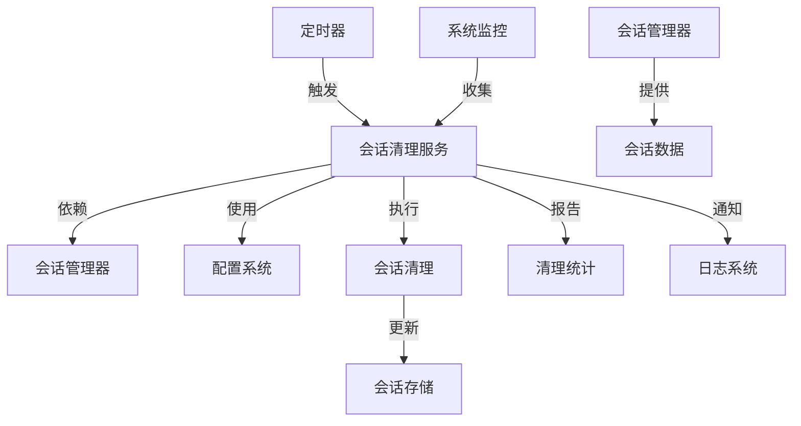
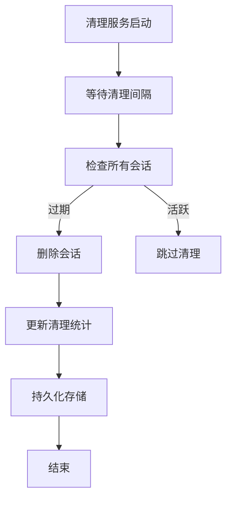
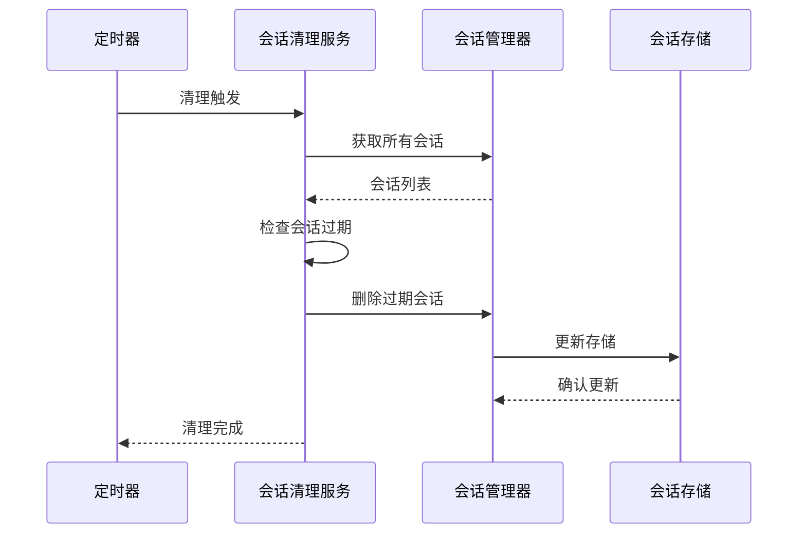
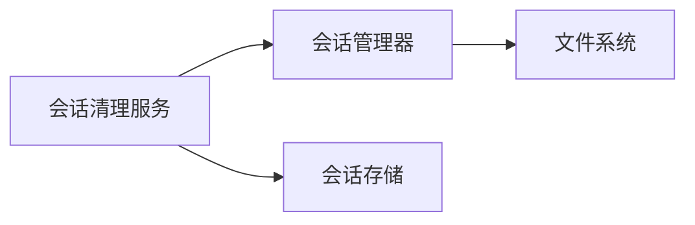

# 会话清理服务 (Session Cleanup Service)

## 概述

### 作用
会话清理服务是GitLab AI Copilot的异步任务维护组件，负责定期清理过期会话、回收系统资源并维护会话存储的整洁性。

### 使用场景
- 定期清理超过最大空闲时间的过期会话
- 维护会话存储的容量在合理范围内
- 处理会话数据的迁移和格式升级

### 核心价值
- **资源回收**：自动清理过期会话，释放内存和存储空间
- **系统稳定性**：防止会话数据无限增长导致系统性能下降
- **数据一致性**：确保会话存储中只保留有效的活跃会话

## 快速开始
1. 创建会话清理服务实例，配置清理间隔和会话管理策略
2. 启动清理服务，开始定期执行会话清理任务
3. 监控清理服务的运行状态和性能指标

## 架构设计

### 系统架构图


### 项目结构
```
src/
├── services/
│   ├── sessionCleanupService.ts   # 主清理服务
│   ├── sessionManager.ts           # 会话管理器
│   └── sessionStore.ts               # 会话存储
```

### 设计原则
- **定时任务模式**：通过定时器定期执行清理操作
- **观察者模式**：监控会话状态变化
- **策略模式**：支持不同的清理策略

## 核心组件分析

### 组件1：会话清理服务 (SessionCleanupService)
**文件路径**：`src/services/sessionCleanupService.ts`

**职责**：
- 定期检查并清理过期会话
- 维护会话存储的容量在合理范围内
- 提供清理统计和性能监控数据

**关键要点**：
- 采用定时器机制定期执行清理任务
- 实现会话数据的迁移和格式升级
- 支持多租户的会话清理隔离

### 组件2：会话管理器 (SessionManager)
**文件路径**：`src/services/sessionManager.ts`

**职责**：
- 提供会话数据的访问和管理接口
- 支持会话状态的批量清理操作
- 处理会话存储的容量管理和优化

### 组件3：会话存储 (SessionStore)
**文件路径**：`src/services/sessionStore.ts`

**职责**：
- 提供会话数据的持久化存储能力
- 支持会话数据的批量删除操作
- 维护会话存储的完整性和一致性

## 执行流程

### 业务流程图


### 时序图（关键交互）


### 关键路径说明
1. **定时触发**：根据配置的清理间隔定期执行清理任务
2. **会话状态检查**：验证每个会话是否超过最大空闲时间
3. **批量清理操作**：一次性删除所有过期会话
4. **统计更新**：记录清理操作的详细统计信息

## 依赖关系

### 内部依赖


### 外部依赖
- **定时器系统**：用于定期触发清理任务
- **配置系统**：获取清理间隔和会话超时配置

### 依赖注入
通过构造函数参数注入会话管理器组件，支持不同的会话管理策略

## 使用方式

### 基础用法
1. 创建会话清理服务实例，配置清理间隔和会话管理策略
2. 启动清理服务，开始定期执行会话清理任务
3. 监控清理服务的运行状态和性能指标

### 高级用法
- **自定义清理策略**：支持基于不同条件的会话清理规则
2. **会话数据迁移**：处理会话存储格式的升级和兼容性

### API参考
| 方法/属性 | 类型 | 说明 | 使用提示 |
|---------|------|------|----------------|
| start | () => void | 启动清理服务 | 开始定期执行清理任务 |
| stop | () => void | 停止清理服务 | 释放系统资源 |

### 配置选项
- **清理间隔**：1小时，定义清理任务的执行频率
- **最大空闲时间**：7天，定义会话过期时间
- **最大会话数**：1000个，限制系统资源使用

## 最佳实践与注意事项

### ✅ 推荐做法
1. **合理设置清理间隔**：根据业务负载调整清理频率
   - 适用场景：高并发环境、大规模部署场景
   - 效果说明：平衡系统性能和资源回收效率

2. **监控清理统计**：定期检查清理服务的运行状态
   - 适用场景：生产环境监控、性能优化分析

### ❌ 常见陷阱
1. **清理间隔过短**：频繁执行清理任务导致系统性能下降
   - 现象描述：系统资源被过度消耗在清理操作上
   - 正确做法：根据实际使用情况调整清理间隔
   - 为什么要避免：会影响系统整体性能表现

2. **会话数据丢失**：清理过程中意外删除活跃会话
   - 现象描述：用户会话状态丢失，需要重新建立会话
   - 正确做法：实现安全的清理算法，确保只删除真正过期的会话

### 性能优化建议
- **批量清理优化**：使用高效的批量删除机制，减少IO操作次数
- **内存管理优化**：合理控制会话缓存大小，避免内存泄漏

### 安全注意事项
- **数据备份机制**：在清理前对重要会话数据进行备份
- **清理验证**：实现清理操作的验证机制，确保数据一致性

## 测试策略

### 单元测试示例
需要覆盖清理服务的启动、停止、清理执行等核心功能，重点验证清理算法的准确性和安全性

### 集成测试要点
- 验证与会话管理器的集成协作
- 测试清理服务在不同负载条件下的性能表现

### 调试技巧
- 开启清理服务调试日志查看详细的清理操作过程
- 检查清理统计数据的准确性和完整性

### 性能监控
- **清理执行频率**：监控清理任务的执行频率和耗时
- **会话清理数量**：跟踪每次清理操作删除的会话数量
- **系统资源使用**：监控清理服务对系统资源的影响

## 扩展性设计

### 扩展点
- **新的清理策略**：支持基于不同条件的会话清理规则
- **清理算法优化**：根据实际使用模式优化清理策略

### 版本演进
- **当前版本的限制**：仅支持基于时间的清理策略
- **未来改进方向**：支持智能清理算法，根据会话活跃度动态调整清理策略

### 相关技术点
- [会话管理器](./会话管理器.md)
- [会话存储](./会话存储.md)

## 总结

会话清理服务作为GitLab AI Copilot的异步任务维护组件，提供了自动化的会话清理和资源回收能力。通过合理的架构设计和扩展性考虑，为系统提供了稳定可靠的会话维护基础。
