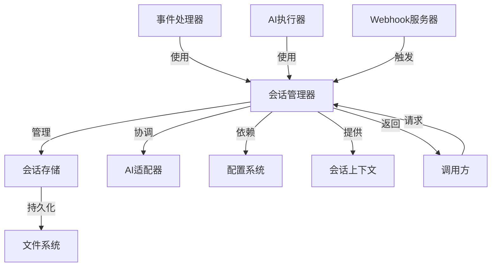
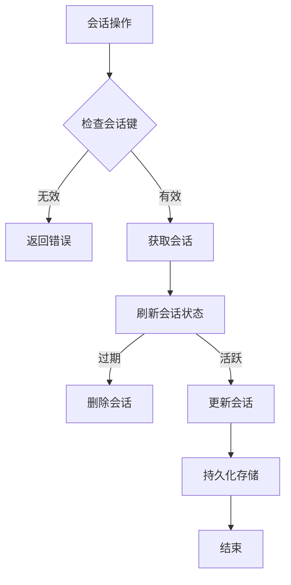
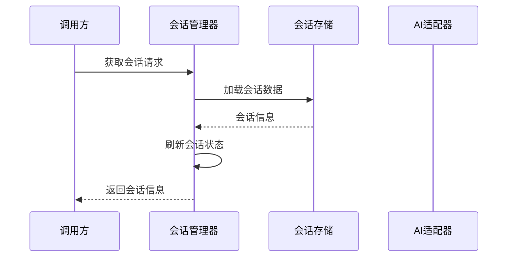
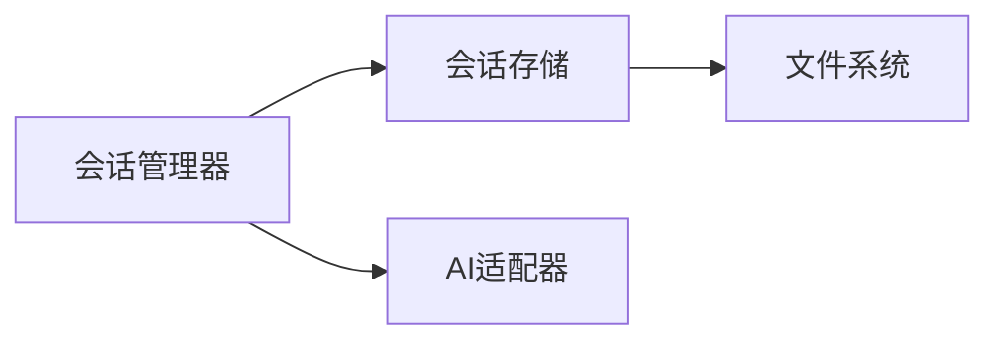

# 会话管理器 (Session Manager)

## 概述

### 作用
会话管理器是GitLab AI Copilot的核心会话管理组件，负责管理长交互会话的生命周期、上下文维护和多提供商会话协调。

### 使用场景
- 管理多轮AI对话的会话状态
- 协调不同AI提供商之间的会话切换
- 维护会话的持久化和状态恢复

### 核心价值
- **会话持久化**：支持会话状态的持久化存储和恢复
- **多提供商支持**：协调Claude、Codex等不同AI提供商的会话信息
- **状态一致性**：确保会话状态在系统重启后能够正确恢复

## 快速开始
1. 创建会话管理器实例，配置会话超时和存储路径
2. 使用会话键生成器创建唯一的会话标识
3. 管理会话的创建、获取、更新和删除操作
4. 处理会话的过期清理和资源回收

## 架构设计

### 系统架构图


### 项目结构
```
src/
├── services/
│   ├── sessionManager.ts         # 主管理器
│   ├── sessionStore.ts           # 会话存储
│   └── providers/                 # AI适配器
```

### 设计原则
- **单例模式**：确保会话状态的一致性
- **观察者模式**：监控会话状态变化
- **策略模式**：支持不同的会话存储策略

## 核心组件分析

### 组件1：会话管理器 (SessionManager)
**文件路径**：`src/services/sessionManager.ts`

**职责**：
- 管理所有活跃会话的生命周期
- 协调不同AI提供商之间的会话切换
- 处理会话的过期清理和资源回收

**关键要点**：
- 采用内存映射和文件存储双重机制
- 实现会话状态的自动刷新和过期检测
- 支持多租户的会话隔离

### 组件2：会话存储 (SessionStore)
**文件路径**：`src/services/sessionStore.ts`

**职责**：
- 提供会话数据的持久化存储能力
- 支持会话状态的序列化和反序列化
- 处理会话数据的迁移和兼容性

### 组件3：AI适配器 (ProviderAdapter)
**文件路径**：`src/services/providers/providerAdapter.ts`

**职责**：
- 封装不同AI提供商的会话管理接口
- 提供统一的会话创建和恢复机制
- 处理不同提供商的会话标识差异

## 执行流程

### 业务流程图


### 时序图（关键交互）


### 关键路径说明
1. **会话键生成**：根据项目ID、Issue ID和所有者ID生成唯一会话标识
2. **会话状态检查**：验证会话是否过期或无效
3. **会话状态刷新**：更新会话的最后使用时间和活跃状态
4. **会话持久化**：将会话状态保存到持久化存储中
5. **会话清理**：定期清理过期会话，释放系统资源

## 依赖关系

### 内部依赖


### 外部依赖
- **文件系统**：用于会话数据的持久化存储
- **配置系统**：获取会话管理相关配置参数

### 依赖注入
通过构造函数参数注入会话存储组件，支持不同的存储实现策略

## 使用方式

### 基础用法
1. 创建会话管理器实例，配置会话超时和存储路径
2. 使用会话键生成器创建唯一的会话标识
3. 管理会话的创建、获取、更新和删除操作
4. 处理会话的过期清理和资源回收

### 高级用法
- **多提供商会话协调**：支持在不同AI提供商之间切换会话
2. **会话状态迁移**：处理会话数据的格式升级和兼容性

### API参考
| 方法/属性 | 类型 | 说明 | 使用提示 |
|---------|------|------|----------------|
| getSession | (issueKey) => SessionInfo | null | 获取会话信息 | 自动刷新会话状态 |
| setSession | (issueKey, sessionId, issueInfo, provider?) => void | 设置会话信息 | 支持多提供商会话管理 |
| getProviderSession | (issueKey, provider) => ProviderSessionInfo | null | 获取指定提供商的会话 | 适用于多提供商切换场景 |

### 配置选项
- **最大空闲时间**：7天，定义会话过期时间
- **最大会话数**：1000个，限制系统资源使用 |
| removeSession | (issueKey, provider?) => boolean | 删除会话 | 支持删除指定提供商的会话 |

## 最佳实践与注意事项

### ✅ 推荐做法
1. **合理设置会话超时**：根据业务需求调整会话过期时间
   - 适用场景：长期项目协作、复杂需求分析
   - 效果说明：平衡用户体验和系统资源消耗

2. **使用会话键生成器**：确保会话标识的唯一性和一致性
   - 适用场景：多用户、多项目环境
   - 效果说明：避免会话冲突和数据混乱

### ❌ 常见陷阱
1. **会话键冲突**：不同项目或用户使用相同的会话标识
   - 现象描述：会话数据被错误覆盖或访问
   - 正确做法：使用包含项目ID、Issue ID和所有者ID的复合键
   - 为什么要避免：会导致数据不一致和用户混淆

2. **会话状态不一致**：会话数据在内存和存储中不一致
   - 现象描述：会话状态丢失或恢复失败
   - 正确做法：实现会话状态的原子性更新

### 性能优化建议
- **会话清理策略**：定期清理过期会话，避免内存泄漏
- **存储优化**：使用高效的序列化机制，减少IO开销

### 安全注意事项
- **会话数据保护**：确保会话数据在存储和传输过程中的安全性
- **访问控制**：基于会话键实现会话访问权限控制

## 测试策略

### 单元测试示例
需要覆盖会话创建、获取、更新、删除和清理等核心操作，重点验证会话状态的一致性和持久化可靠性

### 集成测试要点
- 验证与AI适配器的集成协作
- 测试会话状态在不同提供商之间的切换一致性

### 调试技巧
- 开启会话管理调试日志查看详细的会话操作过程
- 检查会话存储文件的完整性和可读性
- 验证会话过期清理机制的正确性

### 性能监控
- **活跃会话数量**：监控系统当前活跃的会话数量
- **会话创建频率**：跟踪会话的创建和使用模式
- **会话清理效率**：监控过期会话清理的性能表现

## 扩展性设计

### 扩展点
- **新的会话存储策略**：支持数据库、Redis等不同的存储后端
- **会话状态扩展**：支持自定义会话属性和扩展字段

### 版本演进
- **当前版本的限制**：仅支持文件系统存储
- **未来改进方向**：支持分布式会话管理，优化大规模部署场景

### 相关技术点
- [会话存储](./会话存储.md)
- [会话清理服务](./会话清理服务.md)

## 总结

会话管理器作为GitLab AI Copilot的核心会话管理组件，提供了完整的会话生命周期管理能力和多提供商会话协调机制。通过合理的架构设计和扩展性考虑，为系统提供了稳定可靠的会话管理基础。
