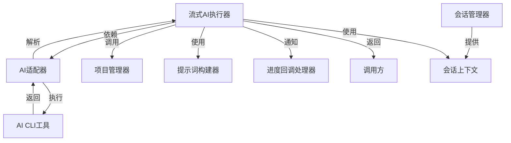
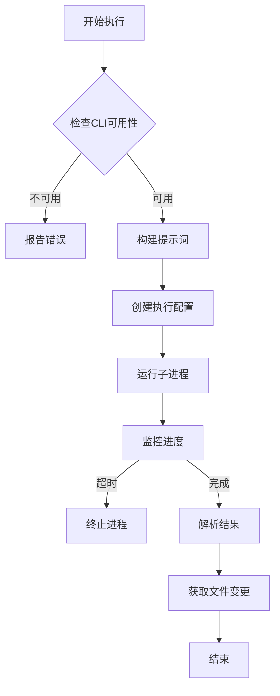
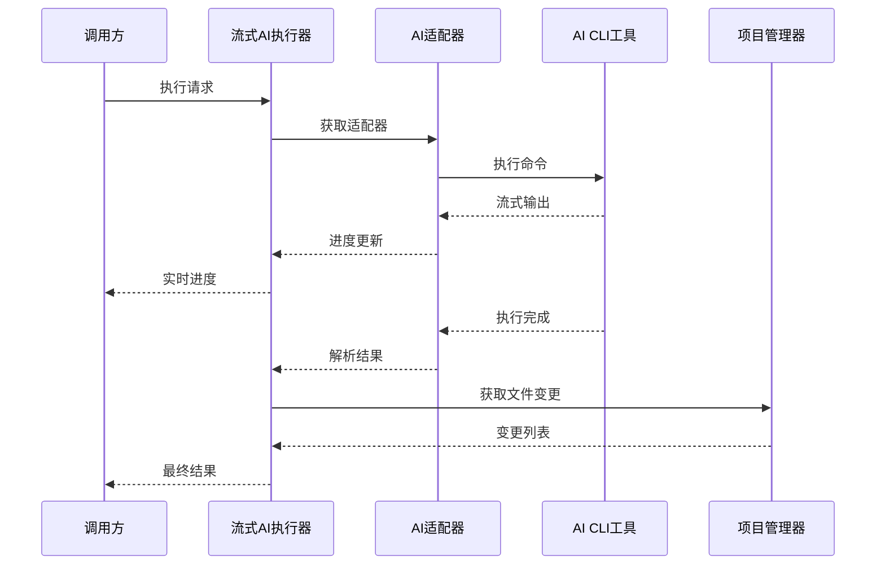
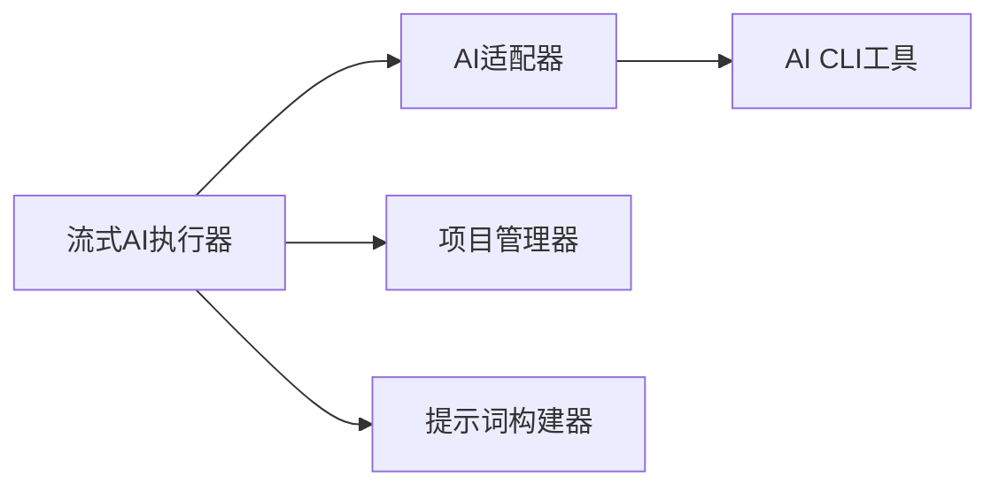

# 流式AI执行器 (Streaming AI Executor)

## 概述

### 作用
流式AI执行器是GitLab AI Copilot的核心异步任务处理组件，负责执行AI CLI工具并实时推送进度更新，支持长交互会话模式。

### 使用场景
- 处理需要长时间运行的AI代码生成任务
- 支持多轮对话的AI交互场景
- 需要实时反馈执行进度的复杂AI任务

### 核心价值
- **实时反馈**：用户可实时查看AI执行进度
- **会话支持**：支持基于会话的连续交互
- **容错处理**：完善的错误处理和超时机制

## 快速开始
1. 准备AI执行上下文，包括项目信息、分支信息和会话配置
2. 配置进度回调处理器，接收实时状态更新
3. 调用执行方法，传入AI指令和配置参数
4. 处理执行结果，包括输出文本和文件变更信息

## 架构设计

### 系统架构图


### 项目结构
```
src/
├── services/
│   ├── streamingAiExecutor.ts     # 主执行器
│   ├── projectManager.ts            # 项目管理
│   ├── promptBuilder.ts             # 提示词构建
│   └── providers/                    # AI适配器
│       ├── claudeAdapter.ts
│       ├── codexAdapter.ts
│       └── providerAdapter.ts
```

### 设计原则
- **观察者模式**：通过回调机制实现进度实时通知
- **策略模式**：支持多种AI提供商的灵活切换
- **依赖注入**：通过构造函数注入依赖组件，提高可测试性
- **异步处理**：所有操作都采用异步方式，避免阻塞主线程

## 核心组件分析

### 组件1：流式AI执行器 (StreamingAiExecutor)
**文件路径**：`src/services/streamingAiExecutor.ts`

**职责**：
- 协调AI执行流程的各个组件
- 管理执行超时和错误处理
- 提供会话支持的长交互执行

**关键要点**：
- 采用子进程管理机制执行AI CLI工具
- 实现实时进度缓冲和定期推送机制
- 支持基于会话的上下文管理和状态恢复

### 组件2：AI适配器 (ProviderAdapter)
**文件路径**：`src/services/providers/providerAdapter.ts`

**职责**：
- 封装不同AI提供商的CLI工具接口
- 提供统一的执行配置和结果解析接口

### 组件3：项目管理器 (ProjectManager)
**文件路径**：`src/services/projectManager.ts`

**职责**：
- 管理Git工作区的状态
- 检测和报告文件变更
- 处理代码提交和推送操作

## 执行流程

### 业务流程图


### 时序图（关键交互）


### 关键路径说明
1. **初始化检查**：验证AI CLI工具的可用性和版本兼容性
2. **提示词构建**：根据AI提供商和上下文构建完整的提示词
3. **进程执行**：通过子进程管理机制运行AI命令
4. **进度监控**：实时收集和推送执行进度信息
5. **结果解析**：将AI输出解析为结构化结果
6. **变更检测**：识别AI执行过程中产生的文件变更

## 依赖关系

### 内部依赖


### 外部依赖
- **Node.js child_process**：用于执行AI CLI工具的子进程管理
- **AI CLI工具**：Claude Code CLI 或 Codex CLI
- **Git**：用于代码版本管理和变更检测

### 依赖注入
通过构造函数参数注入依赖组件，支持在测试时替换为Mock实现，提高代码可测试性

## 使用方式

### 基础用法
1. 创建流式AI执行器实例，传入所需的AI适配器
2. 准备执行上下文，包括项目路径、分支信息和会话配置
3. 配置进度回调处理器，用于接收实时进度更新
4. 调用执行方法，传入AI指令和配置参数
5. 处理返回的执行结果和文件变更信息

### 高级用法
- **会话模式**：使用会话ID支持多轮连续交互
- **自定义超时**：根据任务复杂度设置合适的执行超时时间

### API参考
| 方法/属性 | 类型 | 说明 | 使用提示 |
|---------|------|------|----------------|
| executeWithSession | (command, projectPath, context, callback, options) => Promise<SessionExecutionResult> | 支持会话的流式执行 | 适用于需要保持上下文的长交互场景 |
| executeWithStreaming | (command, projectPath, context, callback) => Promise<ProcessResult> | 基础流式执行 | 适用于单次交互场景 |

### 配置选项
- **默认超时时间**：20分钟，适用于大多数AI代码生成任务
- **进度推送间隔**：2秒或500字符，平衡实时性和性能开销
- **会话配置**：支持会话ID传递和新建会话标识

## 最佳实践与注意事项

### ✅ 推荐做法
1. **合理设置超时**：根据任务复杂度调整执行超时时间
   - 简单任务：5-10分钟
   - 复杂任务：20-30分钟
   - 适用场景：代码生成、文档编写、问题解答

2. **使用会话模式**：对于需要多轮交互的复杂任务
   - 适用场景：需求分析、架构设计、代码重构

### ❌ 常见陷阱
1. **CLI工具不可用**：未正确安装或配置AI CLI工具
