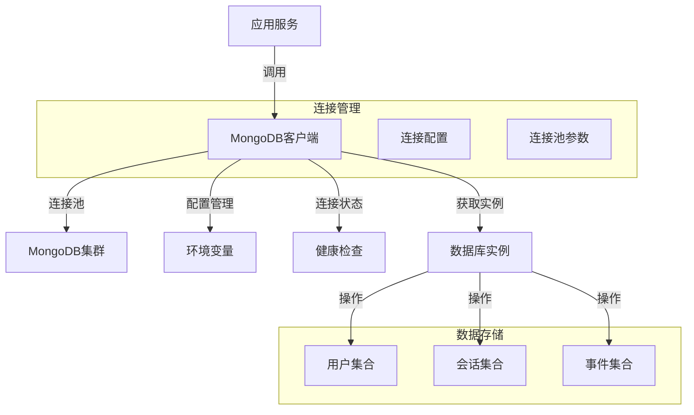
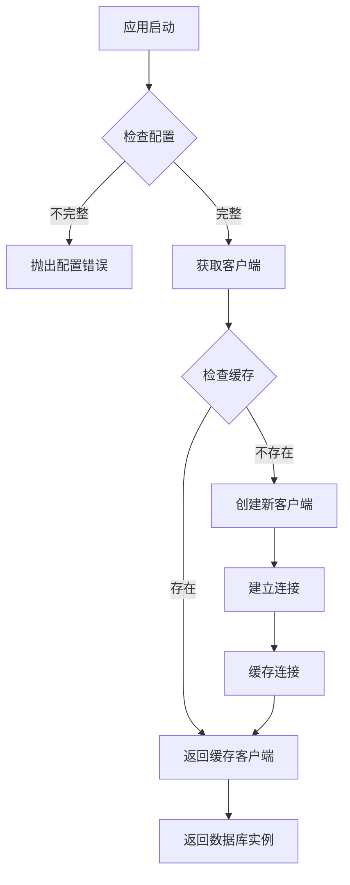
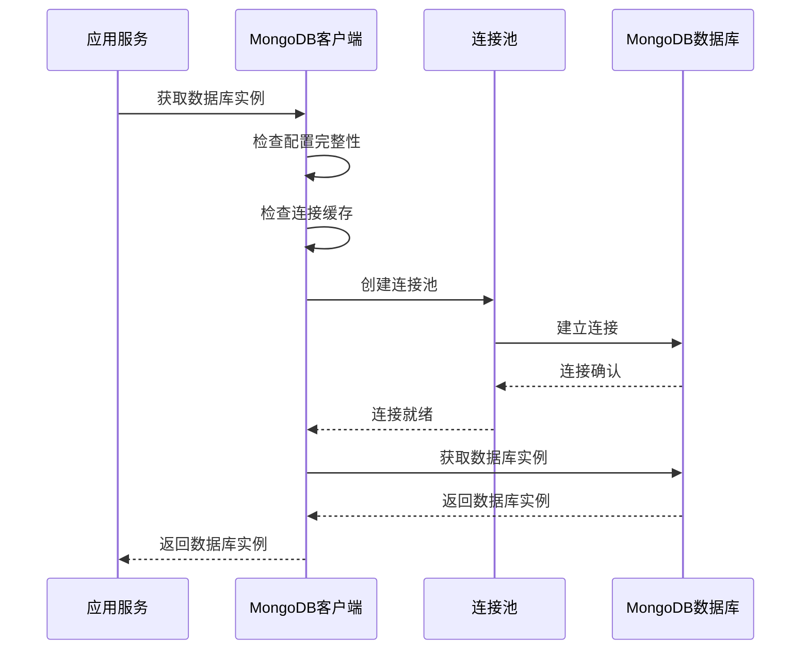
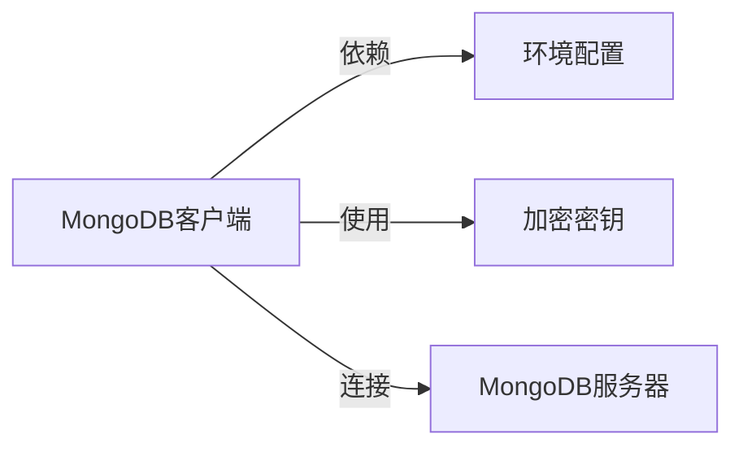

# MongoDB客户端管理

## 概述
- **作用**：提供企业级MongoDB数据库连接管理，支持多租户架构下的数据访问和连接池优化
- **使用场景**：在GitLab AI Copilot平台中管理所有数据存储操作，包括用户信息、会话数据、事件记录等
- **核心价值**：通过连接池复用和智能配置管理，确保系统在高并发场景下的稳定性和性能

## 快速开始
1. 配置MongoDB连接参数和环境变量
2. 初始化MongoDB客户端连接
3. 通过统一接口获取数据库实例
4. 在应用关闭时正确释放连接资源

## 架构设计

### 系统架构图


### 项目结构
```
src/
├── services/storage/
│   ├── mongoClient.ts     # 主客户端管理
│   └── __tests__/           # 测试文件
```

### 设计原则
- **单例模式**：确保整个应用使用同一个MongoDB客户端实例，避免连接泄露
- **懒加载机制**：按需创建连接，减少启动时间
- **连接池优化**：配置最大连接数和超时参数
- **配置验证**：启动时验证MongoDB配置完整性

## 核心组件分析

### 组件1：MongoDB客户端管理器
**文件路径**：`src/services/storage/mongoClient.ts`

**职责**：
- 管理MongoDB客户端生命周期
- 提供数据库连接池管理
- 实现连接状态监控

**关键要点**：
- 采用延迟导入策略，允许在测试环境中使用虚拟Mock
- 实现连接缓存机制，避免重复创建连接
- 提供连接关闭和清理机制

### 组件2：连接配置验证器
**文件路径**：`src/services/storage/mongoClient.ts`

**职责**：
- 验证MongoDB配置参数完整性
- 检查加密密钥配置状态
- 确保生产环境数据安全

## 执行流程

### 业务流程图


### 时序图（关键交互）


### 关键路径说明
1. **配置验证**：启动时验证MONGODB_URI、MONGODB_DB和ENCRYPTION_KEY配置
2. **连接创建**：使用配置参数创建MongoDB客户端
3. **连接缓存**：将已建立的连接缓存供后续使用
4. **连接关闭**：应用关闭时正确释放所有连接资源

## 依赖关系

### 内部依赖


### 外部依赖
- **mongodb**：4.x版本 - 提供MongoDB官方驱动
- **crypto**：Node.js内置模块 - 用于密钥派生
- **logger**：项目日志系统 - 记录连接状态和错误信息

### 依赖注入
通过模块导出函数提供客户端实例，各服务模块通过导入函数获取数据库连接，实现松耦合架构

## 使用方式

### 基础用法
1. 在应用启动时配置MongoDB环境变量
2. 在需要访问数据库的服务中导入getMongoDb函数
3. 通过返回的数据库实例执行CRUD操作
4. 在应用关闭时调用closeMongoConnection释放资源

### 高级用法
- **多租户支持**：通过不同的数据库名称实现数据隔离
- **连接池调优**：根据业务负载调整maxPoolSize参数
- **健康检查**：通过getMongoConnectionState监控连接状态

### API参考
| 方法/属性 | 类型 | 说明 | 使用提示 |
|---------|------|------|----------------|
| getMongoClient | () => Promise<MongoClient> | 获取MongoDB客户端实例 | 确保配置完整后调用 |
| getMongoDb | () => Promise<Db> | 获取数据库实例 | 用于执行具体的数据操作 |
| closeMongoConnection | () => Promise<void> | 关闭数据库连接 | 在应用关闭时调用确保资源释放 |
| getMongoConnectionState | () => { client, db } | 获取连接状态 | 用于监控和诊断 |

### 配置选项
- **MONGODB_URI**：MongoDB连接字符串，包含认证信息
- **MONGODB_DB**：数据库名称，支持多租户隔离
- **ENCRYPTION_KEY**：32字节加密密钥，用于敏感数据加密
- **maxPoolSize**：连接池最大连接数，默认10
- **serverSelectionTimeoutMS**：服务器选择超时时间，默认5000ms

## 最佳实践与注意事项

### ✅ 推荐做法
1. **连接池配置**：根据并发需求合理设置maxPoolSize参数
   - 适用场景：高并发读写操作
   - 效果说明：提高系统吞吐量，减少连接创建开销

2. **配置验证**：在应用启动时验证所有必需配置
   - 适用场景：生产环境部署
   - 效果说明：避免运行时配置错误

### ❌ 常见陷阱
1. **连接泄露**：未正确关闭连接导致资源耗尽
   - 现象描述：连接数持续增长，最终达到上限
   - 正确做法：在应用关闭时调用closeMongoConnection
   - 为什么要避免：影响系统稳定性和性能

2. **配置错误**：环境变量配置不完整或格式错误
   - 现象描述：启动失败或连接异常
   - 正确做法：使用.env文件管理配置，确保所有必需参数都已设置

### 性能优化建议
- **连接池调优**：根据实际负载调整连接池大小
- **超时配置**：合理设置连接超时和操作超时参数

### 安全注意事项
- **敏感信息保护**：MongoDB连接字符串包含认证信息，需妥善保管
- **加密密钥管理**：ENCRYPTION_KEY必须为32字节长度
- **网络隔离**：生产环境建议使用内网连接

## 测试策略

### 单元测试示例
测试需要覆盖连接创建、配置验证、连接缓存等核心功能，验证在不同配置状态下的行为表现

### 集成测试要点
- 验证与真实MongoDB集群的连接稳定性
- 测试连接池在高并发场景下的表现

### 调试技巧
- 通过设置LOG_LEVEL=debug查看详细连接日志
- 使用getMongoConnectionState监控连接状态
- 检查连接池使用率和性能指标

### 性能监控
- **连接池使用率**：监控活跃连接数和空闲连接数
- **连接错误率**：监控连接失败和超时情况
- **响应时间**：监控数据库操作的平均响应时间

## 扩展性设计

### 扩展点
- **连接池参数扩展**：支持更多MongoDB客户端选项
- **多集群支持**：扩展支持连接多个MongoDB集群

### 版本演进
- **当前版本的限制**：依赖Node.js内置crypto模块
- **未来改进方向**：支持连接负载均衡和故障转移
- **兼容性考虑**：保持向后兼容，支持旧版本配置格式

### 相关技术点
- [数据加密机制](./数据加密机制.md)
- [多租户数据存储](./多租户数据存储.md)
- [存储库模式实现](./存储库模式实现.md)
