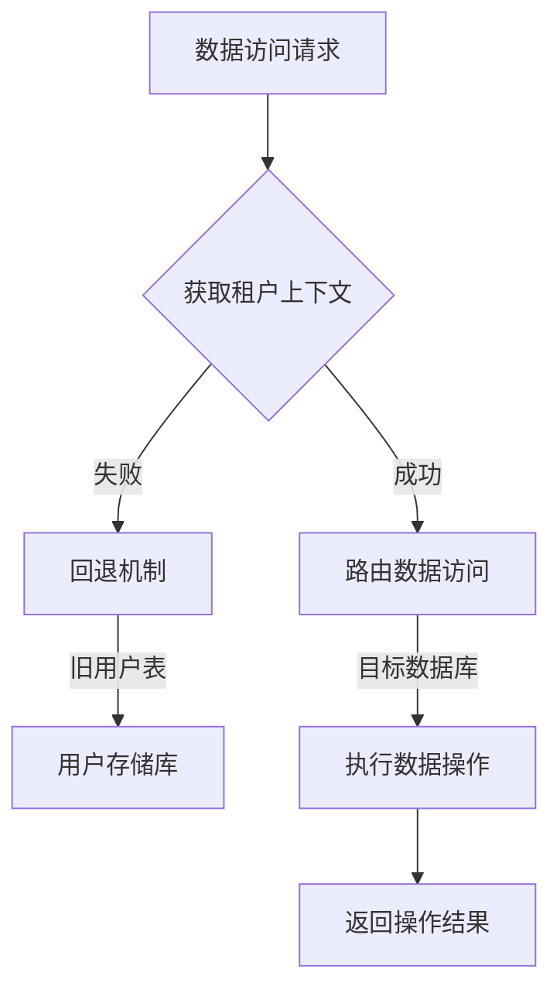
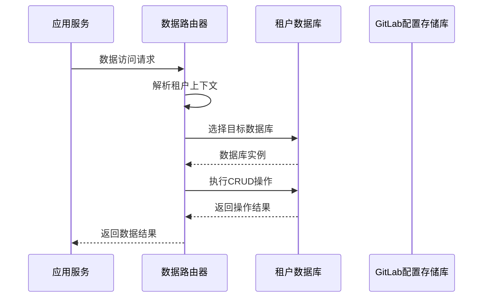
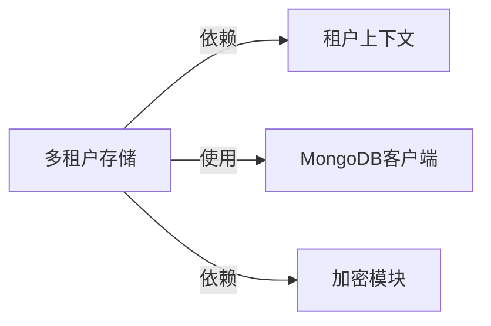

# 多租户数据存储

## 概述
- **作用**：为GitLab AI Copilot平台提供企业级多租户数据隔离方案，确保不同组织的数据完全隔离
- **使用场景**：在企业级部署中，为不同客户组织提供独立的数据存储空间
- **核心价值**：通过数据库级别的数据隔离，实现企业级安全标准和合规性要求

## 快速开始
1. 配置多租户MongoDB连接参数
2. 实现基于租户ID的数据路由和访问控制
- **架构设计**

### 系统架构图
```mermaid
graph TB
    A[应用服务] -->|租户上下文| B[数据路由]
    B -->|数据库选择| C[租户数据库]
    C -->|集合操作| D[用户数据]
    C -->|集合操作| E[会话数据]
    C -->|集合操作| F[事件数据]
    
    subgraph 租户隔离
        C
        G[租户A数据库]
        H[租户B数据库]
    I[租户C数据库]
    
    subgraph 数据访问层
        J[存储库模式]
        J -->|数据操作| C
    end
    
    subgraph 配置管理
        K[GitLab配置存储库]
        L[用户存储库]
        M[会话存储库]
    end
```

### 项目结构
```
src/
├── services/storage/
│   ├── userRepository.ts          # 用户数据存储
│   ├── gitlabConfigRepository.ts    # GitLab配置存储
    │   ├── webSessionRepository.ts      # 会话数据存储
    │   ├── workspaceMetadataRepository.ts # 工作区元数据存储
    │   └── eventRepository.ts         # 事件数据存储
```

### 设计原则
- **数据库级别隔离**：每个租户使用独立的数据库实例
- **租户上下文传递**：通过中间件和工具函数传递租户信息
```

## 核心组件分析

### 组件1：租户数据路由器
**文件路径**：`src/services/storage/userRepository.ts`

**职责**：
- 根据租户上下文选择目标数据库
- 实现数据访问的自动路由
- 确保租户数据完全隔离

**关键要点**：
- 支持多种租户识别方式（用户令牌、配置令牌等）
- 提供向后兼容的租户解析机制

### 组件2：多配置支持器
**文件路径**：`src/services/storage/gitlabConfigRepository.ts`

**职责**：
- 管理用户的多GitLab配置
- 支持默认配置和配置切换

## 执行流程

### 业务流程图


### 时序图（关键交互）


### 关键路径说明
1. **租户识别**：根据请求中的令牌信息识别目标租户
2. **数据路由**：根据租户信息选择对应的数据库
3. **操作执行**：在目标数据库中执行具体的数据操作
4. **结果返回**：将操作结果返回给应用服务

## 依赖关系

### 内部依赖


### 外部依赖
- **MongoDB集群**：提供多数据库实例支持
- **环境配置**：MongoDB连接参数和租户配置
```

### 依赖注入
通过模块化设计，各存储库自动获取租户上下文，实现透明的数据路由

## 使用方式

### 基础用法
1. 配置多租户MongoDB环境变量
2. 在请求处理中设置租户上下文
3. 通过存储库接口进行数据访问，无需关心具体的数据路由逻辑

### 高级用法
- **多配置管理**：支持用户配置多个GitLab实例
- **配置切换**：根据业务需求在不同GitLab配置间切换

### API参考
| 方法/属性 | 类型 | 说明 | 使用提示 |
|---------|------|------|----------------|
| findUserByToken | (userToken: string) => Promise<UserDocument> | 根据用户令牌查找用户 | 支持向后兼容的旧用户表查询 |
| resolveTenantByToken | (token: string) => Promise<ResolvedTenantUser> | 解析租户信息 | 支持配置令牌和用户令牌两种格式 |
| upsertUser | (input: UpsertUserInput) => Promise<UpsertUserResult> | 创建或更新用户 | 支持多种认证方式集成 |

### 配置选项
- **MONGODB_URI**：MongoDB连接字符串
- **MONGODB_DB**：默认数据库名称
- **多租户配置**：通过不同的数据库名称实现数据隔离

## 最佳实践与注意事项

### ✅ 推荐做法
1. **租户上下文管理**：在请求处理链中正确设置和传递租户信息
- **数据迁移策略**：确保租户数据在系统升级时的平滑迁移

2. **配置令牌支持**：支持新的配置令牌格式，提供更好的多配置管理能力

### ❌ 常见陷阱
1. **租户上下文丢失**：在异步操作中未正确传递租户信息
   - 现象描述：数据访问到错误的数据库
   - 正确做法：确保所有异步操作都正确传递租户上下文
   - 为什么要避免：导致数据泄露或操作失败

2. **配置冲突**：多个租户使用相同的配置标识符
   - 现象描述：数据访问冲突或权限错误
   - 正确做法：确保租户标识符的唯一性和一致性

### 性能优化建议
- **连接池优化**：为每个租户数据库配置独立的连接池
- **索引优化**：为每个租户数据库创建适当的索引

### 安全注意事项
- **数据隔离**：确保不同租户的数据在物理层面完全分离
- **访问控制**：实现基于租户的权限验证和数据访问控制

## 测试策略

### 单元测试示例
测试需要覆盖租户解析、数据路由、多配置管理等核心功能

### 集成测试要点
- 验证多租户环境下的数据隔离效果
- 测试配置切换和数据访问的正确性

### 调试技巧
- 通过租户上下文日志跟踪数据路由过程
- 检查租户数据库的连接状态和使用情况

### 性能监控
- **租户数据量**：监控每个租户的数据存储量
- **访问频率**：监控不同租户的数据访问模式

## 扩展性设计

### 扩展点
- **租户识别扩展**：支持更多租户识别方式
- **多集群支持**：扩展支持连接多个MongoDB集群

### 版本演进
- **当前版本的限制**：依赖MongoDB的多数据库支持
- **未来改进方向**：支持动态租户创建和数据库分配

### 相关技术点
- [MongoDB客户端管理](./MongoDB客户端管理.md)
- [数据加密机制](./数据加密机制.md)
- [存储库模式实现](./存储库模式实现.md)
