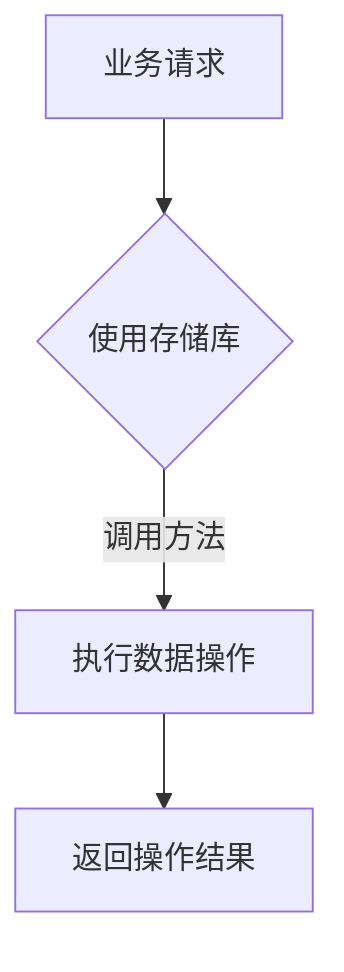
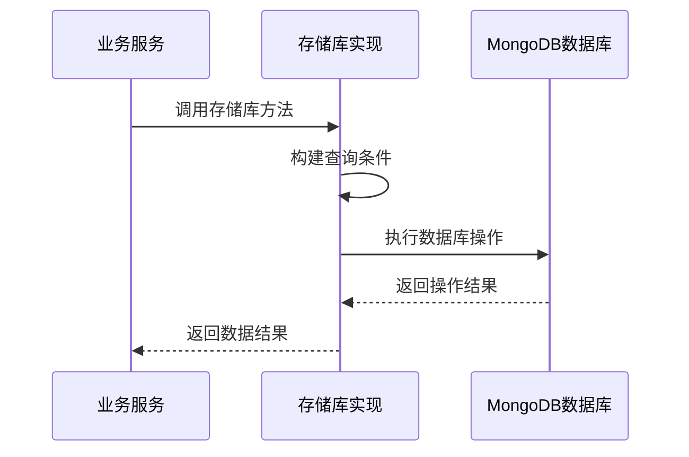
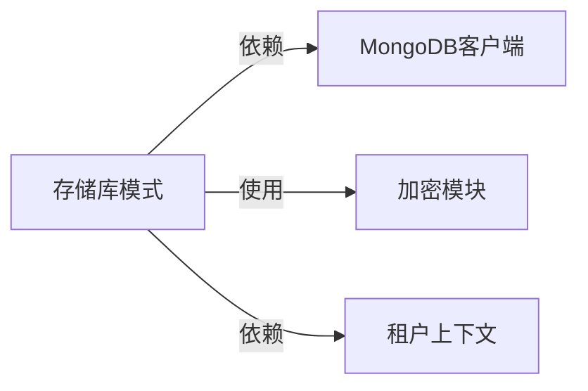

# 存储库模式实现

## 概述
- **作用**：为GitLab AI Copilot平台提供统一的数据访问接口，封装底层数据存储细节
- **使用场景**：在业务服务中通过标准化的接口访问各种数据存储
- **核心价值**：通过抽象层隔离业务逻辑与数据访问逻辑，提高代码可维护性和可测试性

## 快速开始
1. 实现特定领域的存储库接口
2. 在业务服务中导入并使用存储库
3. 通过存储库方法执行CRUD操作，无需直接操作数据库

## 架构设计

### 系统架构图
```mermaid
graph TB
    A[业务服务] -->|调用| B[存储库接口]
    B -->|实现| C[具体存储库]
    C -->|操作| D[MongoDB数据库]
    
    subgraph 存储库层
        E[用户存储库]
        F[GitLab配置存储库]
        G[会话存储库]
        H[事件存储库]
    
    subgraph 数据存储
        I[用户集合]
        J[配置集合]
        K[会话集合]
        L[事件集合]
    end
    
    subgraph 数据访问
        M[MongoDB客户端]
    end
```

### 项目结构
```
src/
├── services/storage/
│   ├── userRepository.ts          # 用户数据访问
│   ├── gitlabConfigRepository.ts    # GitLab配置访问
    │   ├── webSessionRepository.ts      # 会话数据访问
    │   ├── workspaceMetadataRepository.ts # 工作区元数据访问
    │   └── eventRepository.ts         # 事件数据访问
```

### 设计原则
- **接口隔离**：为不同类型的数据提供专门的存储库接口
- **数据抽象**：隐藏底层数据库操作细节
- **统一接口**：提供标准化的数据访问方法

## 核心组件分析

### 组件1：用户存储库
**文件路径**：`src/services/storage/userRepository.ts`

**职责**：
- 管理用户数据的CRUD操作
- 提供用户查找和认证功能
- 支持多配置管理

**关键要点**：
- 实现基于用户令牌、邮箱、用户名的多维度查询
- 提供用户创建和更新功能
- 支持向后兼容的租户解析机制

### 组件2：GitLab配置存储库
**文件路径**：`src/services/storage/gitlabConfigRepository.ts`

**职责**：
- 管理用户的多GitLab配置
- 支持配置令牌和默认配置管理

## 执行流程

### 业务流程图


### 时序图（关键交互）


### 关键路径说明
1. **方法调用**：业务服务调用存储库的特定方法
2. **查询构建**：根据方法参数构建MongoDB查询条件
    Repo-->>Service: 返回数据结果
```

## 依赖关系

### 内部依赖


### 外部依赖
- **MongoDB驱动**：提供底层数据库操作能力
- **配置系统**：项目配置管理模块

### 依赖注入
通过模块导入方式提供存储库实例，业务服务通过标准接口访问数据，实现业务逻辑与数据访问的分离

## 使用方式

### 基础用法
1. 在业务服务中导入所需的存储库
2. 调用存储库的查询方法获取数据
3. 使用存储库的更新方法修改数据

### 高级用法
- **事务支持**：在复杂业务场景中支持跨存储库的事务操作

### API参考
| 方法/属性 | 类型 | 说明 | 使用提示 |
|---------|------|------|----------------|
| findUserByToken | (userToken: string) => Promise<UserDocument> | 根据用户令牌查找用户 | 支持向后兼容的旧用户表查询 |
| resolveTenantByToken | (token: string) => Promise<ResolvedTenantUser> | 解析租户信息 | 支持配置令牌和用户令牌两种格式 |
| upsertUser | (input: UpsertUserInput) => Promise<UpsertUserResult> | 创建或更新用户 | 支持多种认证方式集成 |

### 配置选项
- **集合名称配置**：每个存储库对应特定的MongoDB集合
- **查询条件构建**：根据业务需求构建复杂的查询条件

## 最佳实践与注意事项

### ✅ 推荐做法
1. **存储库职责单一**：每个存储库只负责特定类型的数据访问

## 测试策略

### 单元测试示例
测试需要覆盖存储库的各种查询和更新方法，验证在不同输入条件下的行为表现

### 集成测试要点
- 验证存储库与MongoDB客户端的集成
- 测试多租户环境下的数据访问正确性

### 调试技巧
- 通过存储库方法日志跟踪数据访问过程
- 检查查询条件和操作结果的正确性

### 性能监控
- **查询性能**：监控存储库方法的执行时间
- **数据一致性**：验证存储库操作的数据一致性保证

## 扩展性设计

### 扩展点
- **新存储库实现**：为新的数据类型创建专门的存储库
- **查询优化**：监控和分析存储库查询的性能表现

### 版本演进
- **当前版本的限制**：主要针对MongoDB存储，支持其他存储类型的扩展

### 相关技术点
- [MongoDB客户端管理](./MongoDB客户端管理.md)
- [数据加密机制](./数据加密机制.md)
- [多租户数据存储](./多租户数据存储.md)
