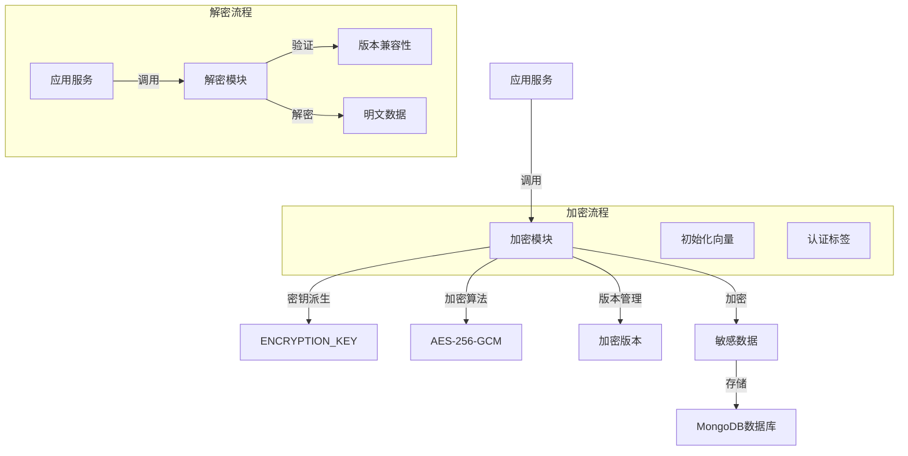
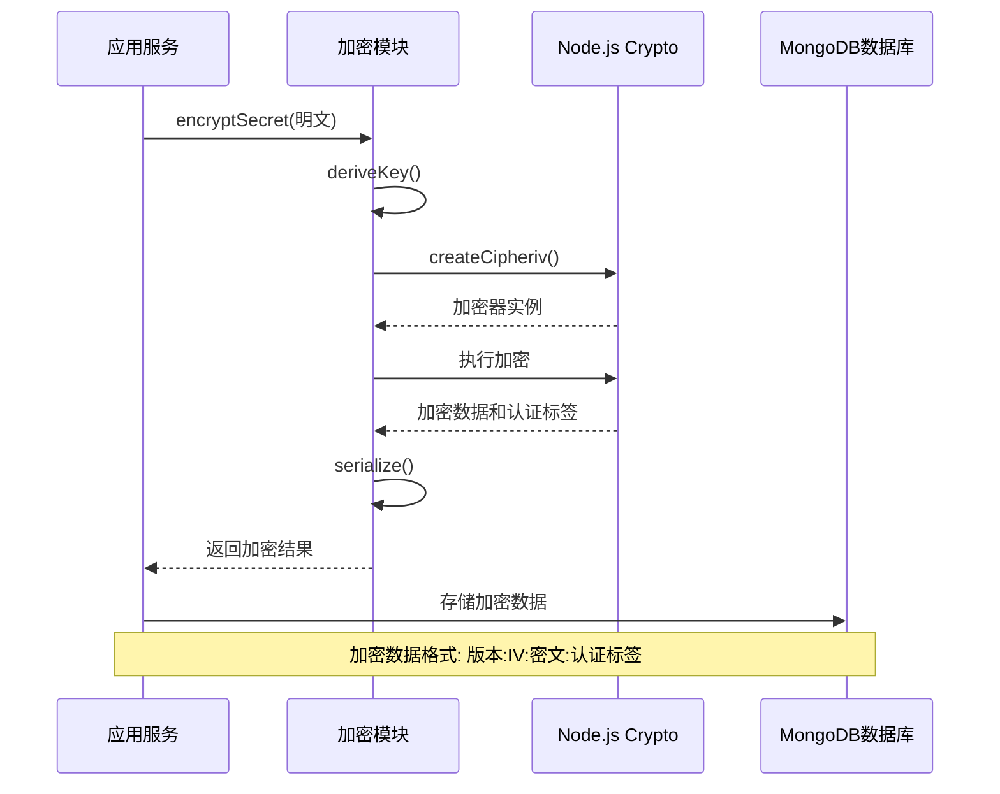
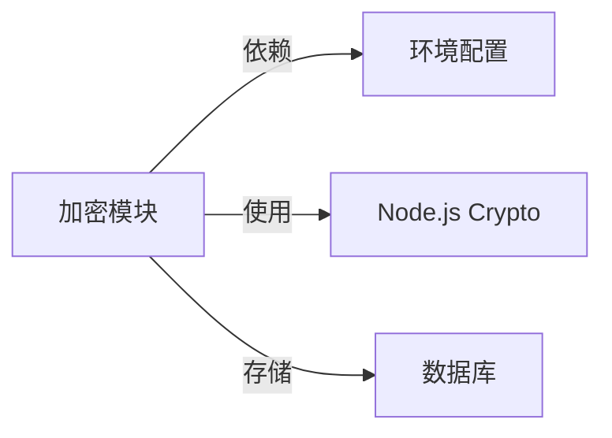

# 数据加密机制

## 概述
- **作用**：为GitLab AI Copilot平台提供企业级数据安全保护，对敏感信息进行加密存储和解密访问
- **使用场景**：在存储用户GitLab访问令牌、Webhook密钥等敏感数据时使用AES-256-GCM加密算法
- **核心价值**：确保即使数据库被非法访问，敏感信息也不会泄露，符合企业级安全标准

## 快速开始
1. 配置32字节长度的ENCRYPTION_KEY环境变量
2. 在需要加密敏感数据的服务中导入encryptSecret和decryptSecret函数
3. 使用统一接口进行数据加密和解密操作
4. 定期轮换加密密钥以增强安全性

## 架构设计

### 系统架构图


### 项目结构
```
src/
├── utils/
│   ├── secretVault.ts     # 核心加密实现
│   └── __tests__/           # 测试文件
```

### 设计原则
- **AES-256-GCM算法**：提供认证加密，确保数据完整性和机密性
- **密钥派生机制**：支持多种密钥格式（十六进制、Base64、UTF-8）
- **版本化存储**：支持加密格式的版本演进和兼容性
- **安全第一**：使用随机初始化向量和认证标签

## 核心组件分析

### 组件1：加密密钥管理器
**文件路径**：`src/utils/secretVault.ts`

**职责**：
- 管理加密密钥的派生和缓存
- 验证密钥格式和长度要求
- 提供密钥清理机制

**关键要点**：
- 支持多种密钥输入格式，自动进行格式检测和转换
- 实现密钥缓存机制，避免重复派生计算
- 确保密钥安全性和一致性

### 组件2：数据加密器
**文件路径**：`src/utils/secretVault.ts`

**职责**：
- 使用AES-256-GCM算法进行数据加密
- 生成随机初始化向量和认证标签
- 实现序列化和反序列化机制

## 执行流程

### 业务流程图
```mermaid
flowchart TD
    Start[加密请求] --> CheckKey{检查密钥}
    CheckKey -->|无效| Error[抛出配置错误]
    CheckKey -->|有效| GenerateIV[生成初始化向量]
    GenerateIV --> Encrypt[执行加密]
    Encrypt --> GenerateTag[生成认证标签]
    GenerateTag --> Serialize[序列化数据]
    Serialize --> End[返回加密结果]
    
    subgraph 解密流程
        DecryptStart[解密请求] --> Parse[解析加密数据]
    Parse --> VerifyVersion{验证版本}
    VerifyVersion -->|不兼容| VersionError[版本错误]
    VerifyVersion -->|兼容| Decrypt[执行解密]
    Decrypt --> VerifyTag[验证认证标签]
    VerifyTag --> Return[返回明文数据]
    VersionError --> DecryptEnd[解密失败]
    Return --> DecryptEnd[解密成功]
```

### 时序图（关键交互）


### 关键路径说明
1. **密钥派生**：根据ENCRYPTION_KEY环境变量派生32字节加密密钥
2. **加密执行**：使用AES-256-GCM算法进行加密
3. **数据序列化**：将初始化向量、密文和认证标签序列化为字符串
4. **解密验证**：解密时验证版本兼容性和认证标签完整性

## 依赖关系

### 内部依赖


### 外部依赖
- **crypto**：Node.js内置模块 - 提供加密算法实现
- **环境变量**：ENCRYPTION_KEY - 加密密钥源
- **配置系统**：项目配置管理模块

### 依赖注入
通过模块导出函数提供加密和解密服务，各存储库通过导入函数进行敏感数据保护

## 使用方式

### 基础用法
1. 配置ENCRYPTION_KEY环境变量
2. 在存储敏感数据前调用encryptSecret进行加密
3. 在需要使用敏感数据时调用decryptSecret进行解密
4. 定期调用clearCachedEncryptionKey清理密钥缓存

### 高级用法
- **密钥轮换**：在更新ENCRYPTION_KEY后调用清理函数

### API参考
| 方法/属性 | 类型 | 说明 | 使用提示 |
|---------|------|------|----------------|
| encryptSecret | (plaintext: string) => string | 加密明文数据 | 输入为空字符串时返回空字符串 |
| decryptSecret | (encrypted: string) => string | 解密密文数据 | 支持向后兼容的明文存储 |
| clearCachedEncryptionKey | () => void | 清理缓存密钥 | 在密钥轮换后调用 |

### 配置选项
- **ENCRYPTION_KEY**：32字节加密密钥，支持十六进制、Base64和UTF-8格式 |
| deriveKey | () => Buffer | 派生加密密钥 | 内部使用，自动缓存优化 |

## 最佳实践与注意事项

### ✅ 推荐做法
1. **密钥格式标准化**：使用十六进制格式（64字符）存储密钥
   - 适用场景：生产环境部署
   - 效果说明：提高密钥管理的一致性和安全性

2. **版本化加密**：支持加密格式的版本管理
   - 适用场景：系统升级和兼容性维护
   - 效果说明：确保数据迁移和系统升级的平滑进行

### ❌ 常见陷阱
1. **密钥长度不足**：使用长度不足的密钥导致加密强度降低
   - 现象描述：加密失败或安全风险
   - 正确做法：确保ENCRYPTION_KEY为32字节长度
   - 为什么要避免：AES-256算法要求32字节密钥

2. **密钥泄露**：将ENCRYPTION_KEY提交到版本控制系统
   - 现象描述：敏感信息泄露风险
   - 正确做法：使用环境变量管理密钥，避免代码中硬编码

### 性能优化建议
- **密钥缓存**：避免重复的密钥派生计算
- **格式检测**：自动识别和转换不同格式的密钥输入

### 安全注意事项
- **密钥管理**：ENCRYPTION_KEY必须妥善保管，定期轮换
- **向后兼容**：支持旧版本的明文存储格式，确保数据迁移的兼容性

## 测试策略

### 单元测试示例
测试需要覆盖不同密钥格式的派生、空值和边界情况的处理

### 集成测试要点
- 验证加密数据在数据库中的存储格式和安全性
- 测试密钥轮换过程中的数据解密能力

### 调试技巧
- 通过设置LOG_LEVEL=debug查看加密操作详细日志
- 检查密钥派生和缓存机制的正确性

### 性能监控
- **加密操作耗时**：监控加密和解密操作的平均响应时间
- **密钥使用情况**：监控密钥缓存状态和派生频率

## 扩展性设计

### 扩展点
- **算法扩展**：支持更多加密算法的集成
- **密钥管理**：扩展支持外部密钥管理系统

### 版本演进
- **当前版本的限制**：仅支持AES-256-GCM算法
- **未来改进方向**：支持硬件安全模块（HSM）集成
- **兼容性考虑**：保持对旧版本加密格式的解密支持

### 相关技术点
- [MongoDB客户端管理](./MongoDB客户端管理.md)
- [多租户数据存储](./多租户数据存储.md)
- [存储库模式实现](./存储库模式实现.md)
