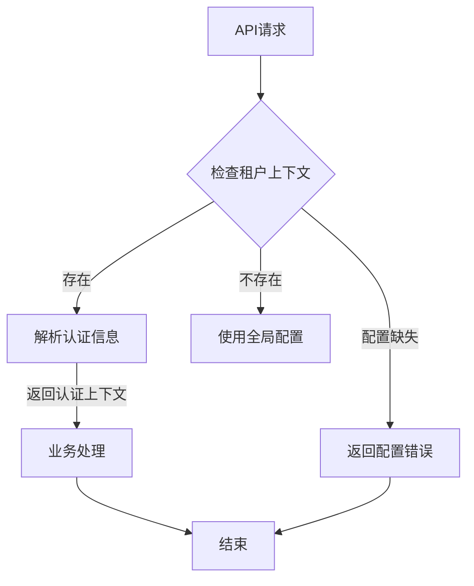
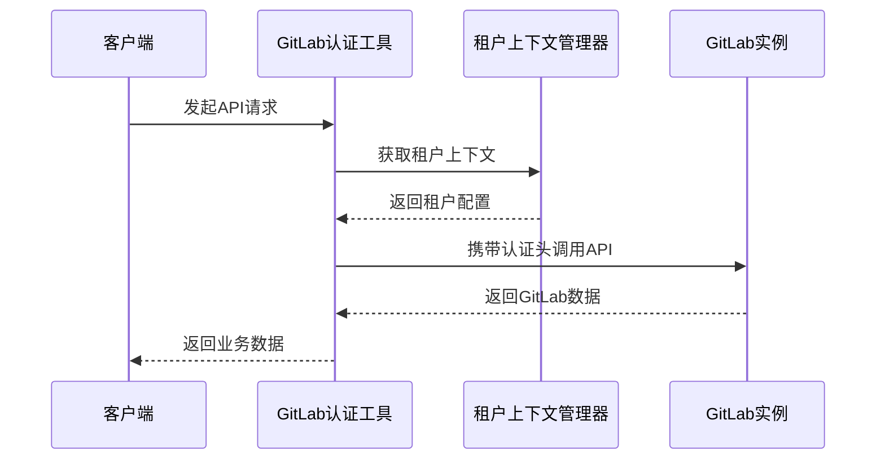
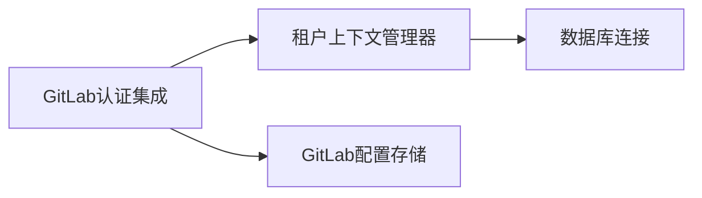

# GitLab认证集成 (GitLab Authentication Integration)

## 概述

**作用**：为 GitLab AI Copilot 系统提供与 GitLab 实例的认证集成，解析租户上下文并构建 GitLab API 调用所需的认证信息。

**使用场景**：
- 多租户环境下的 GitLab 认证配置
- 租户级访问令牌的管理和验证
- GitLab Webhook 请求的签名验证和身份识别

**核心价值**：
- **无缝集成**：与 GitLab REST API 的无缝认证集成
- **租户隔离**：确保不同租户的 GitLab 配置完全独立
- **安全传输**：通过加密机制保护 GitLab 访问令牌

## 快速开始

1. **配置 GitLab 认证**：设置 GitLab 实例的基础 URL 和访问令牌
2. **租户上下文解析**：从请求中提取租户信息并构建认证上下文

## 架构设计

### 系统架构图

```mermaid
graph TB
    A[API请求] -->|携带租户信息| B[GitLab认证工具]
    B -->|解析租户上下文| C[租户上下文管理器]
    C -->|返回认证信息| D[GitLab API客户端]
    D -->|调用GitLab API| E[GitLab实例]
    E -->|返回数据| F[业务处理器]
    
    subgraph "认证集成层"
        B
        C
    end
    
    subgraph "配置存储层"
        G[GitLab配置存储]
    H[租户上下文存储]
    
    subgraph "GitLab集成"
        D
        E
    end
```

### 项目结构

```
src/
├── utils/
│   ├── gitlabAuth.ts       # GitLab认证集成主文件
│   └── __tests__/             # 测试文件
└── types/
    ├── auth.ts                  # 认证相关类型定义
    └── tenant.ts                 # 租户上下文类型定义
```

### 设计原则

- **上下文感知**：自动识别当前请求的租户上下文
- **配置驱动**：通过环境变量和数据库配置管理 GitLab 认证信息
```

## 核心组件分析

### 组件1：GitLab认证工具
**文件路径**：`src/utils/gitlabAuth.ts`

**职责**：
- 解析租户上下文信息
- 构建 GitLab API 调用所需的认证头信息
- 验证 GitLab 配置的有效性和可用性

**关键要点**：
- 支持多租户环境下的 GitLab 配置管理
- 提供租户级访问令牌的解析和验证

### 组件2：租户上下文管理器
**文件路径**：`src/utils/tenantContext.ts`

**职责**：
- 管理当前请求的租户上下文信息
- 处理租户级数据隔离和访问控制

**关键要点**：
- 通过 `getCurrentTenantContext` 函数获取当前租户信息
- 构建包含 GitLab 访问令牌的认证上下文

**关键要点**：
- 支持全局配置和租户级配置的灵活切换

## 执行流程

### 业务流程图



### 时序图（关键交互）



### 关键路径说明

1. **租户上下文解析路径**：`src/utils/gitlabAuth.ts` 中的 `resolveGitLabAuth` 函数处理认证信息解析
2. **认证上下文构建路径**：根据租户信息构建包含访问令牌的认证头信息
3. **API调用路径**：使用解析后的认证信息调用 GitLab REST API

## 依赖关系

### 内部依赖



### 外部依赖

- **GitLab API 客户端**：用于与 GitLab 实例进行 API 交互
- **配置管理服务**：管理 GitLab 配置的存储和检索
```

### 依赖注入

通过模块导入方式实现依赖注入，GitLab 认证集成通过导入租户上下文管理器实现租户信息的动态解析

## 使用方式

### 基础用法

1. **租户上下文识别**：系统自动从请求中提取租户信息
2. **认证信息构建**：根据租户上下文生成 GitLab API 调用所需的认证头信息

### 高级用法

- **多租户配置管理**：支持企业级部署中的多个 GitLab 实例配置
- **动态认证切换**：根据租户信息动态切换 GitLab 认证配置

### API参考

| 方法/属性 | 类型 | 说明 | 使用提示 |
|---------|------|------|----------------|
| resolveGitLabAuth | (tenantOverride?: TenantUserContext) => GitLabAuthContext | 解析 GitLab 认证信息 | 适用于所有需要调用 GitLab API 的场景 |

### 配置选项

- **GITLAB_BASE_URL**：GitLab 实例的基础 URL，用于构建 API 请求地址 |
| resolveGitLabAuth | (tenantOverride?: TenantUserContext) => GitLabAuthContext | 构建 GitLab 认证上下文 | 适用于多租户环境下的 GitLab API 调用 |

## 最佳实践与注意事项

### ✅ 推荐做法

1. **租户级配置隔离**：确保不同租户的 GitLab 配置完全独立，互不影响 |

## 测试策略

### 单元测试示例

需要覆盖的测试场景包括：租户上下文解析、认证信息构建、配置有效性验证等关键路径 |

### 集成测试要点

- 测试 GitLab 认证集成与 GitLab API 的完整交互流程 |

### 调试技巧

- 开启调试日志：设置 LOG_LEVEL=debug 查看详细认证集成过程 |

### 性能监控

- **认证解析成功率**：监控认证信息解析成功与失败的比例 |
- **响应时间**：监控认证集成过程的平均响应时间 |
- **错误频率**：监控认证集成失败请求的频率和原因 |

## 扩展性设计

### 扩展点

- **认证策略扩展**：可以通过实现新的认证适配器支持更多 GitLab 认证方式 |

### 相关技术点

- [JWT令牌管理](./JWT令牌管理.md)
- [用户认证服务](./用户认证服务.md)
- [会话安全管理](./会话安全管理.md)

## 总结

GitLab认证集成作为 GitLab AI Copilot 系统与 GitLab 实例交互的核心认证组件，通过标准化的租户上下文解析和认证信息构建，确保系统能够安全、可靠地与多个 GitLab 实例进行认证集成，为企业级应用提供可靠的 GitLab 集成保障。
