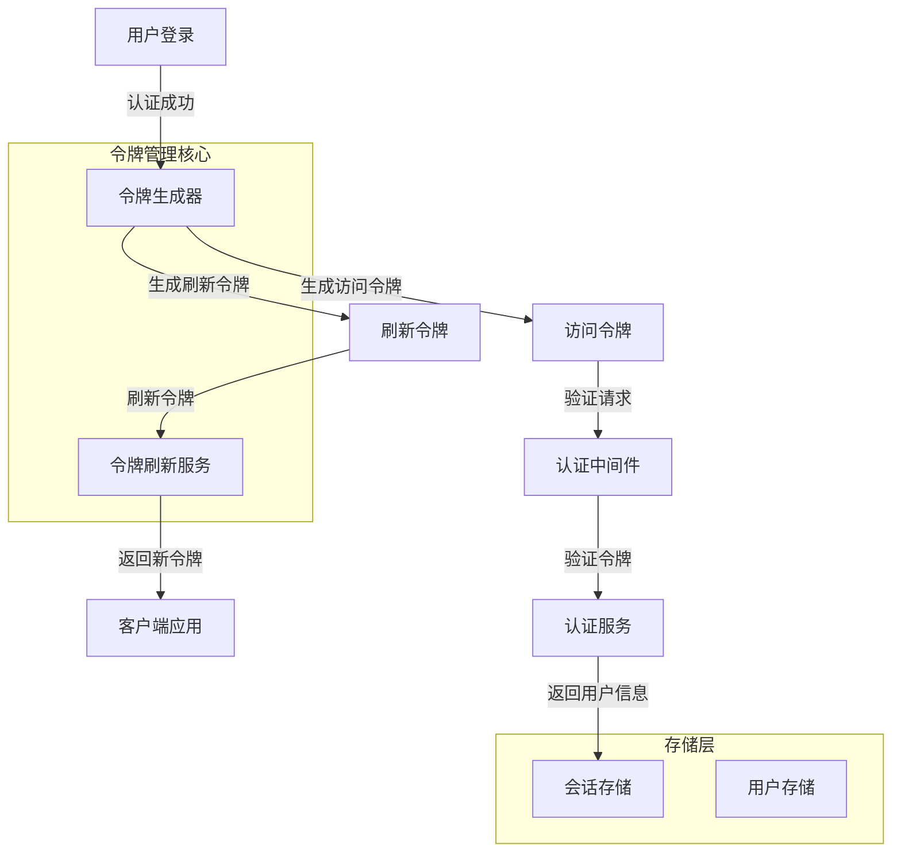
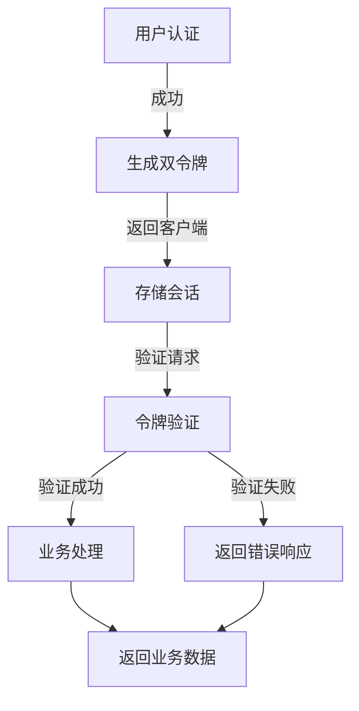
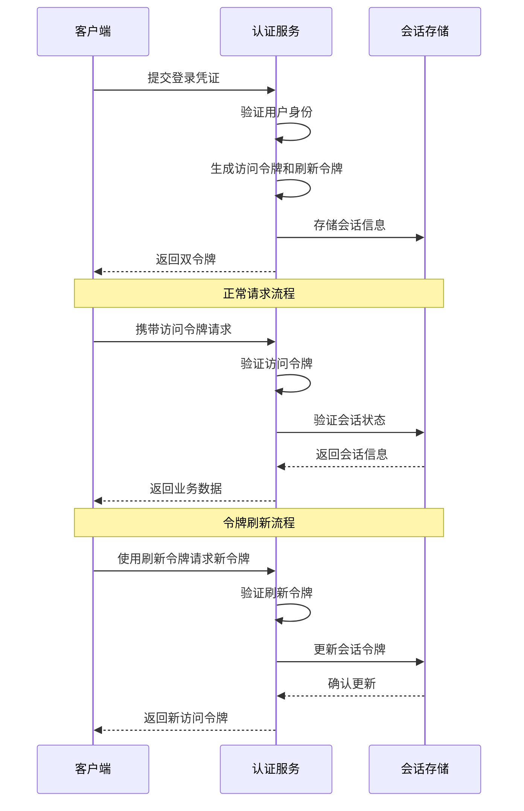
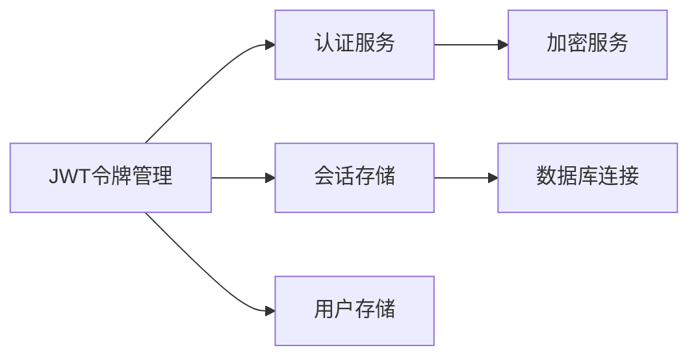

# JWT令牌管理 (JWT Token Management)

## 概述

**作用**：为 GitLab AI Copilot 系统提供完整的 JWT 令牌生命周期管理，包括令牌生成、验证、刷新和失效处理，确保系统访问安全性和用户会话连续性。

**使用场景**：
- 用户登录成功后生成访问令牌和刷新令牌
- API 请求的令牌验证和用户身份识别
- 令牌过期时的自动刷新机制
- 用户主动登出或安全事件时的令牌失效处理

**核心价值**：
- **安全认证**：通过 JWT 标准确保令牌的完整性和真实性
- **会话管理**：支持长会话模式下的令牌自动续期
- **多租户支持**：在令牌中嵌入租户上下文信息

## 快速开始

1. **配置 JWT 密钥**：通过环境变量设置 JWT_SECRET
2. **令牌生成**：用户认证成功后自动生成访问令牌和刷新令牌
3. **请求验证**：中间件自动验证请求头中的 Bearer 令牌
4. **自动刷新**：访问令牌过期时使用刷新令牌自动获取新令牌
5. **安全失效**：支持主动登出和批量会话清理

## 架构设计

### 系统架构图



### 项目结构

```
src/
├── services/
│   ├── authService.ts       # 认证服务，包含令牌生成逻辑
│   └── __tests__/
├── utils/
│   ├── gitlabAuth.ts       # GitLab 认证集成
└── types/
    └── auth.ts                # 令牌相关类型定义
```

### 设计原则

- **无状态设计**：JWT 令牌包含所有必要信息，服务端无需存储会话状态
- **双令牌机制**：访问令牌用于 API 请求，刷新令牌用于获取新访问令牌
- **安全优先**：令牌采用强加密算法，设置合理的过期时间

## 核心组件分析

### 组件1：令牌生成器
**文件路径**：`src/services/authService.ts`

**职责**：
- 根据用户信息生成 JWT 访问令牌和刷新令牌
- 管理令牌的有效期和刷新机制
- 处理令牌的安全存储和传输

**关键要点**：
- 采用 jsonwebtoken 库实现标准 JWT 令牌生成
- 支持自定义令牌载荷，包含用户ID、用户名、邮箱、会话ID等关键信息
- 实现令牌类型区分，访问令牌和刷新令牌具有不同的用途和有效期

### 组件2：令牌验证器
**文件路径**：`src/services/authService.ts`

**职责**：
- 验证 JWT 令牌的签名和有效期
- 检查令牌类型，确保访问令牌和刷新令牌的正确使用
- 验证会话状态，确保令牌对应的会话仍然有效

**关键要点**：
- 异步验证机制，避免阻塞事件循环
- 标准化错误处理，为不同验证失败场景提供明确的错误信息

## 执行流程

### 业务流程图



### 时序图（关键交互）



### 关键路径说明

1. **令牌生成路径**：`src/services/authService.ts` 中的 `generateTokens` 函数负责创建 JWT 令牌
2. **令牌验证路径**：`src/services/authService.ts` 中的 `verifyAccessToken` 函数处理令牌验证
3. **会话验证路径**：调用会话存储验证令牌对应的会话是否仍然有效
4. **令牌刷新路径**：通过刷新令牌获取新的访问令牌，同时保持会话连续性

## 依赖关系

### 内部依赖



### 外部依赖

- **jsonwebtoken 库**：提供 JWT 令牌的生成和验证功能
- **bcrypt 库**：用于密码哈希和验证
- **crypto 模块**：提供随机数生成和加密功能

### 依赖注入

通过模块导入方式实现依赖注入，令牌管理功能通过导入认证服务模块实现，各组件间通过清晰的接口定义实现松耦合

## 使用方式

### 基础用法

1. **用户登录**：用户提交用户名/邮箱和密码进行认证
2. **令牌生成**：认证成功后，系统自动生成访问令牌和刷新令牌
3. **自动验证**：中间件自动拦截请求并验证令牌有效性
4. **会话保持**：通过令牌刷新机制实现长会话模式
5. **安全登出**：用户主动登出时清理所有相关会话和令牌

### 高级用法

- **多租户令牌**：在令牌载荷中嵌入租户上下文信息
- **令牌轮换**：定期更新令牌以增强安全性
- **批量管理**：支持管理员批量清理用户会话和令牌

### API参考

| 方法/属性 | 类型 | 说明 | 使用提示 |
|---------|------|------|----------------|
| generateTokens | (user: AuthUser, sessionId: string) => TokenResponse | 生成访问令牌和刷新令牌 | 适用于用户登录成功后的令牌生成 |
| verifyAccessToken | (token: string) => Promise<JWTPayload> | 验证访问令牌有效性 | 适用于所有需要认证的API请求 |
| refreshTokens | (refreshToken: string) => Promise<TokenResponse> | 刷新访问令牌 | 适用于访问令牌过期时的自动续期 |
| logout | (sessionId: string) => Promise<void> | 登出指定会话 | 适用于用户主动登出场景 |

### 配置选项

- **JWT_SECRET**：JWT 签名密钥，用于令牌验证和防篡改 |
| JWT_ACCESS_EXPIRES_IN | string | 访问令牌有效期 | 默认15分钟，可根据安全要求调整 |
- **JWT_REFRESH_EXPIRES_IN**：刷新令牌有效期，默认7天，控制会话生命周期 |
- **BCRYPT_ROUNDS**：密码哈希强度，默认12轮，平衡安全性和性能 |

## 最佳实践与注意事项

### ✅ 推荐做法

1. **合理设置令牌有效期**：访问令牌设置较短有效期（如15分钟），刷新令牌设置较长有效期（如7天） |
- **MAX_LOGIN_ATTEMPTS**：最大登录尝试次数，防止暴力破解 |
   - 适用场景：所有用户认证场景 |
   - 效果说明：在安全性和用户体验间取得平衡 |

2. **使用 HTTPS 传输**：确保令牌在传输过程中的安全性，防止中间人攻击 |
   - 适用场景：生产环境部署 |
   - 效果说明：防止令牌在传输过程中被截获 |

### ❌ 常见陷阱

1. **令牌泄露风险**：JWT 令牌一旦泄露，攻击者可在有效期内冒充用户 |
   - 现象描述：攻击者获取令牌后可以访问用户资源 |
   - 正确做法：设置合理的令牌过期时间，使用 HTTPS 加密传输 |

2. **会话管理不当**：长时间不清理过期会话可能导致内存泄漏和性能问题 |
   - 正确做法：配置会话清理服务，定期清理过期会话数据 |

### 性能优化建议

- **异步验证**：使用 Promise 异步验证令牌，避免阻塞事件循环 |
- **缓存机制**：对于频繁验证的令牌，可以引入缓存机制提高验证性能 |

### 安全注意事项

- **密钥安全管理**：JWT 密钥作为系统核心机密，必须安全存储和管理 |
- **令牌轮换策略**：定期更新令牌，即使令牌泄露也能限制攻击时间窗口 |

## 测试策略

### 单元测试示例

需要覆盖的测试场景包括：有效令牌生成、无效令牌拒绝、令牌过期检测、刷新令牌验证等关键路径，确保令牌管理逻辑的正确性和安全性 |

### 集成测试要点

- 测试令牌生成与验证的完整流程 |
- 验证令牌刷新机制的正确性 |
- 测试多租户环境下的令牌隔离机制 |

### 调试技巧

- 开启调试日志：设置 LOG_LEVEL=debug 查看详细令牌管理过程 |
- 常见问题排查：检查 JWT 密钥配置、验证令牌格式、排查网络连接问题 |

### 性能监控

- **令牌验证成功率**：监控令牌验证成功与失败的比例 |
- **响应时间**：监控令牌验证过程的平均响应时间 |
- **错误频率**：监控令牌验证失败请求的频率和原因 |

## 扩展性设计

### 扩展点

- **令牌格式扩展**：可以通过实现新的令牌适配器支持更多令牌格式和验证机制 |
- **认证策略扩展**：支持集成第三方认证服务或企业单点登录系统 |

### 版本演进

- **向后兼容**：确保新版本令牌管理兼容旧版本客户端 |
- **安全增强**：未来可支持更复杂的令牌加密算法和验证机制 |

### 相关技术点

- [用户认证服务](./用户认证服务.md)
- [GitLab认证集成](./GitLab认证集成.md)
- [会话安全管理](./会话安全管理.md)

### 当前版本的限制

- 目前主要支持 JWT 令牌认证 |
- 令牌刷新机制需要客户端主动发起 |

## 总结

JWT令牌管理作为 GitLab AI Copilot 系统的核心安全组件，通过标准化的令牌生命周期管理确保系统访问安全，同时支持多租户环境下的用户身份识别和资源隔离，为企业级应用提供可靠的身份验证和会话管理保障。
