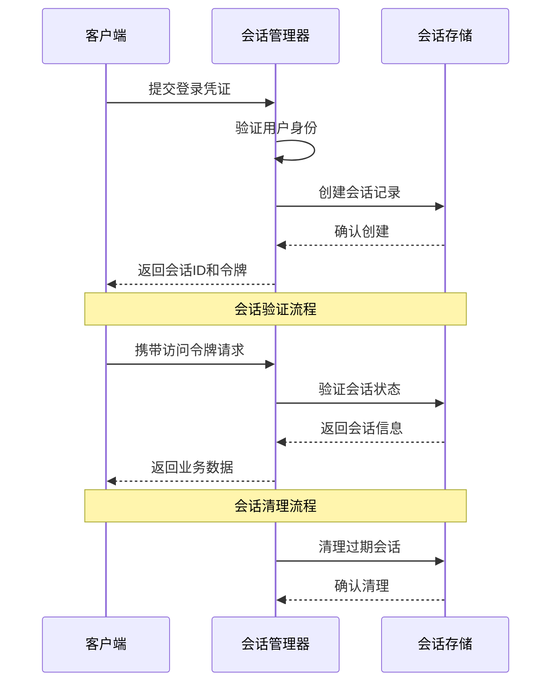
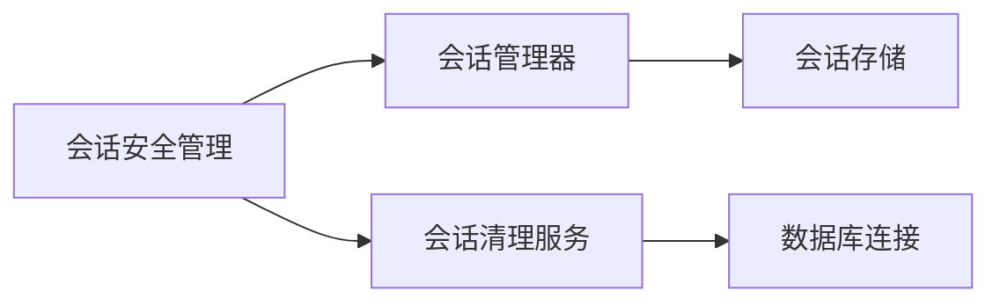

# 会话安全管理 (Session Security Management)

## 概述

**作用**：为 GitLab AI Copilot 系统提供 Web 会话的安全管理，包括会话创建、验证、刷新和清理等完整生命周期管理。

**使用场景**：
- 用户登录成功后的会话创建和管理
- 会话状态验证和用户身份确认
- 会话过期清理和资源回收

**核心价值**：
- **会话安全**：通过哈希存储和定期清理确保会话数据安全
- **资源优化**：自动清理过期会话，防止内存泄漏和性能问题

## 快速开始

1. **会话创建**：用户登录成功后创建新的 Web 会话
- **自动续期**：支持会话的自动刷新和续期机制
- **多租户支持**：在企业级部署中实现会话数据的完全隔离

## 架构设计

### 系统架构图

```mermaid
graph TB
    A[用户登录] -->|认证成功| B[会话创建器]
    B -->|生成会话ID| C[会话存储]
    C -->|存储会话数据| D[数据库]
    
    subgraph "会话管理层"
        B
        E[会话验证器]
        F[会话清理器]
    G[会话刷新器]
    
    subgraph "存储层"
        C
        H[用户存储]
    end
    
    subgraph "安全监控"
        I[安全日志]
        J[异常检测器]
    end
```

### 项目结构

```
src/
├── services/
│   ├── sessionManager.ts       # 会话管理器主文件
    ├── sessionStore.ts            # 会话存储接口
    └── __tests__/                 # 测试文件
├── storage/
│   ├── webSessionRepository.ts   # Web会话存储实现
    └── __tests__/                 # 存储层测试
└── types/
    └── session.ts                 # 会话相关类型定义
```

### 设计原则

- **安全存储**：会话令牌使用哈希存储，避免明文泄露风险
- **自动清理**：配置会话清理服务定期清理过期会话
```

## 核心组件分析

### 组件1：会话管理器
**文件路径**：`src/services/sessionManager.ts`

**职责**：
- 管理 Web 会话的完整生命周期
- 处理会话的创建、验证、刷新和清理操作

**关键要点**：
- 采用异步操作模式，支持高并发场景
- 实现会话状态的实时验证和更新

### 组件2：会话存储
**文件路径**：`src/services/sessionStore.ts`

**职责**：
- 提供会话数据的持久化存储能力
- 支持会话的快速查询和状态更新

### 组件3：会话清理服务
**文件路径**：`src/services/sessionCleanupService.ts`

**职责**：
- 定期扫描和清理过期会话
- 管理会话存储的容量和性能优化

**关键要点**：
- 采用哈希存储会话令牌，增强安全性
- 实现会话数据的定期清理和资源回收

**关键要点**：
- 配置清理间隔和会话过期时间
- 处理会话清理的异常情况和错误恢复

## 执行流程

### 业务流程图

```mermaid
flowchart TD
    Start[用户登录] -->|成功| CreateSession[创建会话]
    CreateSession -->|存储数据| SessionStore[会话存储]
    SessionStore -->|返回状态| SessionManager[会话管理器]
    
    subgraph "会话管理流程"
        CreateSession
        ValidateSession[验证会话]
        RefreshSession[刷新会话]
        CleanupSession[清理会话]
    
    CreateSession -->|返回会话ID| End[结束]
    ValidateSession -->|验证成功| UpdateActivity[更新活动时间]
    UpdateActivity --> End
    CleanupSession --> End
```

### 时序图（关键交互）



### 关键路径说明

1. **会话创建路径**：`src/services/sessionManager.ts` 中的 `createSession` 函数处理会话创建
2. **会话验证路径**：`src/services/sessionManager.ts` 中的 `validateSession` 函数处理会话验证
3. **会话刷新路径**：`src/services/sessionManager.ts` 中的 `refreshSession` 函数处理会话续期
4. **会话清理路径**：`src/services/sessionCleanupService.ts` 中的 `cleanupExpiredSessions` 函数处理过期会话清理

## 依赖关系

### 内部依赖



### 外部依赖

- **MongoDB 数据库**：提供会话数据的持久化存储能力

### 依赖注入

通过模块导入方式实现依赖注入，会话安全管理通过导入会话存储和用户存储模块实现数据持久化

## 使用方式

### 基础用法

1. **会话创建**：用户登录成功后自动创建新的 Web 会话
2. **会话验证**：每次 API 请求时自动验证会话状态和用户身份

### 高级用法

- **批量会话管理**：支持管理员批量清理用户会话和令牌

### API参考

| 方法/属性 | 类型 | 说明 | 使用提示 |
|---------|------|------|----------------|
| createSession | (userId: string, accessToken: string, refreshToken: string, sessionData: WebSessionData, expiresIn: number, sessionId: string) => Promise<void> | 创建新会话 | 适用于用户登录成功后的会话建立 |
| validateSession | (sessionId: string, token: string) => Promise<WebSession> | 验证会话状态 | 适用于所有需要会话验证的API请求 |
| refreshSession | (sessionId: string, oldRefreshToken: string, newAccessToken: string, newRefreshToken: string, expiresIn: number) => Promise<WebSession> | 刷新会话令牌 | 适用于会话续期和令牌更新场景 |

### 配置选项

- **SESSION_MAX_IDLE_TIME**：会话最大空闲时间，控制会话生命周期和自动清理策略 |

## 最佳实践与注意事项

### ✅ 推荐做法

1. **合理设置会话生命周期**：根据安全要求和用户体验设置合适的会话过期时间 |

## 测试策略

### 单元测试示例

需要覆盖的测试场景包括：会话创建、会话验证、会话刷新、会话清理等关键操作，确保会话管理的安全性和可靠性 |

2. **定期清理机制**：配置自动清理服务定期清理过期会话，防止内存泄漏和性能问题 |
   - 适用场景：生产环境部署 |
   - 效果说明：保持系统性能稳定，防止资源浪费 |

### ❌ 常见陷阱

1. **会话泄露风险**：会话数据如果管理不当可能导致用户身份被冒用 |
   - 正确做法：配置合理的会话过期时间和清理间隔，确保过期会话及时清理 |

2. **并发访问问题**：高并发场景下可能出现会话数据竞争和状态不一致问题 |
   - 正确做法：使用数据库事务和乐观锁机制确保会话数据的一致性 |

### 性能优化建议

- **异步操作**：所有会话管理操作都采用异步方式，避免阻塞事件循环 |
- **索引优化**：为会话存储创建合适的数据库索引，提高查询性能 |

### 安全注意事项

- **会话令牌安全**：会话令牌使用哈希存储，避免明文泄露风险 |

## 扩展性设计

### 扩展点

- **存储策略扩展**：可以通过实现新的存储适配器支持更多数据库类型和存储方案 |

### 相关技术点

- [JWT令牌管理](./JWT令牌管理.md)
- [用户认证服务](./用户认证服务.md)
- [GitLab认证集成](./GitLab认证集成.md)

## 总结

会话安全管理作为 GitLab AI Copilot 系统的会话生命周期管理核心，通过标准化的会话创建、验证、刷新和清理机制确保系统访问安全，同时支持多租户环境下的会话数据隔离，为企业级应用提供可靠的会话管理保障。
