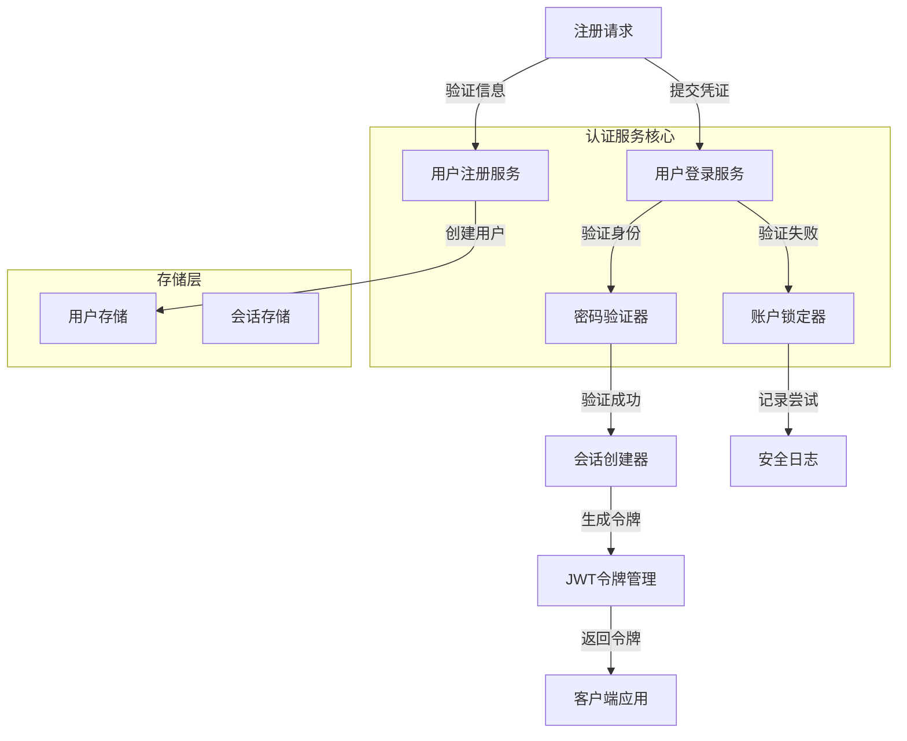
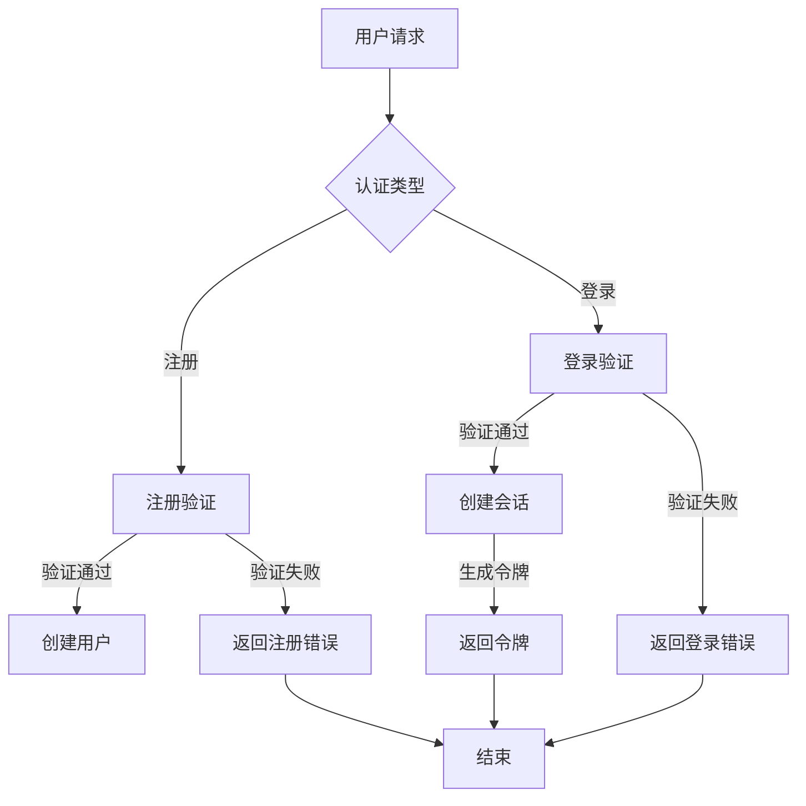
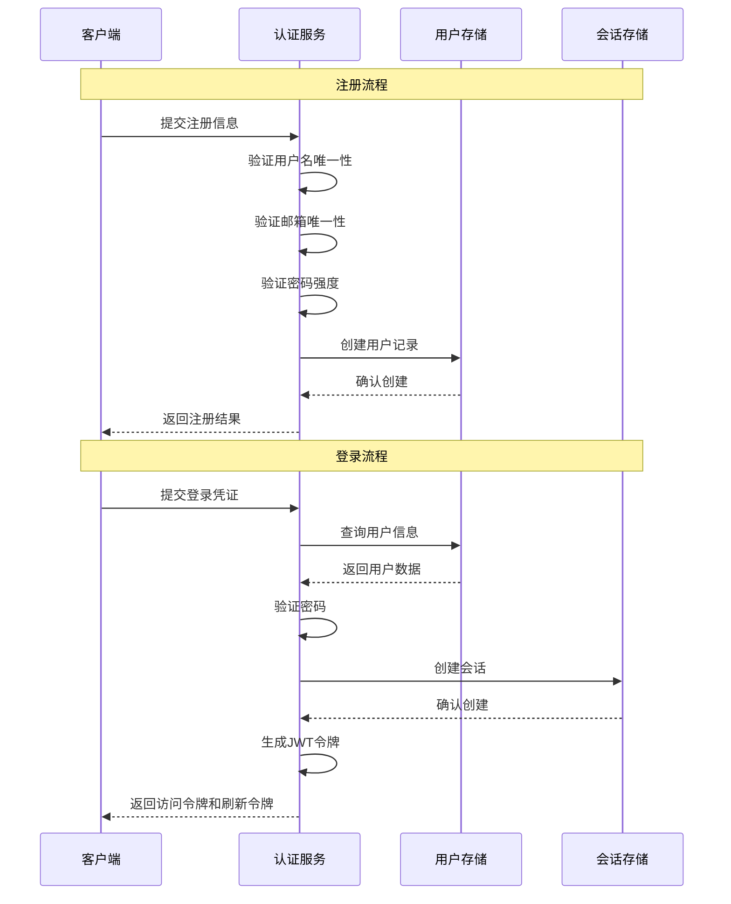
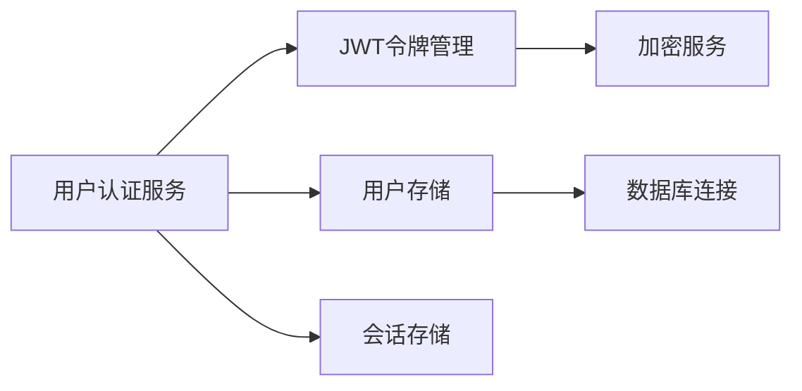

# 用户认证服务 (User Authentication Service)

## 概述

**作用**：为 GitLab AI Copilot 系统提供完整的用户身份认证流程，包括用户注册、登录、密码验证、账户锁定等安全机制，确保系统访问的合法性和安全性。

**使用场景**：
- 新用户注册和账户创建
- 用户登录认证和会话建立
- 密码安全验证和强度检查
- 账户安全保护和防暴力破解

**核心价值**：
- **企业级安全**：通过多重验证机制保护用户账户
- **用户体验**：提供流畅的注册和登录体验
- **多租户支持**：在企业级部署中实现用户数据的完全隔离

## 快速开始

1. **用户注册**：新用户提交注册信息，系统验证并创建账户
2. **登录认证**：用户提交凭证，系统验证身份并建立会话
3. **会话管理**：支持长会话模式下的用户状态保持
4. **安全防护**：自动检测和阻止可疑登录行为

## 架构设计

### 系统架构图



### 项目结构

```
src/
├── services/
│   ├── authService.ts       # 认证服务主文件
│   └── __tests__/             # 测试文件
├── storage/
│   ├── userRepository.ts      # 用户数据存储
│   ├── webSessionRepository.ts # Web会话存储
│   └── __tests__/             # 存储层测试
└── types/
    └── auth.ts                  # 认证相关类型定义
```

### 设计原则

- **分层架构**：认证服务、存储层、业务逻辑层职责清晰分离
- **安全优先**：所有敏感操作都经过严格的安全验证
- **配置驱动**：通过环境变量灵活配置认证参数和安全策略

## 核心组件分析

### 组件1：用户注册服务
**文件路径**：`src/services/authService.ts`

**职责**：
- 验证用户注册信息的完整性和合法性
- 检查用户名和邮箱的唯一性
- 对密码进行强度验证和加密存储

**关键要点**：
- 采用异步验证机制，支持高并发注册场景
- 标准化错误响应，为不同验证失败场景提供明确的错误信息

**关键要点**：
- 密码强度验证包括长度、大小写字母、数字和特殊字符要求
- 用户令牌生成采用加密随机数确保唯一性

### 组件2：用户登录服务
**文件路径**：`src/services/authService.ts`

**职责**：
- 验证用户登录凭证的正确性
- 实现账户锁定机制防止暴力破解
- 管理登录尝试次数和锁定时间

**关键要点**：
- 登录失败次数统计和账户自动锁定
- 成功登录后的会话创建和令牌生成

### 组件3：密码验证器
**文件路径**：`src/services/authService.ts`

**职责**：
- 使用 bcrypt 算法验证密码哈希
- 处理密码验证的异步操作和错误处理

## 执行流程

### 业务流程图



### 时序图（关键交互）



### 关键路径说明

1. **注册验证路径**：`src/services/authService.ts` 中的 `register` 函数处理用户注册
2. **登录验证路径**：`src/services/authService.ts` 中的 `login` 函数处理用户登录
3. **密码验证路径**：使用 bcrypt 算法异步验证密码哈希
4. **账户锁定路径**：当登录失败次数超过阈值时自动锁定账户

## 依赖关系

### 内部依赖



### 外部依赖

- **bcrypt 库**：用于密码哈希和验证
- **jsonwebtoken 库**：用于 JWT 令牌生成和验证
- **crypto 模块**：提供随机数生成和加密功能

### 依赖注入

通过模块导入方式实现依赖注入，认证服务通过导入用户存储和会话存储模块实现数据持久化

## 使用方式

### 基础用法

1. **用户注册流程**：
   - 验证用户名格式和唯一性
   - 验证邮箱格式和唯一性
   - 验证密码强度和匹配性
- **用户创建**：验证通过后创建用户记录
- **密码加密**：使用 bcrypt 对密码进行哈希处理
2. **用户登录流程**：
   - 验证用户凭证的正确性
   - 检查账户锁定状态
   - 验证密码哈希
   - 创建会话和生成令牌

### 高级用法

- **多因素认证**：支持短信验证码、邮箱验证等增强认证方式
- **账户恢复**：提供安全的账户恢复和密码重置机制

### API参考

| 方法/属性 | 类型 | 说明 | 使用提示 |
|---------|------|------|----------------|
| register | (userData: RegisterRequest) => Promise<RegisterResponse> | 用户注册服务 | 适用于新用户创建账户 |
| login | (credentials: LoginRequest, sessionData: WebSessionData) => Promise<LoginResponse> | 用户登录认证 | 适用于用户访问系统时的身份验证 |
| validatePassword | (password: string) => ValidationResult | 密码强度验证 | 适用于注册和密码修改场景 |
| validateEmail | (email: string) => Promise<ValidationResult> | 邮箱格式和唯一性验证 | 适用于用户注册和邮箱更新操作 |

### 配置选项

- **BCRYPT_ROUNDS**：密码哈希强度，默认12轮，平衡安全性和性能 |
- **MAX_LOGIN_ATTEMPTS**：最大登录尝试次数，默认5次，防止暴力破解 |
- **LOCKOUT_DURATION**：账户锁定持续时间，默认15分钟，控制安全防护强度 |

## 最佳实践与注意事项

### ✅ 推荐做法

1. **密码强度要求**：设置合理的密码复杂度要求，包括长度、字符类型等 |
   - 适用场景：所有用户认证场景 |
   - 效果说明：在安全性和用户体验间取得平衡 |

2. **账户锁定机制**：自动检测和阻止可疑登录行为 |
   - 适用场景：生产环境部署 |
   - 效果说明：防止账户被暴力破解 |

### ❌ 常见陷阱

1. **密码哈希强度不足**：使用过低的 bcrypt 轮数可能导致密码容易被破解 |
   - 现象描述：攻击者使用暴力破解或字典攻击可能成功 |
   - 正确做法：根据系统安全要求设置合适的 bcrypt 轮数 |

2. **会话管理不当**：长时间不清理过期会话可能导致内存泄漏和性能问题 |
   - 正确做法：配置会话清理服务，定期清理过期会话数据 |

### 性能优化建议

- **异步操作**：所有认证操作都采用异步方式，避免阻塞事件循环 |
- **缓存策略**：对于频繁访问的用户信息，可以引入缓存机制提高查询性能 |

### 安全注意事项

- **敏感信息保护**：用户密码、令牌等敏感信息使用强加密算法存储 |

## 测试策略

### 单元测试示例

需要覆盖的测试场景包括：有效注册信息验证、重复用户名检测、密码强度检查、登录成功验证、登录失败处理等关键路径 |

### 集成测试要点

- 测试用户注册与登录的完整认证流程 |
- 验证账户锁定机制的正确性 |
- 测试多租户环境下的用户数据隔离机制 |

### 调试技巧

- 开启调试日志：设置 LOG_LEVEL=debug 查看详细认证过程 |
- 常见问题排查：检查数据库连接、验证加密配置、排查网络连接问题 |

### 性能监控

- **认证成功率**：监控认证成功与失败的比例 |
- **响应时间**：监控认证过程的平均响应时间 |
- **错误频率**：监控认证失败请求的频率和原因 |

## 扩展性设计

### 扩展点

- **认证策略扩展**：可以通过实现新的认证适配器支持更多认证方式 |
- **安全增强**：支持更复杂的密码策略和多因素认证机制 |

### 版本演进

- **向后兼容**：确保新版本认证服务兼容旧版本客户端 |

### 相关技术点

- [JWT令牌管理](./JWT令牌管理.md)
- [GitLab认证集成](./GitLab认证集成.md)
- [会话安全管理](./会话安全管理.md)

### 当前版本的限制

- 目前主要支持基于用户名/邮箱和密码的认证方式 |
- **多因素认证**：当前版本暂不支持多因素认证，未来版本可扩展此功能 |

## 总结

用户认证服务作为 GitLab AI Copilot 系统的用户身份验证核心，通过标准化的注册和登录流程确保系统访问安全，同时支持多租户环境下的用户数据隔离，为企业级应用提供可靠的身份认证保障。
