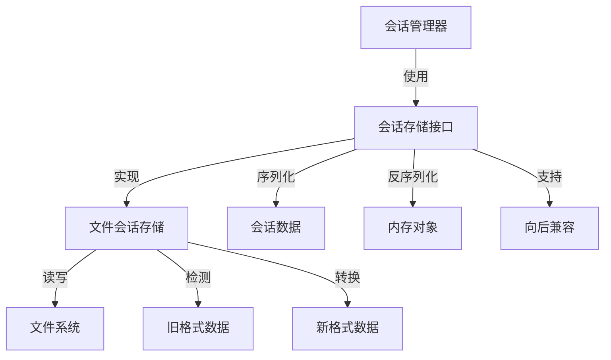
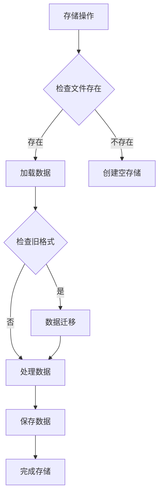
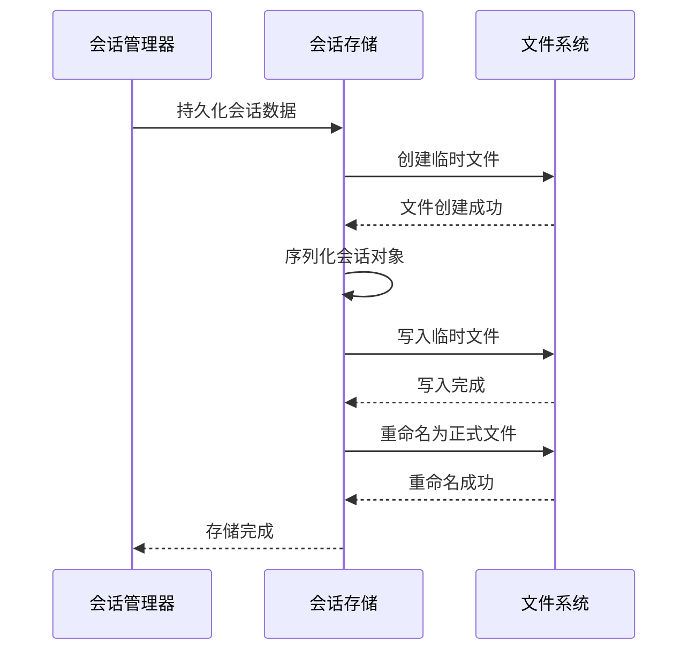

# 会话存储 (Session Store)

## 概述
- **作用**：提供会话数据的持久化存储能力，支持会话状态的恢复和迁移
- **使用场景**：系统重启后需要恢复之前的会话状态，或者需要将旧格式会话数据迁移到新格式
- **核心价值**：通过抽象存储层，实现会话数据的可靠持久化和向后兼容

## 快速开始
1. 实现SessionStore接口定义存储行为
2. 使用FileSessionStore作为默认文件系统实现
3. 支持自定义存储后端扩展

## 架构设计

### 系统架构图


### 项目结构
```
src/
├── services/
│   ├── sessionStore.ts        # 存储接口定义
    │   └── FileSessionStore.ts   # 文件系统实现
```

### 设计原则
- **接口隔离**：定义清晰的存储操作接口
- **文件持久化**：使用JSON格式存储会话数据
- **临时文件策略**：先写入临时文件再重命名，确保数据完整性
- **格式迁移**：自动检测并转换旧格式会话数据

## 核心组件分析

### 组件1：会话存储接口
**文件路径**：`src/services/sessionStore.ts`

**职责**：
- 定义会话数据的加载和持久化标准接口
- 支持旧格式数据的检测和转换机制

**关键要点**：
- 使用临时文件机制防止数据损坏
- 支持旧格式会话数据的自动迁移

### 组件2：文件会话存储实现
**文件路径**：`src/services/sessionStore.ts`

**职责**：
- 实现文件系统的会话数据读写操作
- 处理会话数据的序列化和反序列化过程
- 维护旧格式检测标志，支持数据迁移状态跟踪

### 组件3：数据格式转换器
**文件路径**：`src/services/sessionStore.ts`

**职责**：
- 将内存中的会话对象转换为可存储的JSON格式
- 从存储的JSON数据重建内存会话对象

## 执行流程

### 业务流程图


### 时序图（关键交互）


### 关键路径说明
1. **数据加载**：从文件系统读取持久化数据
2. **格式检测**：检查是否存在旧格式数据
3. **数据转换**：将旧格式数据转换为新格式
4. **持久化存储**：将会话数据写入文件系统

## 依赖关系

### 内部依赖
```mermaid
graph LR
    A[会话存储] --> B[文件系统]
    A --> C[日志系统]
    A --> D[序列化机制]

### 外部依赖
- **Node.js文件系统模块**：提供文件读写能力
- **JSON序列化**：标准的数据交换格式

### 依赖注入
通过构造函数注入存储路径，支持灵活的存储位置配置

## 使用方式

### 基础用法
1. 在会话管理器初始化时创建存储实例
2. 配置存储路径和文件格式
3. 支持会话数据的自动迁移和格式升级

### 高级用法
- **自定义存储后端**：实现SessionStore接口支持不同存储方案
- **数据完整性保护**：通过临时文件机制确保数据不会损坏

### API参考
| 方法/属性 | 类型 | 说明 | 使用提示 |
|---------|------|------|----------------|
| load | () => SessionInfo[] | 加载所有持久化会话数据 | 自动处理格式迁移 |
| persist | (sessions: SessionInfo[]) => void | 持久化会话数据 | 使用临时文件确保数据安全 |
| hasLegacyFormat | () => boolean | 检查是否存在旧格式数据 | 用于数据迁移状态跟踪 |

### 配置选项
- **storagePath**：会话数据持久化存储文件路径
- **临时文件机制**：先写入.tmp文件再重命名

## 最佳实践与注意事项

### ✅ 推荐做法
1. **数据备份策略**：定期备份会话数据文件
   - 适用场景：生产环境数据保护
   - 效果说明：防止数据丢失，支持系统恢复

2. **格式兼容性**：确保新版本能够处理旧格式数据
   - 适用场景：系统升级和版本迁移
   - 效果说明：平滑升级，数据不丢失

### ❌ 常见陷阱
1. **数据损坏风险**：直接写入正式文件可能导致数据不完整
   - 现象描述：系统异常退出时可能损坏会话数据
   - 正确做法：使用临时文件机制，写入完成后再重命名

### 性能优化建议
- **批量操作**：减少文件I/O操作次数
- **增量更新**：只更新变化的会话数据

### 安全注意事项
- **文件权限控制**：确保会话数据文件只有授权用户可访问
- **数据加密**：敏感会话数据在存储时进行加密处理

## 测试策略

### 单元测试示例
需要覆盖数据加载、持久化、格式转换等核心功能

### 集成测试要点
- 测试会话存储与会话管理器的集成
- 验证数据迁移的正确性和完整性

### 调试技巧
- 检查存储文件内容验证数据格式
- 监控数据迁移过程确保转换正确

### 性能监控
- **文件大小监控**：确保会话数据文件不会无限增长
- **存储性能指标**：监控读写操作耗时和成功率

## 扩展性设计

### 扩展点
- **存储后端扩展**：支持MongoDB、Redis等数据库存储
- **压缩存储**：对于大量会话数据使用压缩算法减少存储空间

### 版本演进
- **当前版本的限制**：仅支持JSON文件格式存储
- **未来改进方向**：支持多种存储后端，实现高可用存储架构

### 相关技术点
- [会话管理器](../状态管理/会话管理器.md)
- [会话清理服务](../状态管理/会话清理服务.md)
- [流式AI执行器](../状态管理/流式AI执行器.md)
