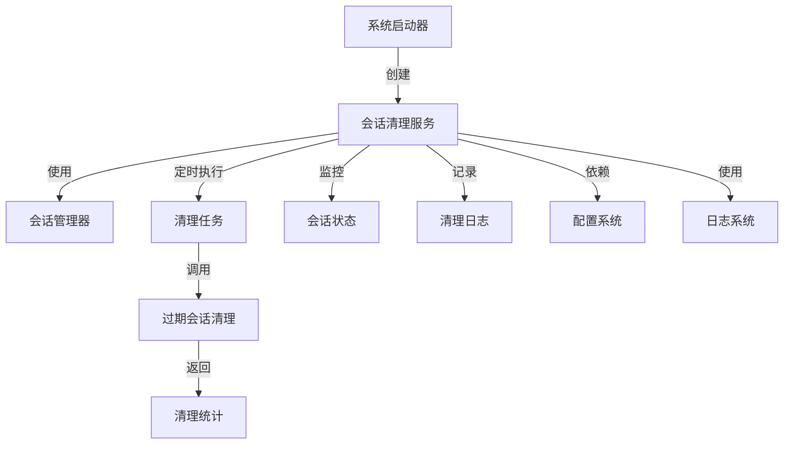
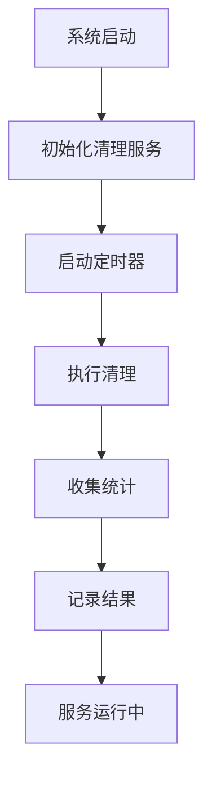
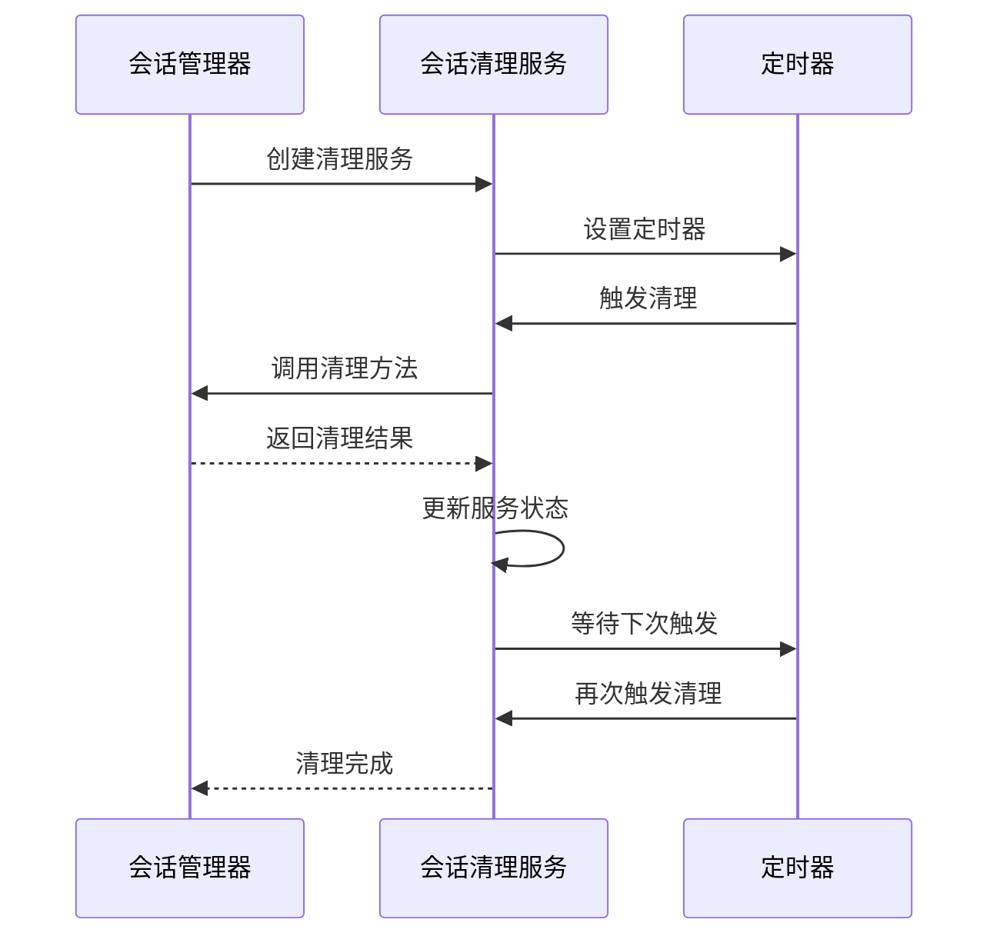

# 会话清理服务 (Session Cleanup Service)

## 概述
- **作用**：定期清理过期会话，防止资源泄漏，维护系统性能
- **使用场景**：系统长时间运行后需要清理不再使用的会话数据
- **核心价值**：通过自动化清理机制，确保会话管理系统的稳定性和资源利用率

## 快速开始
1. 在系统启动时初始化会话清理服务
2. 配置清理间隔和会话过期时间
3. 支持手动触发清理操作

## 架构设计

### 系统架构图


### 项目结构
```
src/
├── services/
│   ├── sessionCleanupService.ts # 主清理服务
    │   └── 定时器机制
```

### 设计原则
- **定时清理**：通过定时器定期执行清理任务
- **资源监控**：实时监控会话资源使用情况
- **渐进式清理**：避免一次性清理大量会话导致性能波动

## 核心组件分析

### 组件1：会话清理服务主类
**文件路径**：`src/services/sessionCleanupService.ts`

**职责**：
- 管理清理服务的启动、停止和状态监控
- 提供手动清理接口支持运维操作

**关键要点**：
- 使用Node.js setInterval实现定时清理
- 支持服务状态查询和运行控制

### 组件2：清理任务执行器
**文件路径**：`src/services/sessionCleanupService.ts`

**职责**：
- 执行实际的会话清理操作
- 收集清理统计信息用于监控和分析

### 组件3：性能监控器
**文件路径**：`src/services/sessionCleanupService.ts`

**职责**：
- 监控清理任务执行性能
- 记录清理过程中的异常和警告信息

## 执行流程

### 业务流程图


### 时序图（关键交互）


### 关键路径说明
1. **服务初始化**：创建清理服务实例并配置参数
2. **定时器启动**：设置清理任务执行间隔
3. **清理执行**：识别并移除过期会话
4. **统计收集**：记录清理操作的详细统计信息

## 依赖关系

### 内部依赖
```mermaid
graph LR
    A[会话清理服务] --> B[会话管理器]
    A --> C[定时器系统]
    A --> D[日志记录系统]

### 外部依赖
- **Node.js定时器API**：提供定时任务执行能力
- **系统时间**：用于计算会话过期时间和清理间隔

### 依赖注入
通过构造函数注入会话管理器实例，实现服务间的解耦和可测试性

## 使用方式

### 基础用法
1. 在应用启动时调用start方法启动清理服务
2. 配置清理间隔和会话过期时间阈值
3. 支持手动触发清理操作进行系统维护

### 高级用法
- **动态调整清理策略**：根据系统负载自动调整清理频率
- **清理性能监控**：实时监控清理任务执行效率

### API参考
| 方法/属性 | 类型 | 说明 | 使用提示 |
|---------|------|------|----------------|
| start | () => void | 启动清理服务 | 自动执行定期清理 |
| runManualCleanup | () => Promise<CleanupStats> | 手动执行清理 | 返回详细统计信息 |
| getStatus | () => ServiceStatus | 获取服务运行状态 | 包含下次清理时间预估 |

### 配置选项
- **cleanupInterval**：清理任务执行间隔时间
- **maxIdleTime**：会话最大空闲时间阈值
| isServiceRunning | () => boolean | 检查服务是否正在运行 | 用于健康检查 |

## 最佳实践与注意事项

### ✅ 推荐做法
1. **合理配置清理间隔**：根据业务负载设置适当的清理频率
   - 适用场景：高并发环境需要更频繁的清理
- **效果说明**：保持系统性能稳定，防止内存泄漏

2. **监控清理性能**：定期检查清理任务执行时间
   - 适用场景：性能敏感的生产环境
   - 效果说明：及时发现性能问题，优化系统资源使用

### ❌ 常见陷阱
1. **清理间隔过短**：可能导致频繁的清理操作影响系统性能
   - 现象描述：系统CPU使用率异常升高
   - 正确做法：根据实际使用情况调整清理间隔

### 性能优化建议
- **异步清理**：避免阻塞主线程，提高系统响应能力

### 安全注意事项
- **数据完整性**：确保清理操作不会误删活跃会话
- **操作审计**：记录所有清理操作的详细日志

## 测试策略

### 单元测试示例
需要覆盖服务启动、停止、手动清理等核心功能，验证清理逻辑的正确性和统计信息的准确性

### 集成测试要点
- 测试会话清理服务与会话管理器的集成
- 验证清理统计数据的正确性

### 调试技巧
- 启用调试日志查看清理任务执行过程
- 监控清理统计信息识别异常清理行为

### 性能监控
- **清理执行时间**：监控清理任务耗时
- **会话数量变化**：观察清理前后会话数量的变化趋势

## 扩展性设计

### 扩展点
- **清理策略扩展**：支持不同的会话清理算法和策略
- **监控告警**：设置清理异常告警机制

### 版本演进
- **当前版本的限制**：清理策略相对简单，缺乏智能优化
- **未来改进方向**：基于机器学习预测会话使用模式，实现智能清理

### 相关技术点
- [会话管理器](../状态管理/会话管理器.md)
- [会话存储](../状态管理/会话存储.md)
- [流式AI执行器](../状态管理/流式AI执行器.md)
