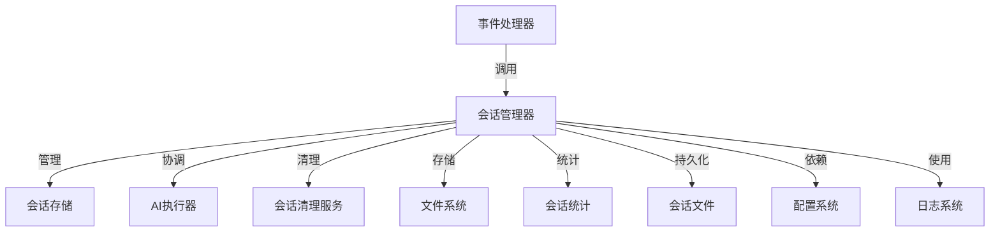
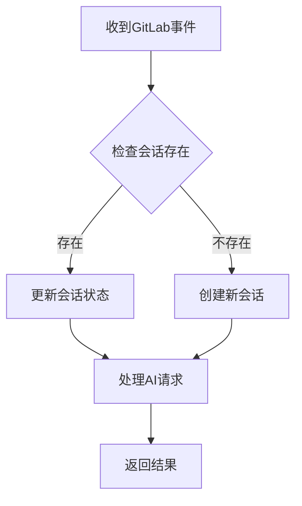
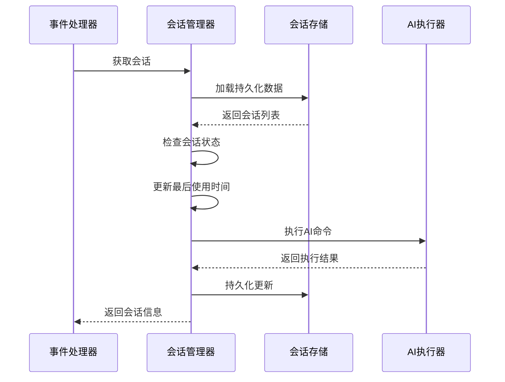
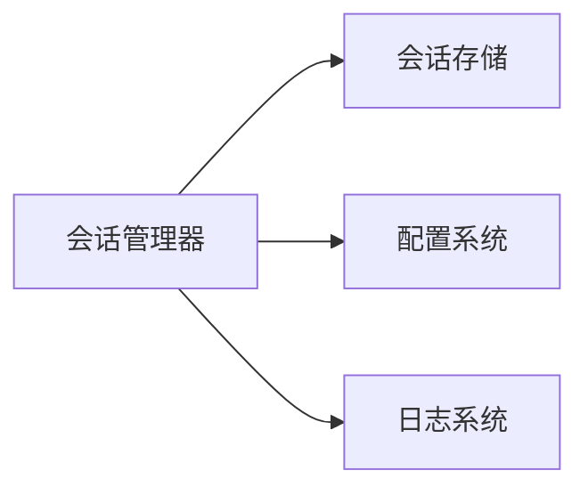

# 会话管理器 (Session Manager)

## 概述
- **作用**：作为AI交互会话的中央协调器，管理多轮对话的上下文状态和生命周期
- **使用场景**：当用户与AI进行长交互对话时，需要维护会话状态，支持上下文记忆和持续交互
- **核心价值**：通过统一的会话管理机制，确保AI能够记住对话历史，提供连贯的交互体验

## 快速开始
1. 通过环境变量配置会话管理参数
2. 在事件处理器中调用会话管理器
3. 根据Issue/MR事件创建或复用会话
4. 支持多种AI提供商的会话状态管理

## 架构设计

### 系统架构图


### 项目结构
```
src/
├── services/
│   ├── sessionManager.ts     # 主管理器
│   ├── sessionStore.ts        # 存储抽象层
│   └── sessionCleanupService.ts # 清理服务
```

### 设计原则
- **单例模式**：确保全局唯一的会话管理实例
- **内存优先**：使用内存Map存储活跃会话，文件系统作为持久化备份
- **向后兼容**：支持旧格式会话数据的迁移和转换
- **资源控制**：通过配置限制最大会话数量和空闲时间

## 核心组件分析

### 组件1：会话管理器主类
**文件路径**：`src/services/sessionManager.ts`

**职责**：
- 管理所有活跃会话的生命周期
- 提供会话的创建、获取、更新和删除接口
- 处理会话过期和资源清理

**关键要点**：
- 使用Map数据结构在内存中维护活跃会话
- 支持多AI提供商的会话状态独立管理
- 实现会话键的标准化生成和解析

### 组件2：会话存储接口
**文件路径**：`src/services/sessionStore.ts`

**职责**：
- 定义会话数据的加载和持久化接口
- 处理会话数据的序列化和反序列化
- 支持旧格式数据的检测和迁移

### 组件3：会话清理服务
**文件路径**：`src/services/sessionCleanupService.ts`

**职责**：
- 定期清理过期会话
- 监控会话资源使用情况
- 提供手动清理接口

## 执行流程

### 业务流程图


### 时序图（关键交互）


### 关键路径说明
1. **会话创建**：根据项目ID、Issue ID和所有者ID生成唯一会话键
2. **会话获取**：检查会话是否过期，更新使用时间
3. **会话清理**：定期检查并移除过期会话

## 依赖关系

### 内部依赖


### 外部依赖
- **文件系统**：用于会话数据的持久化存储
- **Node.js定时器**：用于定期清理任务

### 依赖注入
通过构造函数注入自定义配置和存储实现，支持测试和扩展

## 使用方式

### 基础用法
1. 在系统启动时初始化会话管理器
2. 配置会话管理参数（最大会话数、空闲时间等）
- **会话存储抽象**：支持不同的存储后端实现

### 高级用法
- **多租户会话隔离**：通过所有者ID实现不同用户的会话数据分离
- **会话状态迁移**：支持旧格式会话数据的自动转换
- **会话统计监控**：实时监控会话使用情况和资源占用

### API参考
| 方法/属性 | 类型 | 说明 | 使用提示 |
|---------|------|------|----------------|
| getSession | (key: string) => SessionInfo | null | 获取指定会话信息 | 自动更新最后使用时间 |
| setSession | (key, sessionId, issueInfo, provider) => void | 创建或更新会话 | 支持多AI提供商会话状态管理 |
| removeSession | (key: string, provider?) => boolean | 删除会话或指定提供商会话 | 支持部分删除和完全删除 |

### 配置选项
- **maxIdleTime**：会话最大空闲时间，超过此时间自动清理
- **maxSessions**：系统支持的最大活跃会话数量
- **cleanupInterval**：会话清理任务执行间隔
- **storagePath**：会话数据持久化存储路径

## 最佳实践与注意事项

### ✅ 推荐做法
1. **会话复用策略**：优先复用现有会话，减少资源创建开销
   - 适用场景：同一Issue的持续对话
   - 效果说明：提高响应速度，保持对话连贯性

2. **渐进式清理**：当会话数量接近上限时，逐步清理最旧的会话

### ❌ 常见陷阱
1. **内存泄漏**：未及时清理过期会话可能导致内存占用过高
   - 现象描述：系统内存使用率持续增长
   - 正确做法：配置合理的清理间隔和最大会话数
   - 为什么要避免：影响系统稳定性和性能

### 性能优化建议
- **懒加载策略**：只在需要时加载会话数据
- **批量持久化**：减少文件I/O操作频率

### 安全注意事项
- **会话数据隔离**：确保不同用户的会话数据完全分离
- **敏感信息处理**：会话数据中不包含敏感认证信息

## 测试策略

### 单元测试示例
需要覆盖会话创建、获取、更新、删除等基本操作，验证会话过期机制和清理逻辑

### 集成测试要点
- 测试会话管理器与事件处理器的集成
- 验证会话数据持久化的正确性

### 调试技巧
- 启用调试日志查看会话状态变化
- 监控会话统计信息识别异常情况

### 性能监控
- **活跃会话数量**：监控系统负载情况
- **内存使用率**：确保会话管理不会导致内存泄漏

## 扩展性设计

### 扩展点
- **存储后端扩展**：支持数据库、Redis等不同存储方案
- **会话策略定制**：支持不同业务场景的会话管理策略

### 版本演进
- **当前版本的限制**：仅支持文件系统存储
- **未来改进方向**：分布式会话管理，支持集群部署

### 相关技术点
- [会话存储](../状态管理/会话存储.md)
- [会话清理服务](../状态管理/会话清理服务.md)
- [流式AI执行器](../状态管理/流式AI执行器.md)
