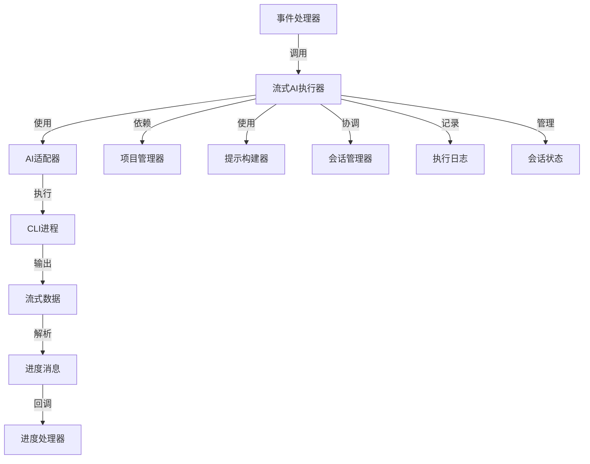
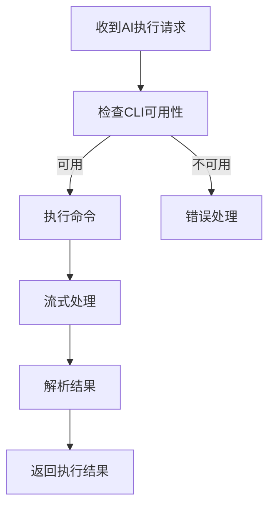
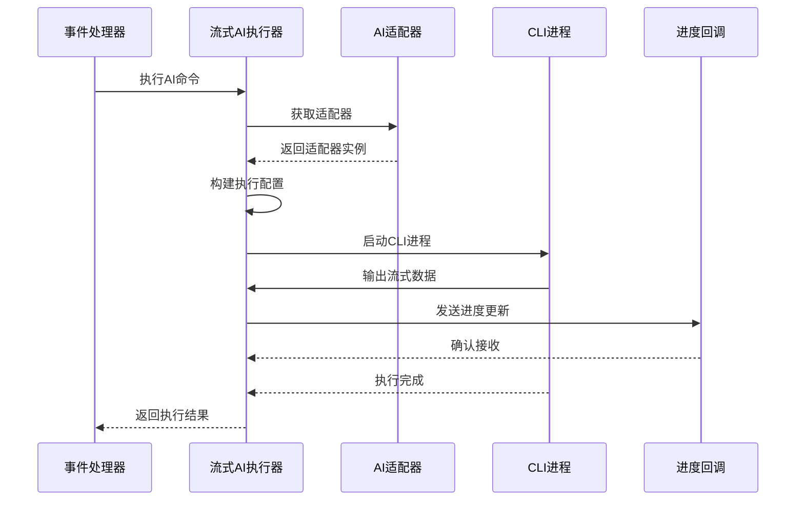
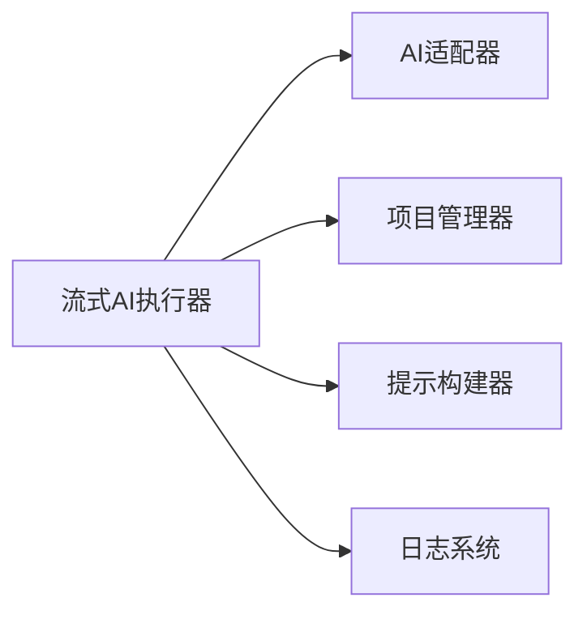

# 流式AI执行器 (Streaming AI Executor)

## 概述
- **作用**：提供流式AI命令执行能力，支持实时进度更新和会话状态维护
- **使用场景**：当需要执行长时间运行的AI任务时，提供实时反馈和状态更新
- **核心价值**：通过流式处理机制，实现AI命令的实时执行和状态同步

## 快速开始
1. 配置AI提供商适配器
2. 创建流式AI执行器实例
3. 调用executeWithSession方法执行AI命令
4. 通过回调函数接收实时进度更新

## 架构设计

### 系统架构图


### 项目结构
```
src/
├── services/
│   ├── streamingAiExecutor.ts    # 主执行器
    │   ├── providers/              # AI提供商适配器
    │   │   ├── claudeAdapter.ts
    │   │   └── codexAdapter.ts
    │   └── providerAdapter.ts     # 适配器接口
```

### 设计原则
- **流式处理**：实时处理AI命令输出，提供进度反馈
- **会话集成**：支持会话模式的AI命令执行
- **实时更新**：通过回调机制提供执行进度实时更新

## 核心组件分析

### 组件1：流式AI执行器主类
**文件路径**：`src/services/streamingAiExecutor.ts`

**职责**：
- 管理AI命令的流式执行过程
- 提供会话支持和实时进度更新

**关键要点**：
- 支持多种AI提供商的命令执行
- 实现CLI进程的启动、监控和结果收集

### 组件2：AI提供商适配器注册表
**文件路径**：`src/services/streamingAiExecutor.ts`

**职责**：
- 管理AI适配器的注册和查找
- 支持默认提供商的自动选择

### 组件3：CLI进程执行器
**文件路径**：`src/services/streamingAiExecutor.ts`

**职责**：
- 执行实际的CLI命令
- 处理标准输出和错误输出的实时流式处理

## 执行流程

### 业务流程图


### 时序图（关键交互）


### 关键路径说明
1. **CLI可用性检查**：验证AI CLI工具是否可用
2. **命令执行**：启动CLI进程并监控执行过程
3. **结果解析**：将CLI输出解析为结构化结果
4. **会话状态更新**：根据执行结果更新会话状态

## 依赖关系

### 内部依赖


### 外部依赖
- **AI CLI工具**：Claude Code CLI、Codex CLI等
- **Node.js子进程模块**：提供CLI进程执行能力

### 依赖注入
通过构造函数注入AI适配器实例，支持灵活的AI提供商切换

## 使用方式

### 基础用法
1. 创建流式AI执行器实例
2. 配置AI提供商适配器
3. 调用执行方法并传递进度回调函数

### 高级用法
- **多提供商负载均衡**：根据性能指标自动选择最优AI提供商

### API参考
| 方法/属性 | 类型 | 说明 | 使用提示 |
|---------|------|------|----------------|
| executeWithSession | (command, projectPath, context, callback, options) => Promise<SessionExecutionResult> | 执行带会话的AI命令 | 支持多轮对话上下文 |
| executeWithStreaming | (command, projectPath, context, callback) => Promise<ProcessResult> | 执行流式AI命令 | 提供实时进度反馈 |

### 配置选项
- **defaultTimeoutMs**：默认命令执行超时时间
- **AI提供商配置**：指定默认使用的AI模型

## 最佳实践与注意事项

### ✅ 推荐做法
1. **超时时间配置**：根据AI命令复杂度设置合理的超时阈值
   - 适用场景：复杂代码生成任务需要更长的执行时间

## 测试策略

### 单元测试示例
需要覆盖CLI进程执行、流式数据处理、结果解析等核心功能

### 集成测试要点
- 测试流式AI执行器与事件处理器的集成
- 验证流式进度更新的正确性和实时性

### 调试技巧
- 启用详细日志查看CLI执行过程
- 监控进程执行状态和资源使用情况

### 性能监控
- **命令执行时间**：监控AI命令执行效率
- **内存使用监控**：确保流式处理不会导致内存泄漏

## 扩展性设计

### 扩展点
- **新AI提供商集成**：实现ProviderAdapter接口即可添加新的AI模型支持

### 相关技术点
- [会话管理器](../状态管理/会话管理器.md)
- [会话存储](../状态管理/会话存储.md)
- [会话清理服务](../状态管理/会话清理服务.md)
