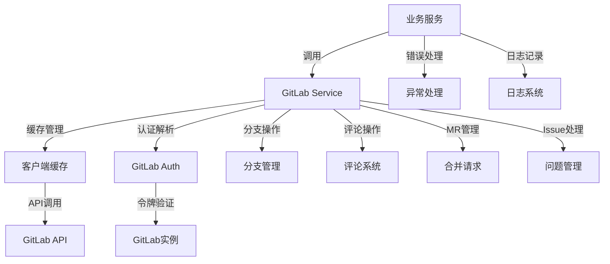
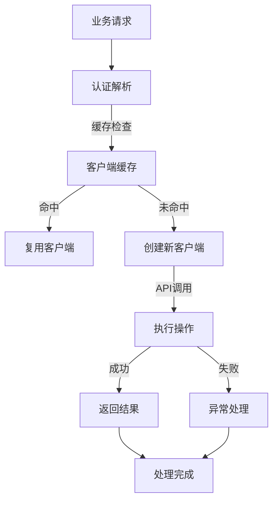
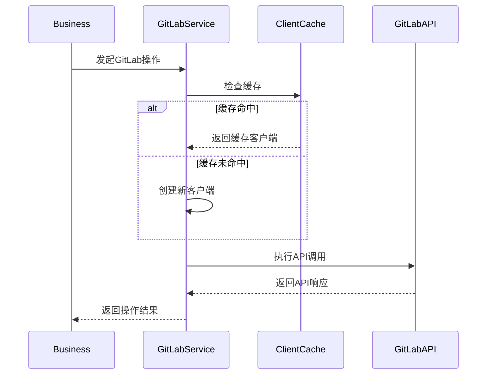
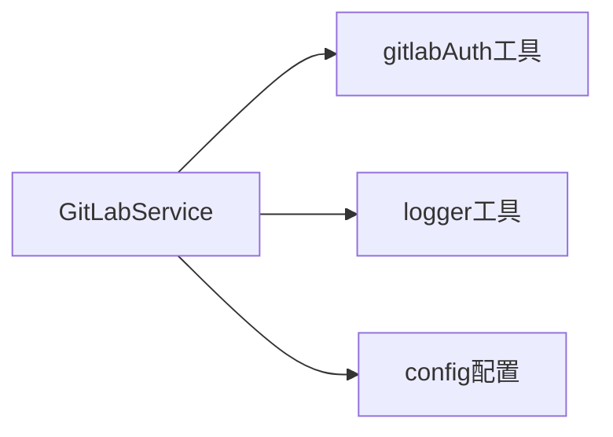

# GitLab API客户端 (GitLab API Client)

## 概述

**作用**：封装GitLab REST API的所有交互操作，为系统提供统一的GitLab服务访问接口。

**使用场景**：当需要与GitLab进行数据交互时，如创建分支、提交评论、获取项目信息等场景。

**核心价值**：提供类型安全的GitLab API访问，支持连接池管理和错误处理，确保与GitLab实例的稳定通信。

## 快速开始

1. **配置认证**：设置GitLab访问令牌和基础URL
2. **创建实例**：初始化GitLabService类
3. **调用方法**：通过实例方法执行具体的GitLab操作

## 架构设计

### 系统架构图



### 项目结构

```
src/
├── services/              # 业务服务层
│   ├── gitlabService.ts - 主服务类
│   └── __tests__/       # 测试文件
└── utils/                # 工具层
    ├── gitlabAuth.ts      - 认证解析
    └── config.ts          - 配置管理
```

### 设计原则

- **单例模式**：客户端实例在生命周期内复用
- **连接池管理**：优化API调用性能和资源使用
```

### 设计原则

- **工厂模式**：通过认证信息动态创建GitLab客户端
- **缓存策略**：减少重复认证和客户端创建开销
- **错误处理**：统一的异常捕获和日志记录机制

## 核心组件分析

### 组件1：GitLabService类
**文件路径**：`src/services/gitlabService.ts`

**职责**：
- 管理GitLab客户端实例缓存
- 提供完整的GitLab API操作接口
- 实现请求重试和错误恢复机制

**关键要点**：
- 使用@gitbeaker/node库作为底层API客户端
- 支持基于令牌的多租户认证
- 提供统一的错误处理和日志记录

### 组件2：客户端缓存系统
**文件路径**：`src/services/gitlabService.ts` 中的 `clientCache`

**职责**：
- 缓存已创建的GitLab客户端实例
- 基于认证信息生成缓存键
- 减少重复认证和客户端创建开销

**关键要点**：
- 使用Map数据结构实现内存缓存
- 基于基础URL和访问令牌生成唯一标识
- 提高API调用性能和响应速度

### 组件3：认证解析器
**文件路径**：`src/utils/gitlabAuth.ts`

**职责**：
- 解析GitLab认证配置
- 支持多租户令牌解析
- 提供传统认证模式回退机制

## 执行流程

### 业务流程图



### 时序图（关键交互）



### 关键路径说明

1. **认证解析**：调用 `resolveGitLabAuth` 解析认证信息
2. **缓存检查**：基于认证信息检查客户端缓存
3. **客户端创建**：当缓存未命中时创建新的GitLab客户端实例
4. **API执行**：通过GitLab客户端执行具体的API操作
5. **结果返回**：将操作结果返回给业务调用方

## 依赖关系

### 内部依赖



### 外部依赖

- **@gitbeaker/node**：40.x - 提供GitLab API客户端功能
- **fetch API**：Node.js内置 - 用于直接REST API调用
- **crypto**：Node.js内置 - 用于签名验证
- **MongoDB驱动**：4.x - 提供多租户数据存储

### 依赖注入

- 通过配置对象管理外部依赖
- 支持环境变量配置认证信息
- 通过工具函数解析认证配置

## 使用方式

### 基础用法

1. **服务初始化**：创建GitLabService实例
2. **认证配置**：通过环境变量或配置文件设置GitLab访问参数

## 最佳实践与注意事项

### ✅ 推荐做法

1. **使用连接池**：充分利用客户端缓存机制减少连接开销
   - 适用场景：频繁的GitLab API调用
   - 效果说明：提高系统响应速度和性能表现

2. **错误处理**：对所有API调用实施统一的异常捕获和错误处理

### ❌ 常见陷阱

1. **认证失败**：当GitLab访问令牌无效或过期时发生
   - 现象描述：API调用失败，返回认证错误
   - 正确做法：定期更新访问令牌，确保认证有效性
   - 为什么要避免：导致GitLab操作无法正常执行

2. **连接超时**：当GitLab实例不可达或网络故障时发生
   - 现象描述：请求超时，连接失败
   - 正确做法：配置合理的超时时间和重试机制

### 性能优化建议

- **缓存策略优化**：根据业务场景调整客户端缓存策略
- **批量操作**：对多个相关操作实施批量处理减少API调用次数

### 安全注意事项

- **令牌安全**：确保GitLab访问令牌的安全存储和传输
- **权限控制**：基于租户令牌实现细粒度权限管理

## 测试策略

### 单元测试示例

需要覆盖客户端创建、缓存管理、API调用等核心功能，验证不同认证配置下的正确行为

### 集成测试要点

- 测试与GitLab API的完整集成流程
- 验证多租户场景下的数据隔离效果

### 调试技巧

- **启用API调试**：通过日志系统记录详细的API调用信息
- **连接测试**：定期执行连接测试验证GitLab实例可达性

### 性能监控

- **API响应时间**：监控GitLab API调用性能
- **错误率监控**：跟踪认证失败和API调用错误
- **缓存命中率**：监控客户端缓存的使用效果

## 扩展性设计

### 扩展点

- **API操作扩展**：支持添加新的GitLab API功能
- **认证方式扩展**：支持多种认证机制和令牌类型

### 版本演进

- **API版本兼容**：确保与GitLab API版本变更的兼容性
- **功能模块扩展**：支持新的GitLab功能模块集成

### 相关技术点

- [Webhook服务器](../网络协议/Webhook服务器.md)
- [事件处理器](../网络协议/事件处理器.md)
