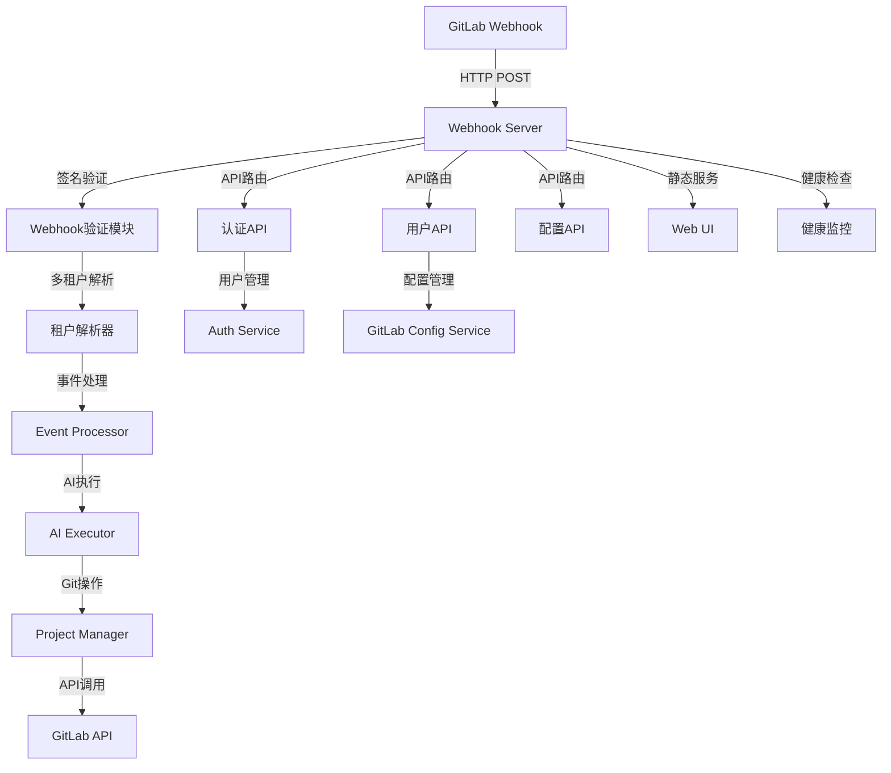
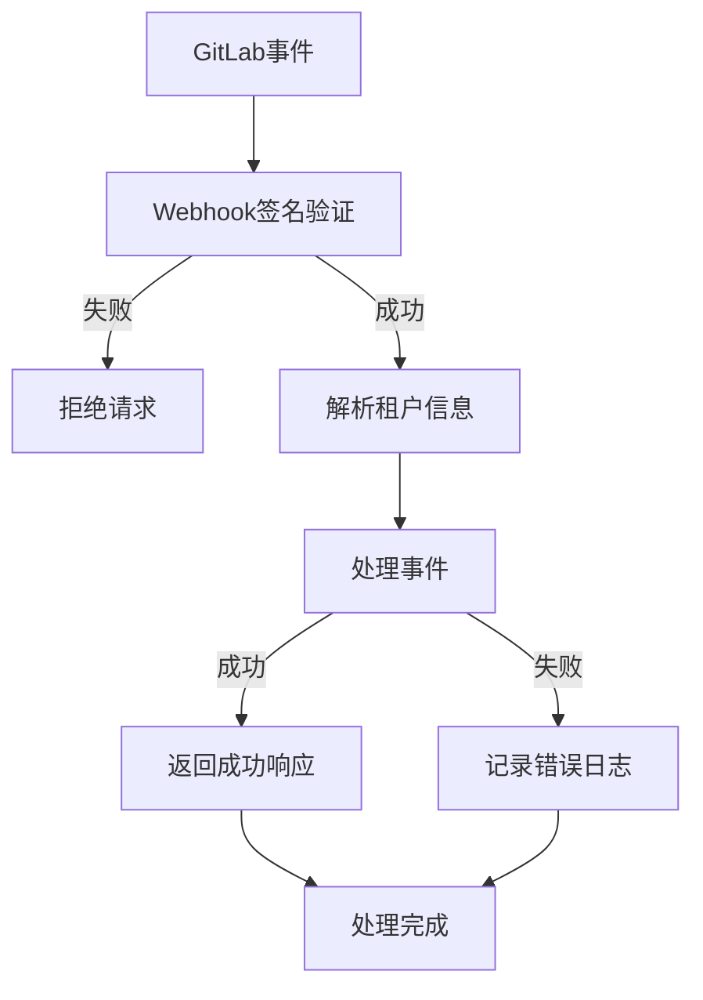
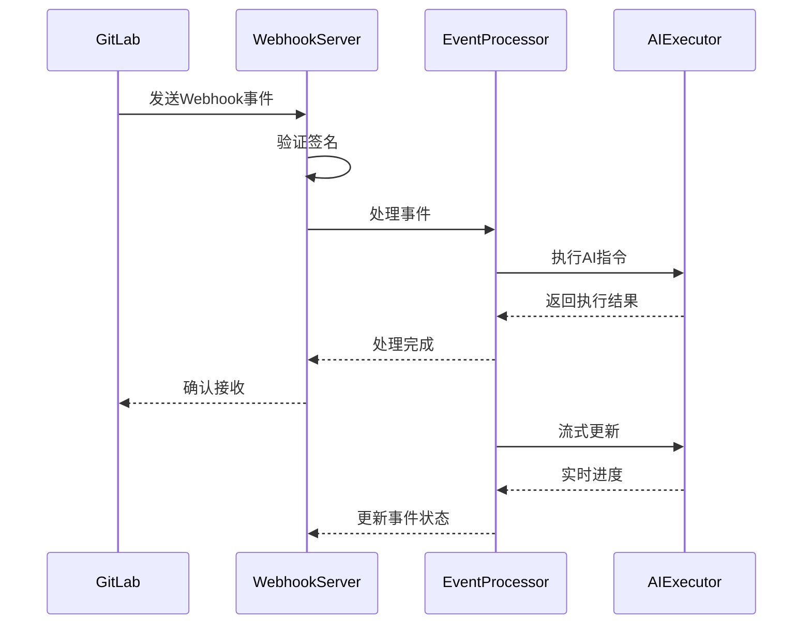
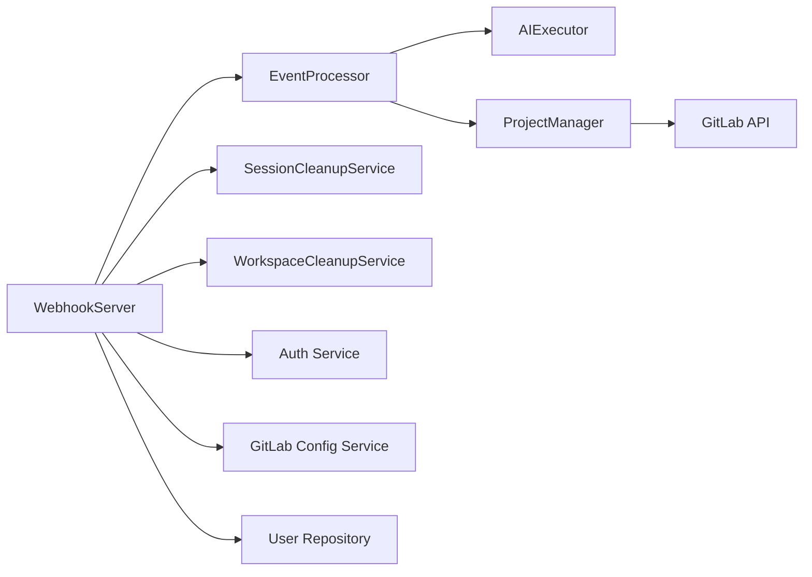

# Webhook服务器 (Webhook Server)

## 概述

**作用**：作为GitLab AI Copilot系统的入口点，负责接收、验证和处理来自GitLab的Webhook事件，是整个AI工作流的起点和协调中心。

**使用场景**：当GitLab中发生Issue评论、MR创建等事件时，通过Webhook机制触发AI处理流程。

**核心价值**：提供企业级的Webhook处理能力，支持多租户认证、签名验证和事件路由，确保系统安全可靠地响应外部事件。

## 快速开始

1. **配置GitLab Webhook**：在GitLab项目中设置Webhook地址指向本服务
2. **接收事件**：通过HTTP POST端点接收GitLab事件
3. **验证签名**：使用配置的密钥验证请求合法性
4. **路由处理**：根据事件类型分发给相应的处理器
5. **返回响应**：向GitLab确认事件接收成功

## 架构设计

### 系统架构图



### 项目结构

```
src/
├── server/              # 服务器层
│   ├── webhookServer.ts - 主服务器类
│   └── __tests__/       # 测试文件
└── services/            # 业务服务层
```

### 设计原则

- **单例模式**：确保系统中只有一个Webhook服务器实例
- **中间件链**：通过Express中间件实现请求处理流水线
- **插件化架构**：支持通过配置启用或禁用Web UI功能
- **多租户支持**：通过令牌解析实现企业级数据隔离
- **配置驱动**：通过环境变量灵活配置服务器行为

## 核心组件分析

### 组件1：WebhookServer类
**文件路径**：`src/server/webhookServer.ts`

**职责**：
- 初始化Express应用和中间件
- 配置路由和API端点
- 管理服务生命周期
- 提供健康检查接口

**关键要点**：
- 使用Express.js框架构建HTTP服务器
- 支持原始请求体处理以进行签名验证
- 提供静态文件服务支持Web UI
- 实现多租户认证和权限验证

### 组件2：中间件配置系统
**文件路径**：`src/server/webhookServer.ts` 中的 `setupMiddleware` 方法

**职责**：
- 配置CORS跨域策略
- 添加请求ID用于链路追踪
- 处理JSON和URL编码请求体
- 为Webhook路由保留原始请求体

**关键要点**：
- 使用cookie-parser处理Cookie
- 支持10MB请求体限制
- 根据配置动态启用Web UI功能

### 组件3：路由管理系统
**文件路径**：`src/server/webhookServer.ts` 中的 `setupRoutes` 方法

**职责**：
- 配置API路由（认证、用户、配置等）
- 实现SPA路由支持
- 提供健康检查端点

## 执行流程

### 业务流程图



### 时序图（关键交互）



### 关键路径说明

1. **事件接收**：`src/server/webhookServer.ts` 中的 `handleWebhook` 方法负责接收事件
2. **签名验证**：调用 `verifyGitLabSignature` 验证请求合法性
3. **租户解析**：根据请求令牌解析多租户信息
4. **事件处理**：将事件传递给 `EventProcessor` 进行业务逻辑处理
5. **结果返回**：向GitLab返回200状态码确认事件接收
6. **异步处理**：事件处理在后台异步进行，不影响响应时间

## 依赖关系

### 内部依赖



### 外部依赖

- **Express.js**：4.x - 提供HTTP服务器框架
- **cookie-parser**：1.x - 解析Cookie数据
- **path**：Node.js内置模块 - 处理文件路径
- **@gitbeaker/node**：40.x - GitLab API客户端库
- **MongoDB驱动**：4.x - 提供多租户数据存储
- **crypto**：Node.js内置模块 - 提供加密和签名验证功能

### 依赖注入

- 通过构造函数注入核心服务实例
- 使用配置对象管理外部依赖
- 支持环境变量配置数据库连接和认证信息

## 使用方式

### 基础用法

1. **环境准备**：配置必要的环境变量和数据库连接
2. **服务启动**：调用 `start` 方法启动服务器
3. **事件处理**：通过 `/webhook` 端点接收GitLab事件
4. **配置管理**：通过配置文件或环境变量设置服务器参数
5. **监控维护**：通过健康检查接口监控服务状态

### 高级用法

**多租户配置**：
- 支持基于令牌的租户识别
- 提供传统模式回退机制
- 支持租户数据完全隔离

### API参考

| 方法/属性 | 类型 | 说明 | 使用提示 |
|---------|------|------|----------------|
| start | () => Promise<void> | 启动服务器 | 需要先配置数据库连接 |
| stop | () => void | 停止服务器 | 优雅关闭所有服务 |

### 配置选项

- **WEB_UI_ENABLED**：布尔值 - 控制是否启用Web UI功能
- **WEB_UI_BASE_PATH**：字符串 - Web UI基础路径配置
- **SESSION_ENABLED**：布尔值 - 控制会话管理功能
- **WORK_DIR**：字符串 - 工作目录路径配置
- **LOG_LEVEL**：字符串 - 日志级别控制
- **PORT**：数字 - 服务器监听端口

## 最佳实践与注意事项

### ✅ 推荐做法

1. **配置签名验证**：始终启用Webhook签名验证以确保请求安全
   - 适用场景：生产环境部署
   - 效果说明：防止未授权访问和数据篡改

2. **启用健康检查**：配置健康检查端点用于监控
   - 适用场景：容器化部署和负载均衡

### ❌ 常见陷阱

1. **签名验证失败**：当GitLab配置的密钥与系统配置不匹配时发生
   - 现象描述：Webhook请求被拒绝，返回401状态码
   - 正确做法：确保GitLab Webhook设置中的密钥与系统配置一致
   - 为什么要避免：导致合法事件无法被处理

2. **租户解析失败**：当提供的令牌无法匹配任何租户时发生
   - 现象描述：返回404状态码，租户不存在
   - 正确做法：检查令牌配置和数据库中的租户记录

### 性能优化建议

- **连接池管理**：优化GitLab API客户端连接池配置
- **缓存策略**：对频繁访问的数据实施缓存机制

### 安全注意事项

- **签名验证**：必须验证Webhook签名以防止伪造请求
- **令牌安全**：确保租户令牌的安全存储和传输
- **权限控制**：基于租户令牌实现细粒度权限管理

## 测试策略

### 单元测试示例

需要覆盖签名验证、租户解析、事件路由等核心功能，验证不同输入条件下的正确行为

### 集成测试要点

- 测试与GitLab API的完整集成流程
- 验证多租户场景下的数据隔离效果

### 调试技巧

- **启用调试日志**：设置LOG_LEVEL=debug查看详细处理过程

### 性能监控

- **请求处理时间**：监控Webhook事件处理性能
- **错误率监控**：跟踪签名验证失败和租户解析错误
- **资源使用**：监控内存和CPU使用情况

## 扩展性设计

### 扩展点

- **中间件扩展**：支持添加自定义中间件处理逻辑
- **路由扩展**：支持添加新的API端点和处理程序

### 版本演进

- **向后兼容**：确保新版本不影响现有Webhook配置
- **协议升级**：支持GitLab Webhook协议版本更新

### 相关技术点

- [GitLab API客户端](../网络协议/GitLab%20API客户端.md)
- [Webhook签名验证](../网络协议/Webhook签名验证.md)
- [事件处理器](../网络协议/事件处理器.md)
