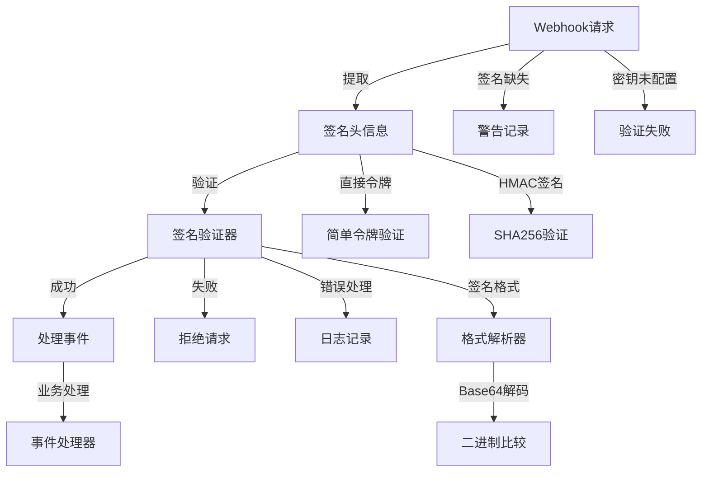
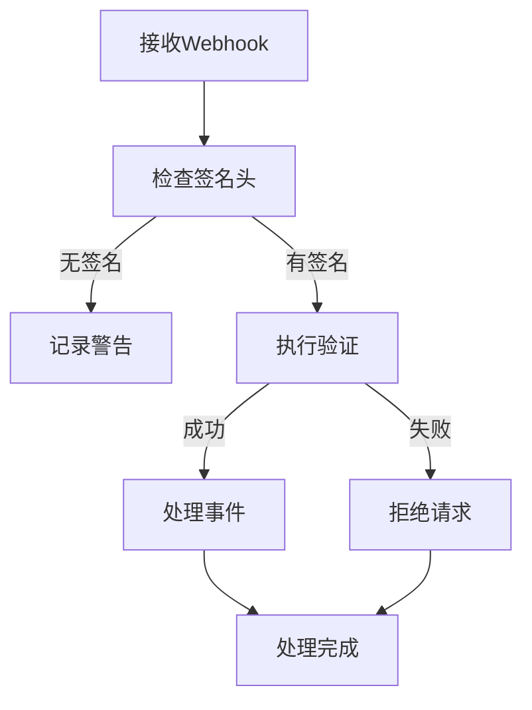
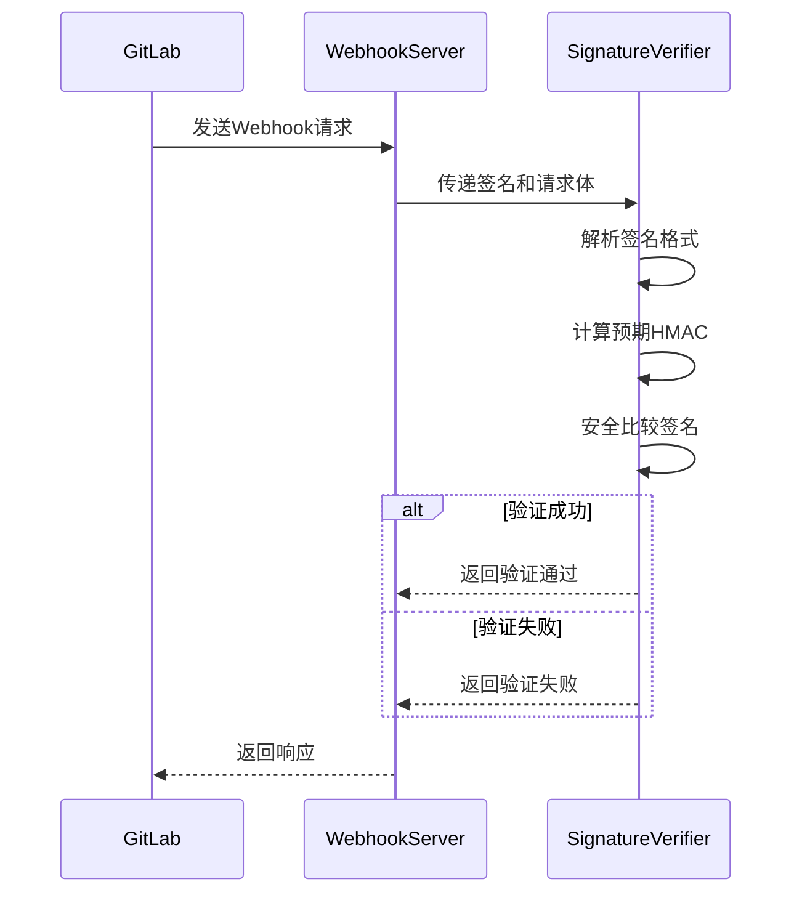
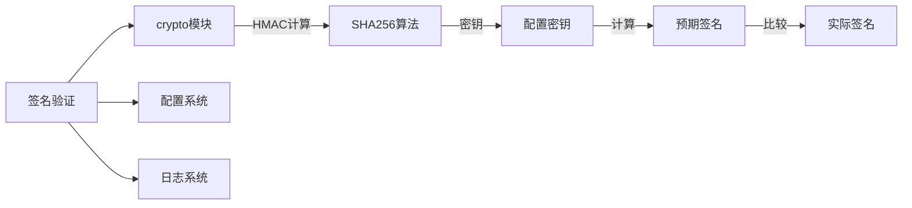

# Webhook签名验证 (Webhook Signature Verification)

## 概述

**作用**：验证GitLab Webhook请求的签名，确保请求来源可信且未被篡改。

**使用场景**：每次接收到GitLab Webhook请求时，必须进行签名验证以确保系统安全。

**核心价值**：提供企业级的安全保障机制，防止未授权访问和数据篡改攻击。

## 快速开始

1. **配置密钥**：在系统配置中设置Webhook签名密钥
2. **提取签名**：从请求头中提取签名信息
3. **计算预期签名**：使用配置的密钥和请求体计算预期签名
4. **比较签名**：使用安全的时间恒定比较算法验证签名

## 架构设计

### 系统架构图



### 项目结构

```
src/
├── utils/                # 工具层
│   ├── webhook.ts       - 签名验证主逻辑
│   └── __tests__/       # 测试文件
└── services/            # 业务服务层
```

### 设计原则

- **安全第一**：签名验证失败必须拒绝请求
- **双重验证**：支持直接令牌和HMAC签名两种验证方式
```

### 设计原则

- **时间恒定比较**：使用crypto.timingSafeEqual防止时序攻击
- **多重签名支持**：兼容GitLab不同版本的签名机制
- **错误处理**：提供详细的错误日志用于问题排查

## 核心组件分析

### 组件1：签名验证函数
**文件路径**：`src/utils/webhook.ts` 中的 `verifyGitLabSignature`

**职责**：
- 验证Webhook请求的签名合法性
- 支持直接令牌和SHA256 HMAC签名验证

**关键要点**：
- 支持两种签名验证模式：直接令牌匹配和HMAC签名验证
- 提供签名格式解析和转换功能
- 实现安全的时间恒定签名比较算法

### 组件2：签名头解析器
**文件路径**：`src/utils/webhook.ts` 中的 `toBufferFromSignature`

**职责**：
- 解析GitLab Webhook签名头格式
- 支持Base64和十六进制编码的签名
- 提供详细的错误日志记录验证过程

**关键要点**：
- 支持"sha256="前缀的签名格式
- 自动检测签名编码格式并进行转换

### 组件3：HMAC计算器
**文件路径**：`src/utils/webhook.ts` 中的 `buildExpectedHmac`

**职责**：
- 使用SHA256算法计算预期HMAC签名
- 提供十六进制和二进制格式的签名输出
- 确保签名格式的兼容性和扩展性

## 执行流程

### 业务流程图



### 时序图（关键交互）



### 关键路径说明

1. **签名提取**：从请求头中提取X-Gitlab-Token和X-Gitlab-Webhook-Signature
    WebhookServer-->>GitLab: 确认接收或拒绝
```

## 依赖关系

### 内部依赖



### 外部依赖

- **crypto**：Node.js内置模块 - 提供加密和签名验证功能
- **配置管理**：通过环境变量获取Webhook签名密钥
- **请求体处理**：确保使用原始请求体进行签名计算
- **环境配置**：支持通过环境变量配置签名验证参数

### 依赖注入

- 通过函数参数传递签名信息和配置密钥
- 支持密钥覆盖机制用于多租户场景

## 使用方式

### 基础用法

1. **配置验证密钥**：在GitLab Webhook设置和系统配置中保持一致性

## 最佳实践与注意事项

### ✅ 推荐做法

1. **启用签名验证**：在生产环境中必须启用签名验证功能
   - 适用场景：所有生产环境部署
   - 效果说明：确保系统安全性和数据完整性

2. **日志记录**：详细记录签名验证过程和结果
   - 适用场景：问题排查和安全审计
   - 效果说明：提供完整的审计追踪能力

### ❌ 常见陷阱

1. **签名格式错误**：当签名头格式不符合预期时发生
   - 现象描述：签名解析失败，无法进行验证
   - 正确做法：确保GitLab Webhook配置使用正确的签名格式
   - 为什么要避免：导致合法请求被错误拒绝

2. **密钥不匹配**：当系统配置的密钥与GitLab设置不一致时发生
   - 现象描述：签名验证失败，请求被拒绝
   - 正确做法：定期检查密钥配置的一致性

### 性能优化建议

- **签名缓存**：对已验证的签名实施缓存机制减少重复计算

### 安全注意事项

- **时间恒定比较**：必须使用crypto.timingSafeEqual防止时序攻击
- **密钥轮换**：定期更新Webhook签名密钥增强安全性

## 测试策略

### 单元测试示例

需要覆盖不同签名格式、验证场景和错误情况的处理逻辑

### 集成测试要点

- 验证与Webhook服务器的完整集成流程
- 测试多租户场景下的签名验证机制

### 调试技巧

- **详细日志**：启用调试级别日志查看签名验证的详细过程

### 性能监控

- **验证成功率**：监控签名验证的成功率和失败原因分布

## 扩展性设计

### 扩展点

- **签名算法扩展**：支持新的签名算法和验证机制

### 版本演进

- **协议兼容**：确保与GitLab Webhook协议版本变更的兼容性

### 相关技术点

- [Webhook服务器](../网络协议/Webhook服务器.md)
- [GitLab API客户端](../网络协议/GitLab%20API客户端.md)
- [事件处理器](../网络协议/事件处理器.md)
