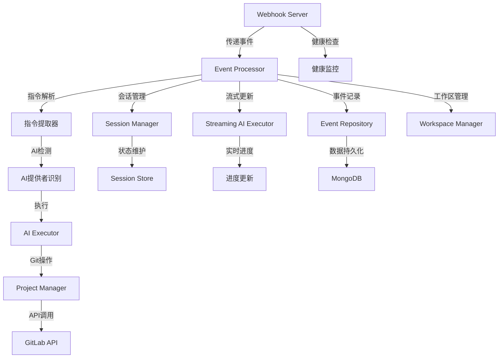
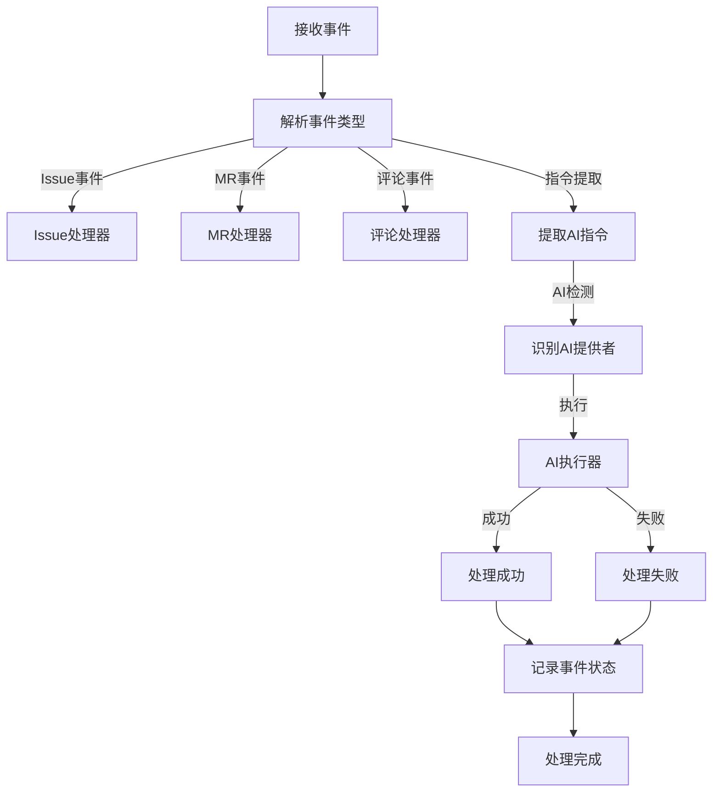
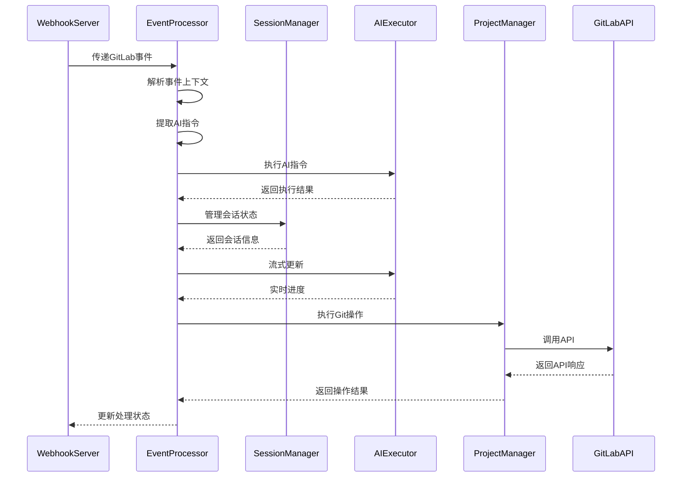

# 事件处理器 (Event Processor)

## 概述

**作用**：作为GitLab AI Copilot系统的中央协调器，负责接收、解析、路由和处理所有GitLab Webhook事件。

**使用场景**：当Webhook服务器接收到GitLab事件后，由事件处理器负责整个AI工作流的协调和执行。

**核心价值**：提供智能的事件路由和流程控制，确保AI工作流的高效执行和状态管理。

## 快速开始

1. **事件接收**：从Webhook服务器接收已验证的GitLab事件
2. **指令提取**：从事件内容中识别AI指令和提供者信息
3. **会话管理**：根据事件类型决定是否启用会话模式
4. **AI执行**：调用相应的AI执行器处理指令
5. **结果处理**：根据AI执行结果更新事件状态和触发后续操作

## 架构设计

### 系统架构图



### 项目结构

```
src/
├── services/              # 业务服务层
│   ├── eventProcessor.ts - 主处理器类
│   └── __tests__/       # 测试文件
└── utils/                # 工具层
    ├── eventContextHelper.ts - 事件上下文解析
    └── webhook.ts         - 签名验证
```

### 设计原则

- **中央协调器模式**：作为系统的事件处理中枢
- **状态机管理**：维护事件处理的生命周期状态
- **异步处理**：支持长时间运行的AI任务和流式更新

## 核心组件分析

### 组件1：EventProcessor类
**文件路径**：`src/services/eventProcessor.ts`

**职责**：
- 解析GitLab事件类型和内容
- 提取AI指令和提供者信息
- 协调AI执行和Git操作
- 管理会话生命周期和多轮对话

**关键要点**：
- 支持多种事件类型：Issue、Merge Request、Comment等
- 实现事件处理的状态机管理
- 提供事件处理的完整生命周期控制

### 组件2：事件上下文解析器
**文件路径**：`src/utils/eventContextHelper.ts`

**职责**：
- 确定事件发生的上下文环境
- 提取相关的项目、用户和操作信息
- 支持AI指令的自动识别和提取

### 组件3：AI提供者检测器
**文件路径**：`src/utils/eventContextHelper.ts` 中的 `determineEventContext`

**关键要点**：
- 根据事件类型解析不同的上下文信息
- 提供事件背景信息的构建和格式化

## 执行流程

### 业务流程图



### 时序图（关键交互）



### 关键路径说明

1. **事件接收**：从Webhook服务器接收已验证的事件
2. **上下文解析**：确定事件发生的项目、用户和操作类型
3. **AI指令处理**：根据检测到的AI提供者执行相应指令
4. **结果记录**：将事件处理结果持久化到数据库

## 依赖关系

### 内部依赖

```mermaid
graph LR
    A[EventProcessor] --> B[AIExecutor]
    A --> C[SessionManager]
    A --> D[ProjectManager]
    A --> E[EventRepository]
    A --> F[StreamingAIExecutor]

### 外部依赖

- **GitLab API**：通过ProjectManager与GitLab进行交互
- **Session Store**：用于会话数据的持久化存储
- **MongoDB**：提供多租户数据存储能力

## 使用方式

### 基础用法

1. **服务初始化**：创建EventProcessor实例并注入依赖服务
2. **事件处理**：调用 `processEvent` 方法处理GitLab事件
3. **状态管理**：通过SessionManager维护长交互会话
4. **进度监控**：通过流式更新机制实时跟踪AI执行进度

### 高级用法

**多租户事件处理**：
- 支持基于租户令牌的事件路由和处理
- 实现事件处理的异步执行和状态更新

### API参考

| 方法/属性 | 类型 | 说明 | 使用提示 |
|---------|------|------|----------------|
| processEvent | (event, user) => Promise<Result> | 处理GitLab事件 | 需要先配置多租户认证 |

## 最佳实践与注意事项

### ✅ 推荐做法

1. **启用会话管理**：对于需要多轮交互的场景启用会话模式
   - 适用场景：复杂AI任务和持续对话
   - 效果说明：提供更好的用户体验和任务完成率

2. **详细日志记录**：记录事件处理的完整过程用于问题排查
   - 适用场景：生产环境部署和运维监控

### ❌ 常见陷阱

1. **事件类型识别错误**：当无法正确识别GitLab事件类型时发生
   - 现象描述：事件处理失败，无法执行AI指令
   - 正确做法：确保事件解析逻辑覆盖所有支持的GitLab事件类型
   - 为什么要避免：导致系统无法响应特定类型的事件

2. **会话状态丢失**：当会话数据未能正确持久化时发生
   - 现象描述：多轮对话中断，上下文丢失
   - 正确做法：配置合理的会话超时时间和清理策略

### 性能优化建议

- **异步处理**：将耗时的AI执行操作放在后台异步处理
- **状态机管理**：确保事件处理状态的一致性和可恢复性

### 安全注意事项

- **租户隔离**：确保不同租户的事件处理完全隔离
- **权限验证**：基于租户令牌验证操作权限

## 测试策略

### 单元测试示例

需要覆盖事件解析、指令提取、AI执行等核心功能

### 集成测试要点

- 测试与Webhook服务器的完整集成流程
- 验证多租户场景下的事件处理和数据隔离效果

### 调试技巧

- **启用事件调试**：通过日志系统记录详细的事件处理过程

### 性能监控

- **事件处理时间**：监控不同类型事件的处理性能
- **会话使用率**：监控会话资源的分配和使用情况

## 扩展性设计

### 扩展点

- **事件类型扩展**：支持新的GitLab事件类型处理
- **AI提供者扩展**：支持集成新的AI模型和工具

### 版本演进

- **协议兼容**：确保与GitLab Webhook协议版本变更的兼容性

### 相关技术点

- [Webhook服务器](../网络协议/Webhook服务器.md)
- [GitLab API客户端](../网络协议/GitLab%20API客户端.md)
- [Webhook签名验证](../网络协议/Webhook签名验证.md)
